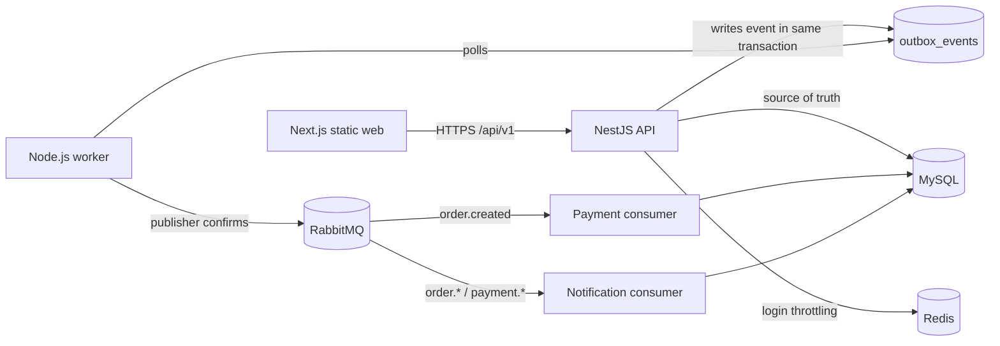

# Order Management System

A portfolio-grade commerce backend that demonstrates the parts of order management that are harder than CRUD: atomic stock reservation, idempotent order creation, explicit state transitions, asynchronous payment processing, transactional event publication, and duplicate-safe consumers.

The project is a pragmatic modular monolith. Business features live together in one NestJS API and one MySQL schema while asynchronous work runs in a separate worker process. The Next.js frontend is maintained in the same pnpm workspace and is exported as static assets for same-origin production delivery.

## Status

The product workflow is implemented and verified locally through the production container topology. The repository-wide gate, database/API integration suites, dependency audit, and complete customer-to-delivery smoke workflow pass. The remaining release work is public zero-cost provisioning plus hosted verification and deeper automated failure/load scenarios.

See [project progress](docs/progress.md) for the weighted completion score, remaining release gates, and deployment status.

## What the system does

- Registers and authenticates customers with opaque access and refresh credentials.
- Rotates refresh credentials and protects cookie-backed refresh/logout requests with CSRF tokens.
- Throttles login attempts in Redis without storing raw email addresses in keys.
- Exposes active Products and SKUs publicly and versioned Catalog administration to operators.
- Tracks on-hand, reserved, and available inventory per SKU and warehouse.
- Creates orders idempotently and reserves every requested SKU from one warehouse in a serializable transaction.
- Simulates asynchronous payment authorization and deterministic failure for demonstration.
- Releases reservations on failed payment or cancellation and commits stock when an order ships.
- Publishes business events through a MySQL transactional outbox and RabbitMQ.
- Creates duplicate-safe in-app notifications from order and payment events.
- Provides a responsive Next.js UI for catalog, cart, checkout, orders, notifications, and administration.
- Publishes versioned HTTP APIs, RFC 9457 Problem Details, Swagger/OpenAPI, structured logs, and health endpoints.

## Runtime architecture



MySQL is authoritative. Redis is disposable throttling state. RabbitMQ is an at-least-once delivery mechanism, not a database. The `processed_messages` table makes worker side effects idempotent when RabbitMQ redelivers.

Read the [architecture overview](docs/architecture/overview.md), [database design](docs/architecture/database.md), [API contracts](docs/architecture/api-contracts.md), and [event model](docs/architecture/events-and-consistency.md) before changing a business invariant.

## Repository structure

```text
apps/
  api/          NestJS HTTP runtime and feature modules
  web/          Next.js static frontend
  worker/       outbox publisher, payment consumer, notification consumer
packages/
  configuration/ validated runtime configuration
  database/      Prisma schema, migrations, and database lifecycle
  messaging/     RabbitMQ topology and event envelope
  redis/         bounded Redis runtime
docs/            living architecture, contracts, ADRs, and operations
infrastructure/ local container configuration
```

Feature code stays close to the feature that owns it. Shared packages exist only for genuine runtime capabilities used by more than one application; there is no package-per-entity abstraction layer.

## Local setup

Prerequisites:

- Node.js `24.18.1` (see `.node-version`)
- pnpm `11.18.x`
- Docker with Compose v2
- OpenSSL for generating local secrets

Install dependencies and create local configuration:

```bash
corepack enable
pnpm install --frozen-lockfile
cp .env.example .env
mkdir -p .local/secrets
umask 077
openssl rand -hex 32 > .local/secrets/mysql-app-password
openssl rand -hex 32 > .local/secrets/mysql-root-password
openssl rand -hex 32 > .local/secrets/redis-app-password
openssl rand -hex 32 > .local/secrets/rabbitmq-password
```

Start the complete local stack:

```bash
pnpm infra:up
```

Compose builds the web/API/worker image, starts MySQL, Redis, and RabbitMQ, applies committed migrations through a one-shot migration container, then starts the API and worker. `DEMO_SEED=true` is the local default. Seeding is idempotent and does not reset existing order data. Local demo accounts are:

- `customer@oms.local` / `Customer123!`
- `admin@oms.local` / `Admin123!`

Local endpoints:

- Web: `http://localhost:3000`
- API: `http://localhost:3000/api/v1`
- Swagger UI: `http://localhost:3000/docs`
- OpenAPI JSON: `http://localhost:3000/docs/openapi.json`
- Liveness: `http://localhost:3000/health/live`
- Readiness: `http://localhost:3000/health/ready`
- RabbitMQ management: `http://localhost:15672`

For source-level hot reload, start only the dependency containers, apply the migration, configure the local RabbitMQ credential from `.local/secrets/rabbitmq-password`, then use `pnpm dev:api`, `pnpm dev:worker`, and `pnpm dev:web`. The web dev server runs on port 3001 and uses the exact configured `WEB_ORIGIN`.

For detailed local/deployment instructions, troubleshooting, secret handling, and shutdown commands, use the [deployment runbook](docs/runbooks/deployment.md) and [operations guide](docs/operations.md).

## Quality gates

Run the same aggregate gate expected by CI:

```bash
pnpm check
```

It checks formatting, validates and generates Prisma, lints, type-checks, tests, and builds every workspace package. Dependency auditing is separate so registry availability does not hide code failures:

```bash
pnpm audit:dependencies
```

With the Compose stack running, verify the complete showcase workflow:

```bash
pnpm smoke:showcase
```

Use `OMS_BASE_URL=https://your-host.example pnpm smoke:showcase` for the eventual public deployment.

Schema changes must be committed as migrations. Never use `prisma db push` against a shared or deployed database.

## Principal design choices

- **Modular monolith first:** transactions and refactoring remain cheap while domain boundaries mature. Payment and Notification are candidates for extraction only after scale or team ownership requires it.
- **Prisma over TypeORM:** the generated client and schema-first migrations provide a smaller, more explicit persistence surface. SQL constraints and conditional updates still enforce invariants that an ORM cannot guarantee alone.
- **Transactional outbox:** order state and the intent to publish an event commit together. Direct publishing inside the HTTP transaction would create an unrecoverable dual-write failure.
- **At-least-once messaging:** RabbitMQ may redeliver; consumers claim `(message_id, consumer)` in MySQL before applying side effects.
- **Opaque sessions:** access credentials are short-lived bearer tokens; refresh credentials are rotated in an HttpOnly, SameSite cookie and bound to a CSRF token.
- **Inventory as a ledger-backed balance:** the current balance supports efficient availability checks, while movement records provide an audit trail.
- **Static frontend export:** the showcase requires no always-on Next.js server and can be served by the API under one origin.

Alternatives and their costs are recorded in [architecture decisions](docs/adr/README.md). Common system-design questions and concise answers are in the [interview guide](docs/interview-guide.md).

## Important limitations

- The payment provider is a deterministic simulator. It must never be presented as real payment processing.
- The current deployment target is a zero-cost showcase, so cold starts, provider quotas, and lack of an SLA are accepted presentation constraints, not production operating standards.
- Reservation expiry reclamation, carrier integration, email delivery, multi-currency pricing, tax, promotions, returns, and reconciliation remain future work.
- A live public URL is not considered complete until migrations, secrets, health checks, the worker, and an end-to-end order have all been verified in the hosted environment.

## Contributing workflow

Use short-lived branches named `feature/<scope>`, `fix/<scope>`, or `docs/<scope>`. Rebase or merge the latest `master`, run `pnpm check`, open a pull request, and merge only with green required checks. `master` must remain releasable; do not maintain long-lived environment branches.

See [LICENSE](LICENSE).
