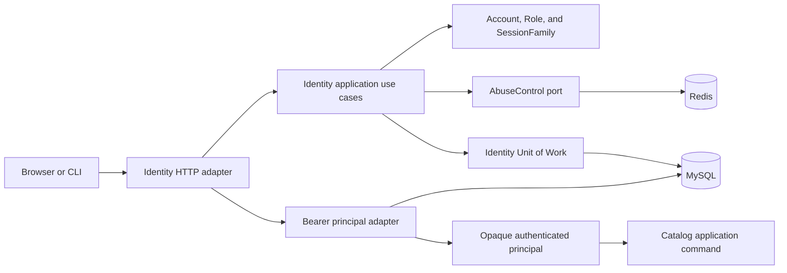

# Identity and session contract

## Scope and delivery gate

This contract defines the first administrator identity boundary for the
modular monolith. It covers accounts, password credentials, roles,
permissions, opaque sessions, browser and CLI transport, MySQL authority,
Redis abuse control, revocation, fixed failures, and the exact HTTP surface.

It does not define public customer identity, registration, self-service
password recovery, invitations, MFA, service accounts, API keys, social login,
OIDC federation, impersonation, or an administrator user interface. Those
capabilities require separate threat models and contracts. It does define the
narrow offline operator rebind needed after the password authenticator reaches
its mandatory failed-attempt limit; that is recovery of an existing
administrator authenticator, not a public recovery surface.

The backend contract can support a token-mediating browser client, but an
access credential visible to JavaScript remains stealable during XSS. A full
Backend for Frontend is the default recommendation for the privileged UI. No
such UI ships until a separate threat-model decision selects that pattern or
explicitly accepts the bounded token-mediating risk. The public showcase
continues to publish no administrator credential.

No route in this document exists yet. The four Identity routes and the first
administrative route may be registered only after all of these capabilities
are implemented and integration-tested together:

- the framework-independent Identity domain and application package;
- a reviewed forward-only MySQL migration and authoritative principal query;
- cryptographic token and Argon2id adapters plus offline first-admin and
  disabled-authenticator rebind commands, with no default or showcase
  credentials;
- an explicit Identity Unit of Work for login, rotation, reuse revocation,
  logout, and security events;
- a real Redis runtime and atomic Identity abuse-control adapter;
- reviewed trusted-ingress, exact credentialed CORS, cookie, Origin, Fetch
  Metadata, and CSRF behavior;
- the fixed Bearer `401`, authorization `403`, and Identity-owned cookie clear
  path in Problem Details and OpenAPI;
- secret-safe logs with Prisma driver-adapter debug/query output disabled,
  immutable security events, bounded cleanup, and operational metrics; and
- real MySQL, real Redis, HTTP, concurrency, failure, and production-composition
  tests proving the complete contract.

There is no development bypass, shared API key, hard-coded administrator,
caller-supplied principal, or configuration switch that skips a gate. The
transport choice is owned by
[ADR-0017](../adr/0017-use-split-browser-session-credentials.md); the broader
authorization decision remains
[ADR-0015](../adr/0015-authenticate-and-authorize-administrative-apis.md).

## Security and consistency objectives

The boundary follows these priorities:

1. A stolen refresh credential is detectable and revocable without storing a
   recoverable copy.
2. Suspension, revocation, password replacement, and permission changes affect
   the next privileged request.
3. Passwords, raw credentials, login identifiers, cookies, and network
   identifiers never enter logs or business modules.
4. Browser CSRF cannot cause credential issuance, rotation, or logout.
5. Password guessing and credential stuffing are bounded across replicas
   before expensive Argon2id work.
6. Dependency ambiguity never results in a new credential.

MySQL is the system of record. Redis may deny or defer credential issuance but
cannot authenticate a principal, grant a permission, keep a session alive, or
prove revocation.

## Module and dependency boundary



The business package is `@oms/identity` under `packages/modules/identity`.
Its root now exports its first runtime application use case,
`ResolveIdentityBearerPrincipal`, together with only its caller-facing
resolution types, `IdentityBearerResolutionUnavailableError`, and the
authenticated-principal type. Domain types and credential construction remain
package-internal. Domain and application code import no NestJS, Prisma, Redis
client, Node crypto, HTTP, or logging vendor.

Infrastructure adapters use explicit subpaths such as
`@oms/identity/infrastructure/prisma` and
`@oms/identity/infrastructure/cryptography`. Prisma construction stays in the
API composition root. Delivery belongs under
`apps/api/src/features/identity/delivery/http`; reusable Bearer extraction and
request association belong to the API authentication platform adapter.

The delivered `IdentityAccessAuthorityReader` is a package-internal,
digest-level persistence port. Its Prisma adapter executes the writer-MySQL
query, performs bounded relational mapping, and calls the package-internal
principal factory. It returns only an exact `resolved` result or one frozen
`rejected` singleton; unknown credentials and ordinary lifecycle ineligibility
are intentionally indistinguishable. `ResolveIdentityBearerPrincipal` is now
the application boundary that authenticates an already-extracted access-wire
value, calculates and authenticates its digest, invokes this port, and
runtime-authenticates the returned principal before releasing it.

The future API authentication platform adapter will only extract the Bearer
value, invoke that resolver, and associate its returned immutable principal
with the request. A business delivery adapter will map that value into its own
command context. Catalog never imports an Identity repository, role, account,
credential, digest, or resolver dependency and never queries an Identity
table. The concrete Prisma reader remains available only from
`@oms/identity/infrastructure/prisma`; credential internals remain absent from
the package root.

The principal contains exactly:

- canonical opaque `actorId`;
- canonical opaque `sessionId`; and
- a distinct, lexicographically sorted permission-code set.

It contains no login name, role name, account status, password metadata,
credential identifier, raw token, digest, cookie, IP address, or user agent.
The resolver fails closed if the result exceeds 16 active roles or 128
distinct permissions; those bounds prevent corrupt configuration from making
authority an unbounded request input.

### Bearer principal resolution application contract

`ResolveIdentityBearerPrincipal` accepts only one already-extracted primitive
token candidate. It does not receive an HTTP request or an `Authorization`
field, select among repeated fields, parse the `Bearer` scheme, trim input, or
associate state with a request. A non-string value, an entire
`Bearer <credential>` field value, or a string that is not the exact canonical
access-wire representation is malformed.

The resolver returns one of two recursively frozen exact outcomes: a
`resolved` outcome containing only an authentic
`IdentityAuthenticatedPrincipal`, or the shared `rejected` outcome containing
only its discriminator. Malformed access-wire input and ordinary authority
rejection use that same rejected value. Parsing failure stops before hashing;
ordinary authority rejection follows exactly one hash and one authority read.
Neither path reveals whether a credential was malformed, unknown, expired,
revoked, attached to an inactive Account, or otherwise ineligible.

An authentic wire wrapper is passed to the credential-cryptography port. The
resolver runtime-authenticates the resulting access-digest wrapper before the
authority read, then runtime-authenticates a resolved principal rather than
trusting a structurally convincing object. A known cryptography or authority
outage becomes the fixed, cause-free
`IdentityBearerResolutionUnavailableError`. Every other dependency,
representation, or authority-integrity failure becomes one fixed internal
failure. Neither failure retains a provider cause or includes the presented
wire value, digest, SQL, identifier, or permission. An outage is never
misreported as credential rejection, and corruption is never converted into
partial authority.

The isolated real-MySQL authority suite composes this use case with the
production Node SHA-256 factory and Prisma reader. It proves one canonical wire
through to a current principal. Its loopback TCP listener accepts a connection
but never performs the MySQL handshake, proving that a connect/handshake stall
becomes the public unavailable failure rather than rejection. It does not test
an established connection or in-flight query. HTTP remains outside that test
because no transport is composed yet.

Keeping HTTP extraction outside this use case makes the same application
policy reusable by a later NestJS adapter or another trusted delivery adapter.
It also creates a deliberate split: the transport must independently enforce
the exactly-one-header and scheme grammar before calling the resolver. Passing
the raw request into Identity would make application policy depend on a
framework; accepting a digest at the public boundary would let callers bypass
canonical wire validation and target-kind hashing.

### Authenticated principal application contract

`IdentityAuthenticatedPrincipal` is the first public `@oms/identity`
application contract. Its runtime value has exactly three own enumerable
members in this order:

| Field | Application rule |
| --- | --- |
| `actorId` | Canonical lowercase UUIDv7 for the authenticated account, exposed only as an opaque string. |
| `sessionId` | Canonical lowercase UUIDv7 for the authoritative SessionFamily, exposed only as an opaque string. |
| `permissions` | A copied and frozen array of zero through 128 canonical permission codes, already distinct and ASCII-lexicographically sorted. |

The public type carries a non-exported nominal brand that has no runtime
property. The package root exports no principal factory, credential parser,
digest constructor, Account/Role/SessionFamily type, fact, or snapshot. This
does not make TypeScript a security boundary—a cast can always lie—but it
prevents ordinary structural assignment from accidentally constructing a
trusted principal. Runtime trust comes only from the Identity authority mapper,
the resolver's runtime-authentic principal check, and the future server-owned
request association.

Package-internal
`createIdentityAuthenticatedPrincipalFromAuthority(value: unknown)` is the
only production factory. Its authority-evidence input has exactly `actorId`,
`sessionId`, `activeRoleCount`, and `permissions`; the output deliberately drops
the role count and has only the three public fields. It validates both
identifiers with their separate Identity namespaces, requires an integer role
count from zero through 16, requires a real permission array bounded before
iteration, and validates every permission with the application-owned grammar.
Zero roles requires zero permissions; one through 16 active roles may validly
produce an empty permission set. Actor and session IDs may contain the same
UUID bytes because they identify different namespaces.

The implemented authority mapper bounds raw join rows, counts distinct active roles,
deduplicates permission codes legitimately repeated through different roles,
sorts them in ASCII order, and enforces the 128-distinct-code ceiling before it
calls the strict factory. The factory rejects duplicate or unsorted values in
that already canonical evidence rather than sorting, deduplicating, trimming,
or otherwise hiding a mapper defect. It copies only validated primitives before
recursively freezing the permission array and principal record.

Every malformed shape, value, bound violation, or ordering failure, plus any
exception thrown during bounded reflection or property reads, collapses to the
fixed, cause-free `InvalidIdentityAuthenticatedPrincipalError`; errors never
echo an identifier or permission. A Proxy that exposes valid data may be copied
safely—the contract does not claim JavaScript can identify every Proxy or
survive non-terminating or process-ending code. Zero roles and permissions is
valid authentication and leaves later command authorization to return its
ordinary `403`. Invalid or oversized authoritative evidence later becomes the
fixed internal authority failure, never credential `401`, permission `403`, or
partial authority.

The alternative is a public structural interface plus constructor, or passing
Identity Account/Role records into business modules. A public constructor is
convenient for fixtures but invites caller-created trust objects; Identity
records couple every module to authentication persistence and expose data it
does not need. The nominal contract requires explicit trusted test fixtures,
while the narrow resolver export preserves the one-way dependency without
exposing a general authority-construction API.

## Domain boundaries and lifecycle

| Boundary | Ownership and invariants |
| --- | --- |
| `Account` aggregate | Canonical login, `ACTIVE`, `SUSPENDED`, or terminal `DEACTIVATED`, and optimistic version. Roles and password state are not loaded into this aggregate. |
| `PasswordAuthenticator` aggregate | One account key, `ACTIVE` or `REBIND_REQUIRED`, Argon2id PHC value, optimistic version, bounded consecutive failures, and the next permitted verification instant. It is separate because rejected login mutates this hot state without changing Account. |
| `Role` aggregate | Immutable code, display name, `ACTIVE` or terminal `RETIRED`, optimistic version, and a bounded permission set. |
| `SessionFamily` aggregate | Stable session identifier, one account, absolute and idle deadlines, revocation, only the current command's presented/successor refresh entities, and the access entity issued by that command. It never loads access or refresh history. |
| `Permission` reference | Immutable application-owned permission code seeded by a reviewed migration. |
| `SecurityEvent` record | Logically append-only evidence with a closed action type, compatible outcome/reason pair, and typed context; it is not a mutable aggregate. |
| Authority read model | One purpose-built current-state projection returning only the authenticated principal. |

An active account may be suspended and resumed. Active or suspended accounts
may be deactivated; deactivation is terminal. Suspension, deactivation, and
password replacement revoke all active session families in the same
transaction. Roles may be retired but not restored. Role and permission
changes become visible through the next authority read and do not mutate token
records.

The first Account slice defines and rehydrates exactly these
persistence-facing fields:

| Field | Domain rule |
| --- | --- |
| `id` | Canonical lowercase UUIDv7. |
| `loginName` | Canonical 3-through-64-character ASCII login while the account is active or suspended; it may be `null` only after a separately versioned erasure of a deactivated account. |
| `status` | `ACTIVE`, `SUSPENDED`, or terminal `DEACTIVATED`. |
| `version` | Positive unsigned 32-bit optimistic version; creation is version 1 and every lifecycle transition advances it once. |
| `createdAt`, `updatedAt` | MySQL-range UTC instants with exactly six fractional digits; time never regresses and creation initializes both to the same value. |
| `suspendedAt` | Current-state marker. It equals `updatedAt` while suspended and is cleared by resume or deactivation; historical suspensions belong in security events. |
| `deactivatedAt` | Terminal marker. It is `null` before deactivation, equals `updatedAt` on the terminal transition, and remains the original deactivation time after later erasure. |

The currently reachable snapshots are deliberately narrower than the future
table: Active is version 1 or an odd version from 3 onward, Suspended is an
even version from 2 onward, and Deactivated may be any version from 2 onward.
A deactivated account retaining its login is unchanged since the terminal
transition, so `deactivatedAt` equals `updatedAt`. A retention tombstone has a
null login, version 3 or later, and may have a later `updatedAt`; the version
advance makes erasure visible to optimistic concurrency even though the
business lifecycle remains terminal. Snapshot rehydration rejects missing or
unknown fields, invalid chronology, and impossible lifecycle combinations.
This slice exposes no erasure command; the retention policy and its security
event remain a later contract.

Account creation and lifecycle methods return a new immutable aggregate plus
a frozen, login-free in-process domain fact. These facts are not
`identity_security_events`, integration events, or permission to publish.
The future application Unit of Work maps them to closed security-event rows
and performs required session-family revocation in the same MySQL transaction.
Optimistic version is checked before lifecycle state, mutation time is checked
after lifecycle state, and version capacity is checked last; this fixes stable
failure precedence without accepting stale commands or regressing time.

### Role and permission state contract

A permission code is a stable application-owned policy identifier, not
operator-authored content. It has exactly three dot-separated ASCII segments
representing bounded context, resource, and action. Every segment starts with a
lowercase letter, contains only lowercase letters, digits, or single internal
hyphens, and is at most 32 characters; the complete code is at most 98
characters. Empty segments, underscores, consecutive or edge hyphens,
wildcards, surrounding whitespace, case folding, and silent normalization are
rejected. This intentionally supports codes such as
`catalog.product-variants.read` without admitting wildcard policy semantics.
The application layer later verifies that a syntactically valid code exists in
the immutable permission registry before Role creation, grant, or revoke. This
makes a syntactically valid typo an explicit application failure instead of a
silent absent-mapping no-op; the foreign key remains the final write backstop.

The Role snapshot contains exactly `id`, `code`, `displayName`, `status`,
`permissions`, `version`, `createdAt`, `updatedAt`, and `retiredAt`:

| Field | Domain rule |
| --- | --- |
| `id` | Canonical lowercase UUIDv7. |
| `code` | Immutable 3-through-64-character uppercase ASCII identifier with single internal underscores; uniqueness is enforced transactionally by persistence. |
| `displayName` | Operator-facing NFC Unicode text from 1 through 100 code points, with only non-repeated internal U+0020 spaces and no surrogate, control, format, private-use, or unassigned code point. It is never authorization input. |
| `status` | `ACTIVE` or terminal `RETIRED`; a retired role cannot be renamed or have its mappings changed. |
| `permissions` | Frozen, distinct, ASCII-lexicographically sorted permission codes, with cardinality from 0 through 128. An empty active role safely grants nothing. |
| `version` | Positive unsigned 32-bit optimistic version; creation is version 1 and every effective rename, mapping change, or retirement advances it once. |
| `createdAt`, `updatedAt` | Lossless MySQL-range UTC instants; creation initializes both to the same value and time never regresses. |
| `retiredAt` | `null` while active; equal to `updatedAt` after the terminal transition. |

Creation accepts permissions in any order, rejects duplicate entries as a
caller/configuration defect, and stores the canonical sorted set. Rehydration
is stricter: it rejects extra or missing snapshot fields and any permission
array that is not already distinct and sorted, so persistence corruption is
not silently repaired. An Active version-1 snapshot has
`createdAt = updatedAt` and no retirement time. A Retired snapshot has version
at least 2 and `retiredAt = updatedAt`. Equal mutation instants remain valid
because the version is the concurrency order.

Role exposes explicit `grantPermission` and `revokePermission` operations
instead of replacing the complete set. That prevents a stale administrator
from accidentally overwriting unrelated grants and produces one precise audit
fact per effective change. Granting an existing or revoking an absent
permission, and renaming to the current display name, returns the original
aggregate unchanged, consumes no version, and emits no fact. Removing the last
permission is allowed; retiring a role is a separate terminal business
decision. This deliberately permits a temporarily empty Active role: it is
operationally visible but grants nothing, while forcing retirement would make a
temporary least-privilege response irreversible. Account-role assignments
remain outside both Account and Role so their independent hot paths do not
create oversized aggregates.

An account may have at most 16 total role assignments, including assignments
to roles later retired. The composite database key prevents a duplicate pair,
but a row-count invariant cannot be expressed by a row-local check. The future
assignment Unit of Work locks the Account before the Role, counts the Account's
complete assignment set under that transaction, and conditionally inserts only
below the bound. The authority mapper independently fails closed above 16
active roles, so persistence corruption cannot become partial authority.

Every mutation validates expected version, Active lifecycle, and its new value
before deciding whether it is a no-op. Effective changes then validate
occurrence time and permission capacity where applicable, followed by version
capacity. This stable precedence rejects stale commands first while allowing a
semantic no-op carrying the current expected version to succeed without
requiring a new database time. A replay carrying the pre-change version still
fails optimistic concurrency; durable command idempotency owns lost-response
replay. Changed operations return a new immutable Role and a frozen fact
tuple. Creation emits `ROLE_CREATED` followed by one
`ROLE_PERMISSION_GRANTED` fact per initial mapping in canonical order; every
other effective operation emits one fact and unchanged operations emit none.
Facts contain only type, opaque role ID, resulting status, version, occurrence
time, and—for a mapping change—the non-secret permission code; display names
and complete permission sets are excluded. They are inputs to the future
application Unit of Work, not integration events or permission to publish.

Because Unicode normalization does not prevent homoglyphs, every
administrator-facing role selector or confirmation renders the immutable ASCII
role code beside the display name. The application contract must also define
reserved `SYSTEM_` code ownership and last-administrator protection before any
remote role-management route is enabled; those cross-aggregate policies do not
belong inside Role.

The alternative is a generic RBAC entity with mutable role names and bulk
mapping replacement. It is simpler to scaffold but makes role labels part of
business policy, expands lost-update risk, and obscures audit intent. The
chosen aggregate costs more explicit commands and requires the future Unit of
Work to check the permission registry and persist a Role row plus mapping
delta atomically. In return, business modules depend only on stable permission
codes, authority remains least-privilege, and role retirement preserves
evidence without creating a permanent wildcard administrator.

### PasswordAuthenticator state contract

The PasswordAuthenticator snapshot contains exactly `accountId`,
`passwordPhc`, `status`, `version`, `consecutiveFailureCount`,
`nextVerificationAt`, `disabledAt`, `createdAt`, `updatedAt`, and
`passwordChangedAt`. The PHC is held by an immutable redacting value rather
than a string property; only an explicitly named package-internal serializer
may reveal it to the future crypto and persistence adapters. Ordinary object
inspection, interpolation, and JSON serialization cannot reveal the PHC.

| State | Reachable snapshot |
| --- | --- |
| Fresh `ACTIVE` | Version 1, count 0, no deadline or disabled time, and `createdAt = updatedAt = passwordChangedAt`. |
| `ACTIVE`, count 0 through 4 | No deadline or disabled time. A positive count requires version at least `count + 1`. |
| `ACTIVE`, count 5 through 99 | No disabled time and `nextVerificationAt` equals `updatedAt + min(2^(count - 5), 900) seconds` exactly. A positive count requires version at least `count + 1`. |
| `REBIND_REQUIRED` | Count exactly 100, no deadline, `disabledAt = updatedAt`, and version at least 101. |

Every state requires `createdAt <= passwordChangedAt <= updatedAt`. Equal
authoritative database instants are valid because the version orders
mutations. Cooldown derivation uses lossless Gregorian calendar arithmetic and
retains all six fractional digits; JavaScript `Date` is never an input. A
deadline beyond MySQL's maximum instant is a fixed overflow failure and leaves
the original aggregate unchanged. Attempt 100 performs no deadline
calculation.

Before Argon2 work, the aggregate returns only one of two frozen plans:
`VERIFY_PRESENTED_PASSWORD` or `VERIFY_DUMMY_PASSWORD`. Cooling and
`REBIND_REQUIRED` authenticators use the same dummy plan, so delivery cannot
infer a reason from the type. A real plan contains a frozen internal
verification basis with account ID, version, redacting PHC, and current
deadline. After work completes, the locked aggregate must match that complete
basis before accepting the result. One fixed snapshot-mismatch failure covers
version, PHC, deadline, and cross-account races; it never reveals which value
changed.

An eligible failed verification increments the count and version once.
Failures 1 through 99 return one `PASSWORD_VERIFICATION_REJECTED` fact. Failure
100 atomically enters `REBIND_REQUIRED` and returns that fact followed by
`PASSWORD_AUTHENTICATOR_DISABLED`. Recording a result while cooling or
disabled is a fixed misuse/race failure, not a no-op; the normal login path did
dummy work and never calls the mutation.

An eligible successful verification resets any positive count and deadline.
It may also install a byte-different, already-validated upgraded PHC in the
same single-version mutation. A verifier upgrade does not change
`passwordChangedAt`. If there is neither state to reset nor a real upgrade,
the operation returns the original aggregate unchanged, emits no fact, and
does not consume version capacity. Changed results emit
`PASSWORD_AUTHENTICATOR_FAILURES_RESET` then
`PASSWORD_AUTHENTICATOR_VERIFIER_UPGRADED` for the changes that occurred.

Rebind requires the exact expected version, `REBIND_REQUIRED`, a
non-regressing database instant, and a byte-different validated PHC. It returns
the authenticator to `ACTIVE`, clears count/deadline/disabled time, advances
the version once, sets `updatedAt = passwordChangedAt`, and emits
`PASSWORD_AUTHENTICATOR_REBOUND`. Active Account validation, session-family
revocation, and the durable rebind security event remain responsibilities of
the future application Unit of Work.

All authenticator facts are frozen and contain only type, opaque account ID,
resulting status, version, and occurrence time. They contain no PHC, password,
candidate, salt, tag, verifier parameters, count, deadline, or disabled time.
The stable mutation precedence is verification basis—or expected version for
rebind—then required lifecycle, occurrence time and cooldown eligibility, new
PHC validation where applicable, version capacity, and derived-deadline
overflow. Rehydration collapses every malformed secret or state cause to one
fixed, cause-free snapshot error.

### SessionFamily core state contract

SessionFamily owns the durable lifetime and terminal revocation of one login
session. Expiry is derived from authoritative time and is never persisted as a
status. The first bounded implementation deliberately excludes refresh
rotation: rotation lands only with the locked presented-credential and
successor entities so consuming a predecessor, linking its successor, moving
the family deadline, and detecting replay cannot become separate partial
operations.

The family snapshot contains exactly `id`, `accountId`, `version`, `createdAt`,
`lastRotatedAt`, `refreshIdleExpiresAt`, `refreshAbsoluteExpiresAt`,
`revokedAt`, and `closedReason`:

| Field | Domain rule |
| --- | --- |
| `id` | Externally visible canonical lowercase UUIDv7, branded separately from Account, Role, and credential identifiers. |
| `accountId` | Canonical owning Account identifier; ownership never changes. |
| `version` | Positive unsigned 32-bit version. Creation is version 1; every effective rotation or revocation advances it once. Open families stop at 4,294,967,294 so the final value remains available for terminal revocation. |
| `createdAt`, `lastRotatedAt` | Lossless MySQL-range UTC instants. Creation makes them equal; rotation may use an equal database instant but never an earlier one. |
| `refreshIdleExpiresAt` | Strictly after `lastRotatedAt`, no more than 24 hours later, and no later than the absolute deadline. It gates refresh only. |
| `refreshAbsoluteExpiresAt` | Exactly 1 through 30 whole days after creation and immutable for the complete family. It gates refresh and every access credential. |
| `revokedAt`, `closedReason` | Both null or both present. Revocation time is not before `lastRotatedAt`; the first reason and time are terminal and may be recorded after either deadline. |

The initial refresh-idle lifetime is an integer from 900 through 86,400
seconds, the absolute lifetime is an integer from 86,400 through 2,592,000
seconds, and idle cannot exceed absolute. Creation derives both deadlines from
one database instant with Gregorian, microsecond-preserving arithmetic and no
JavaScript `Date`. An absolute deadline beyond MySQL year 9999 is a fixed
overflow failure. Version-1 open families and version-2 families revoked
without rotation retain `createdAt = lastRotatedAt` and the initial lifetime
bounds. `REFRESH_REUSE_DETECTED` is reachable only on a revoked version-3-or-
later family because consuming the predecessor and installing its successor
must have advanced the family before replay can be concluded. A retained
rotated snapshot has at least one whole second and at most 24 hours from its
last rotation to its idle deadline. When the idle deadline is before the
absolute deadline, the configured 15-minute minimum still applies; the one-
second minimum applies only when the idle deadline equals the earlier absolute
cap.

Version also constrains when the retained last rotation could have happened.
An open version `v` records `v - 1` rotations; a revoked version records
`v - 2`, with revocation consuming the other post-creation version. For one
through 29 rotations, `lastRotatedAt` must be strictly before `createdAt` plus
that count multiplied by 24 hours: every predecessor had an idle deadline no
more than 24 hours after its rotation, and refresh at that deadline is already
expired. At 30 or more rotations, `lastRotatedAt < refreshIdleExpiresAt <=
refreshAbsoluteExpiresAt` and the 30-day absolute maximum already impose the
stronger bound. This rejects a row claiming one late rotation weeks after its
only possible predecessor had expired without retaining complete history.

At one authoritative observation instant, the derived family state is:

1. `REVOKED` when the terminal pair is present;
2. otherwise `ABSOLUTELY_EXPIRED` when observation is equal to or after the
   absolute deadline; or
3. otherwise `AUTHENTICATING`.

Idle expiry is intentionally absent from that state. An access credential may
remain valid after refresh inactivity until its own expiry or the family
absolute deadline. Observation before the current mutation high-water mark
(`revokedAt` when present, otherwise `lastRotatedAt`) is a fixed clock-
regression failure, not a historical query.

The initial closed-reason registry is exactly `LOGOUT`,
`SESSION_LIMIT_REACHED`, `ACCOUNT_SUSPENDED`, `ACCOUNT_DEACTIVATED`,
`PASSWORD_REPLACED`, `PASSWORD_REBOUND`, and `REFRESH_REUSE_DETECTED`. Generic
revocation accepts every listed reason except `REFRESH_REUSE_DETECTED`; only
the future consumed-credential branch may establish that security conclusion.
Generic revocation is server-coordinated from the current locked family and
therefore takes no client or discovery-time expected version. The first
effective caller advances the version and emits `SESSION_FAMILY_REVOKED`; a
later caller reloads the terminal row, returns it unchanged, and cannot replace
the first reason. Persistence still compares or locks the versioned row.

Creation and effective revocation return a new immutable family and a frozen
nonempty fact tuple; unchanged revocation returns the original family and an
empty frozen tuple. Facts contain only type, opaque session and account IDs,
derived state, resulting version, occurrence time, and the closed reason when
applicable. Deadlines, raw credentials, digests, credential IDs, sequences,
cookies, network attributes, and user-agent data are excluded. Rehydration
requires exact fields and collapses every malformed value, chronology,
lifetime, and lifecycle cause to one fixed cause-free error.

The alternative is a stored `ACTIVE`/`EXPIRED` flag or a family-only rotation
method. A stored expiry flag becomes stale without a write at every deadline;
a partial rotation method could extend a family without consuming the refresh
row. Deriving expiry and deferring rotation costs one additional domain
increment, but preserves one authoritative clock and makes the future
consume/link/extend/replay decision atomic.

### RefreshCredential and atomic presentation contract

RefreshCredential is a versionless child entity of SessionFamily. The family
version serializes both family lifecycle and child rotation; adding a child
version or carrying a discovery-time family version could suppress replay
detection. A refresh command loads only its locked presented child and, on
success, constructs one successor. It never loads the complete credential
history.

The exact RefreshCredential snapshot is:

| Field | Domain rule |
| --- | --- |
| `id` | Canonical lowercase UUIDv7 branded separately from session, account, role, and future access-credential identifiers. |
| `sessionId` | Immutable owning SessionFamily identifier; it maps to `family_id` in persistence. |
| `sequence` | Generation number from 1 through 4,294,967,294. The reserved terminal family version makes the unsigned maximum unreachable; the initial credential is sequence 1 and each successor advances exactly once. |
| `issuedAt`, `expiresAt` | Lossless UTC instants. Expiry is strictly later by at least one whole second and no more than 24 hours. |
| `consumedAt`, `successorId` | Both null for the current credential or both present for a consumed predecessor. Consumption never changes again. |

A consumed row requires `issuedAt <= consumedAt < expiresAt`, a successor ID
different from its own ID, and sequence below 4,294,967,294 because no later
credential could otherwise exist. Sequence 1 has an exact whole-second
lifetime from 900 through 86,400 seconds with the same fractional digits as
issuance. Later credentials may have a shorter or fractionally different
interval only when the family relationship proves that their expiry is the
absolute cap. The entity contains no digest, raw value, status, account ID,
`updatedAt`, IP address, user agent, or cookie data. Rehydration requires exact
fields, freezes the snapshot, and collapses every malformed value or intrinsic
lifecycle cause into one fixed cause-free error.

For a locked family, its current credential sequence is the family version
minus one only when the family is revoked; otherwise it equals the family
version. Every presented credential must share the family ID, have sequence no
greater than that current sequence, be issued no earlier than family creation,
and expire no later than the immutable absolute deadline. Sequence 1 is issued
exactly at family creation. For sequences 2 through 30, issuance is strictly
before creation plus `(sequence - 1) * 24 hours`; the 30-day absolute maximum is
stronger afterward. For consumed sequences 1 through 29, consumption is
strictly before creation plus `sequence * 24 hours`; the absolute bound is
stronger afterward.

An unconsumed presented row must be the exact current child: its sequence
equals the current sequence, its issuance equals `lastRotatedAt`, and its
expiry equals `refreshIdleExpiresAt`. A consumed row must be historical: its
sequence is lower than the current sequence and its consumption time is no
later than `lastRotatedAt`. For a later sequence, an expiry interval below 15
minutes or with different fractional digits is valid only when expiry equals
the family absolute deadline. These combined rules detect partial or corrupt
cross-table state without loading token history.

Family creation now requires caller-generated `initialRefreshCredentialId`
and `initialAccessCredentialId` candidates in addition to the family/account
IDs, refresh lifetimes, access lifetime, and occurrence time. It returns the
derived sequence-1 children in the same frozen result as
`initialRefreshCredential` and `initialAccessCredential`. Both issuance times
equal creation. Refresh expiry equals the initial idle deadline; access expiry
uses its configured lifetime because the one-day minimum family absolute life
is longer than the thirty-minute maximum access life. No standalone credential
fact is emitted: the existing family-created fact is the business occurrence.
The future login Unit of Work accepts that complete result and cannot persist
a family or either child through an independent save operation. Before calling
creation it holds the owning Account lock, proves the Account is Active, and
requires the authoritative occurrence time to be no earlier than
`account.updatedAt`.

Creation preserves its existing validation prefix, then appends access
validation: `occurredAt`, family ID, account ID, initial refresh ID, refresh-idle
lifetime, refresh-absolute lifetime, initial access ID, then access lifetime.
Only after all eight values pass does it derive deadlines or construct any
entity. Initial access, refresh, and family IDs may share the same UUID bytes
because their brands and tables are separate namespaces; no invariant or
lookup relies on global UUID uniqueness.

The only refresh presentation operation is
`SessionFamily.presentRefreshCredential({ account,
presentedRefreshCredential, occurredAt, successorRefreshCredentialId,
refreshIdleLifetimeSeconds, issuedAccessCredentialId,
accessLifetimeSeconds })`. It receives the locked current Account, the locked
presented RefreshCredential, one authoritative time, candidate successor
refresh and issued-access IDs, and the two configured lifetimes. It receives no
raw credential, digest, caller-supplied deadline, expected sequence, or family
version from non-locking lookup. It validates the Account/family ownership
relationship and requires `account.createdAt <= family.createdAt`. It records
the locked account version in the write basis; Account itself is never mutated
by refresh.

The operation returns one exact frozen union:

- `rotated` contains exact members `kind`, `basis`, `sessionFamily`,
  `consumedRefreshCredential`, `successorRefreshCredential`,
  `issuedAccessCredential`, and `facts`;
- `reuse-detected` contains exact members `kind`, `basis`, `sessionFamily`,
  `reusedRefreshCredential`, and `facts`; or
- `rejected` contains exact members `kind`, `sessionFamily`,
  `presentedRefreshCredential`, and `facts`, with no detailed reason.

The rotated refresh child is a new immutable consumed view of the predecessor;
the successor refresh and issued access records share the next sequence and
issuance instant. The reuse and rejection children are their original object
references. The Account never appears in a result.

The changed variants' write basis contains exactly `accountId`, locked
`accountVersion`, `sessionId`, prior `sessionFamilyVersion`,
`presentedRefreshCredentialId`, and `presentedRefreshCredentialSequence`. It is
a frozen conditional-write projection, not an aggregate snapshot. It contains
no Account object, login name, Account status, credential value or digest,
deadline, consumption time, successor ID, or request data. Rejected results
carry no write basis because no state may be persisted.

Expected invalid-session conditions use the indistinguishable rejected shape.
Malformed input, impossible persisted relationships, time regression,
using the presented credential ID as its own successor, and capacity
exhaustion are fixed cause-free domain errors. A collision with any other
stored credential cannot be known by this bounded aggregate and is instead a
sanitized infrastructure/Unit-of-Work failure. Only the two changed variants
are accepted by the future write port; there is no independent save-family,
consume-credential, link-successor, or replay method.

The exact new fixed error taxonomy is
`InvalidIdentityRefreshCredentialStateError` for strict child rehydration,
`InvalidIdentitySessionFamilyRefreshStateError` for type, ownership, or
combined reachability,
`IdentitySessionFamilyRefreshTimestampRegressionError` for authoritative time
before `account.updatedAt` or before
`family.revokedAt ?? family.lastRotatedAt`,
`IdentitySessionFamilyRefreshSuccessorConflictError` when the candidate equals
the presented child ID, and
`IdentitySessionFamilyRefreshCapacityExhaustedError` when rotation would
consume the reserved terminal version. Credential ID, sequence, and idle
lifetime parsers retain their own fixed validation errors.

Validation and security precedence is exact:

1. Prove Account/family/credential types, ownership, and combined reachability,
   then parse authoritative time and reject regression against both locked
   aggregates.
2. An already-revoked family or observation equal to or after its absolute
   deadline returns rejected and never replaces a terminal reason.
3. Inspect credential consumption before Account activity, family idle expiry,
   credential expiry, successor input, or idle configuration.
4. A consumed historical credential while the family is open and absolutely
   valid closes the family for reuse even when the predecessor or family idle
   window has expired. An inactive Account with an anomalously open family does
   not suppress this fail-secure conclusion.
5. Only an unconsumed branch requires an Active Account, strict future family
   idle and credential deadlines, and at least one whole second through the
   absolute deadline. Equality at any expiry is rejected.
6. Only then parse the successor refresh ID, parse the refresh-idle lifetime,
   reject reuse of the predecessor ID, and prove family/refresh sequence
   capacity, in that exact order. This preserves the already accepted refresh
   failure precedence.
7. Parse the issued access ID and access lifetime, then construct the complete
   changed bundle. Reuse and rejection never read either access input.

Successful rotation changes the predecessor only by setting consumption time
to the transaction instant and linking the candidate successor. The successor
uses the same family, the next sequence, that instant as issuance, and
`min(occurredAt + idle lifetime, absolute expiry)` as expiry. The family moves
`lastRotatedAt` and idle expiry to those same values and advances once. If
adding the idle lifetime would exceed MySQL year 9999, the valid earlier
absolute deadline is the cap rather than an overflow failure. The issued access
record uses that same next sequence and occurrence time, with expiry
`min(occurredAt + access lifetime, absolute expiry)` independently of refresh
idle expiry. The family still advances exactly once. The result emits one
`SESSION_FAMILY_REFRESH_ROTATED` fact containing only session and account IDs,
`AUTHENTICATING`, resulting family version, and occurrence time. Replay uses
the existing `SESSION_FAMILY_REVOKED` fact narrowed to
`REFRESH_REUSE_DETECTED`. Neither fact contains credential IDs, sequences,
deadlines, tokens, or digests.

An open family at unsigned maximum could no longer record logout, account
revocation, or replay. Therefore open snapshots at 4,294,967,295 are invalid,
rotation refuses to advance an open 4,294,967,294 family, and terminal
revocation may consume the reserved final value. This sacrifices one
theoretical rotation from a range that operational limits cannot approach and
preserves fail-secure closure under every reachable state.

Non-locking digest discovery may return identifiers only. The transaction
reloads Account, current family, and presented credential in global lock order
and never compares a discovery-time version. In a two-refresh race, the winner
consumes the predecessor, inserts and links its successor, and advances the
family. The loser then reloads the newer family plus consumed predecessor and
closes the family for replay. If the winner rolls back, the loser sees the
predecessor unconsumed and may rotate; a lost committed response followed by a
retry intentionally closes the family.

The direct MySQL rotation trace has an important immediate-constraint ordering.
With both one-unconsumed-slot uniqueness and a self-referencing successor
foreign key, it must first mark the predecessor consumed and clear its active
slot, then insert the successor refresh with slot `1`, insert the access record
that references that generation, link the predecessor, and finally update the
family plus projection/event state. A database check requiring consumption
time and successor ID to become
non-null in the same statement would make every order impossible because
MySQL cannot defer those constraints. Persistence therefore enforces the
weaker rule that a successor implies consumption; the domain and Unit of Work
require the final pair and access record, assert every affected-row count, and
roll back every intermediate state on failure. Login similarly inserts family,
initial refresh, then initial access. Real-MySQL failure-injection and
two-refresh race tests are mandatory before any use case is exported.

A definite primary-key, digest, or successor collision during insertion also
rolls back the complete transaction and discards every raw candidate. The
application may boundedly regenerate and retry in a new transaction or return
one sanitized internal failure; it cannot reinterpret an infrastructure
collision as a completed domain transition. An indeterminate commit is never
automatically retried: candidates are discarded and the operation returns a
sanitized unavailable result. In particular, retrying an ambiguous refresh
internally could observe the predecessor as consumed and close the family for
replay.

### AccessCredential and complete issuance result

AccessCredential is a versionless, immutable SessionFamily issuance record.
It is created with the initial refresh generation or one successful refresh
generation, but SessionFamily never loads access history to rotate or revoke.
Old unexpired access rows intentionally coexist after refresh; family and
Account joins, rather than per-access mutation, govern terminal validity.

Its exact domain snapshot is:

| Field | Domain rule |
| --- | --- |
| `id` | Canonical lowercase UUIDv7 branded separately from every other Identity identifier. |
| `sessionId` | Immutable owning SessionFamily identifier; it maps to `family_id` in persistence. |
| `sequence` | The existing `IdentityRefreshCredentialSequence` from 1 through 4,294,967,294. It identifies the exact refresh generation that issued this access record; it is not an optimistic version. |
| `issuedAt`, `expiresAt` | Lossless UTC instants. Expiry is at least one whole second and no more than 1,800 seconds after issuance. |

The entity contains no raw credential, digest, account ID, status, permission
claim, lifecycle version, `updatedAt`, request data, or transport metadata. It
has no mutation or isolated `isValid` method because authentication always
depends on AccessCredential, its paired refresh generation, SessionFamily,
Account, and current permission state together. Strict rehydration accepts
only the five exact fields, copies and freezes them, and collapses every
malformed value or intrinsic chronology cause to the fixed cause-free
`InvalidIdentityAccessCredentialStateError`.

`IdentityAccessCredentialId` has a fixed
`InvalidIdentityAccessCredentialIdError`. Configured
`IdentityAccessLifetimeSeconds` is an integer from 300 through 1,800 with
constants `MIN_IDENTITY_ACCESS_LIFETIME_SECONDS` and
`MAX_IDENTITY_ACCESS_LIFETIME_SECONDS` and a fixed
`InvalidIdentityAccessLifetimeSecondsError`. Local rehydration deliberately
permits an actual interval from one through 1,800 seconds and permits different
fractional digits: a family absolute cap can create either shape. It never
silently expands a capped interval to the configured minimum.

Package-internal `IdentityAccessCredential.issueForSessionFamily` is the only
factory, and SessionFamily is its only production caller. Initial issuance is
sequence 1 at family creation. Refresh issuance uses the successor refresh
sequence and exact issuance instant. In both paths expiry is the earlier of
`issuedAt + access lifetime` and family absolute expiry. If addition would
exceed MySQL year 9999, the already valid earlier absolute deadline is the cap.
Refresh idle and refresh-credential expiry never cap access. There is no
standalone access issue/save operation, and neither the entity nor its factory
is exported from the package root.

Every durable AccessCredential must have one exact issuance witness:

- `(sessionId, sequence)` equals one retained RefreshCredential generation;
- `access.issuedAt` equals that refresh generation's `issuedAt`;
- sequence is no greater than the family's current sequence;
- `family.createdAt <= access.issuedAt <= family.lastRotatedAt`;
- access expiry is no later than family absolute expiry; and
- unless access expiry equals the family absolute cap, issuance and expiry have
  matching fractional digits and the interval is from 300 through 1,800 whole
  seconds.

The paired refresh row is immutable issuance evidence only. Authority never
requires it to remain unconsumed or unexpired, and it never compares access
expiry with refresh idle or refresh expiry. A prior access credential may
therefore remain valid after a later rotation until its own expiry, family
closure/absolute expiry, or Account inactivation.

The existing `SESSION_FAMILY_CREATED` and
`SESSION_FAMILY_REFRESH_ROTATED` facts are the complete business occurrences;
no access-issued fact is added. Facts still exclude every credential ID,
sequence, deadline, raw value, and digest. The refresh conditional-write basis
also remains its exact six prior locked fields: the issued access record is new
insert state, not an optimistic condition.

Future issuance persistence accepts only the complete creation or rotated
bundle. Login commits family, initial refresh/access digests, authenticator
changes, limit eviction, permission projection, and events together. Refresh
commits predecessor consumption, successor refresh/access digests, link,
family advance, projection, and event together. Failure after any step rolls
back all of them. Raw `oms_at_v1_...` and `oms_rt_v1_...` candidates and SHA-256
digests remain application/crypto-adapter material outside domain state. Only
a confirmed commit permits returning the raw access value or setting the
refresh cookie; rejection, reuse closure, rollback, collision, and
indeterminate commit discard candidates.

The alternative is a digest-only access row without generation provenance or
a standalone issuance service. Both are smaller, but neither can prove that a
retained access row belongs to an actual refresh occurrence, and a separate
service can commit rotation without the access record required by the
response. The sequence and foreign key cost four bytes plus one unique indexed
join per protected request and couple cleanup order. In return they enforce at
most one access record per refresh generation, make issuance time
referentially auditable, and let authority fail closed on cross-row corruption
without loading unbounded history.

The alternative is separate family rotation and credential mutation methods,
or a grace period that recovers the prior successor. Separate methods admit
partial in-memory and durable state. Recovery requires retaining or deriving a
raw successor and creates a theft window. The composite strict transition
costs legitimate re-login after concurrent refresh or a lost response and
requires client single-flight coordination, but keeps raw refresh values
unrecoverable and makes replay handling deterministic.

An account has at most five authenticating session families, where
authenticating means unrevoked and before absolute expiry; refresh idle expiry
does not make a still-valid access credential disappear. Login holds the
Account lock and, when the limit is reached, revokes the oldest family by
`(createdAt, id)` with reason `SESSION_LIMIT_REACHED` before inserting the new
family. A concurrent login therefore serializes on Account and cannot exceed
the cap. Any selected family rows are locked in UUID order even though oldest
selection uses creation order.

Failed logins never suspend or deactivate the Account aggregate and do not
revoke an already-authenticated session. The password authenticator retains a
counter capped at 100 and a capped next-verification deadline. On the 100th
consecutive failure it transitions to `REBIND_REQUIRED`; login then performs
only dummy verification for that authenticator until the offline rebind
workflow replaces it. This is durable defense if Redis state is evicted and
meets the current NIST ceiling. It also creates a deliberate operator-recovery
denial-of-service risk for a known login, which the much lower distributed
limits make expensive and observable.

## Persistence design

Identity owns `packages/database/prisma/identity.prisma` and the corresponding
tables. Prisma models are persistence records, not domain objects. The
migration owns ASCII binary collations, checks and their names, and index
direction that Prisma cannot express.

Identity object identifiers are application-generated UUIDv7 values stored as
`BINARY(16)`. Security-event transport context is the deliberate exception: a
server-owned request ID is UUIDv4, and a validated correlation ID is UUIDv4 or
UUIDv7. All application timestamps are UTC `DATETIME(6)`. Codes, states, login
names, credential digests, and PHC values use byte-exact representations.
Foreign keys use `RESTRICT`; deletion and retention are explicit workflows
rather than cascades.

Closed-code checks cast their ASCII columns to binary strings before equality
or membership comparison. MySQL's `ascii_bin` collation still uses PAD SPACE
comparison semantics, so collation-aware checks alone would incorrectly admit
a domain-invalid value such as `ACTIVE `. Login-name format checks use ICU's
absolute-end `\z` assertion because `$` can match before a trailing line
terminator in MySQL.

Identity repositories preserve all six timestamp digits with reviewed
parameterized SQL and lossless string projections such as
`DATE_FORMAT(value, '%Y-%m-%dT%H:%i:%s.%fZ')`. Prisma's ordinary JavaScript
`Date` materialization is not used for aggregate hydration, authoritative
database time, deadline comparison, or credential issuance because it would
truncate the final three microsecond digits. Real-MySQL tests must distinguish
otherwise-equal values that differ only in those digits.

| Table | Required shape and indexes |
| --- | --- |
| `identity_accounts` | UUID primary key; nullable-after-erasure canonical `login_name VARCHAR(64)` with ASCII binary unique index and format check; status; unsigned version; created, updated, suspended, and deactivated timestamps with lifecycle checks. |
| `identity_password_credentials` | `account_id` primary/foreign key; `ACTIVE` or `REBIND_REQUIRED`; `password_phc VARCHAR(255)` using ASCII binary comparison; consecutive-failure count from 0 through 100; optional `next_verification_at` and `disabled_at`; unsigned version; created, updated, and password-changed timestamps. `REBIND_REQUIRED` requires count 100, a disabled time, and no verification deadline. The row is the `PasswordAuthenticator` aggregate. The PHC value already contains algorithm, cost, salt, and hash. |
| `identity_permissions` | Immutable lowercase permission code natural primary key and fixed bounded description; initially seeded from the reviewed authorization registry. |
| `identity_roles` | UUID primary key; immutable unique ASCII code; display name; status; unsigned version and lifecycle timestamps. The initial system role is seeded from the same registry. |
| `identity_role_permissions` | Composite primary key `(role_id, permission_code)` plus reverse `(permission_code, role_id)` index. |
| `identity_account_roles` | Composite primary key `(account_id, role_id)` plus reverse `(role_id, account_id)` index. The future Unit of Work, not a row-local constraint, enforces at most 16 total assignments per account. |
| `identity_session_families` | Externally visible UUID session ID; account ID; unsigned version; `created_at`, `last_rotated_at`, `idle_expires_at`, `absolute_expires_at`, optional revoked time, and closed reason. Indexes `(account_id, revoked_at, absolute_expires_at, id)` and `(absolute_expires_at, id)`. Expiry is derived from time, not a stored status. |
| `identity_access_credentials` | UUID primary key; family ID; unsigned sequence; unique `BINARY(32)` digest; issued and expiry times. Unique `(family_id, sequence)` is also a composite foreign key to the retained refresh generation with the same pair. Indexes `(family_id, expires_at, id)` and `(expires_at, id)`. The digest is persistence-only; validity derives from credential, paired issuance generation, family, account, and current permissions. |
| `identity_refresh_credentials` | UUID primary key; family ID; unique `BINARY(32)` digest; unsigned sequence; issued, expiry, optional consumed time, optional unique successor ID, and nullable writable `active_slot TINYINT UNSIGNED` with no default. Unique `(family_id, sequence)` and `(family_id, active_slot)` enforce generation identity and at most one unconsumed credential per family. |
| `identity_security_events` | UUIDv7 primary key; normalized action type; compatible `SUCCEEDED` or `REJECTED` outcome and closed reason; typed actor-account, subject-account, role, session, permission, request, correlation, and offline-operator context; occurrence time; and keyset indexes for time, subject, and session queries. It has no arbitrary JSON and no foreign key from any evidence identifier to mutable or purgeable Identity state. |
| `identity_bootstrap_state` | One seeded singleton row locked by first-admin provisioning so two concurrent commands cannot both claim bootstrap. |

The refresh active slot is deliberately writable rather than a generated
column because Prisma cannot faithfully represent a MySQL generated-column
expression without future schema drift. The migration owns the null-safe,
exhaustive check
`active_slot <=> IF(consumed_at IS NULL, 1, NULL)`. Ordinary equality is
not sufficient because MySQL accepts an unknown `CHECK` result; `<=>` forces a
boolean result and therefore rejects every mismatched null state. SQL can never
hide an unconsumed row behind a null slot or retain a slot after consumption.
Rotation sets `consumed_at` and clears `active_slot` in the same predecessor
update before inserting the successor with slot `1`. This costs one derived
column assignment per rotation, but keeps the Prisma record accurate while the
database—not writer convention—rejects divergence.

The versioned
[authorization registry](../../packages/modules/identity/authorization.registry.json)
and migration seed exactly this initial policy:

| Permission code | Fixed description |
| --- | --- |
| `audit.records.read` | Read immutable audit records. |
| `catalog.products.publish` | Change catalog product publication lifecycle. |
| `catalog.products.read` | Read catalog product administration data. |
| `catalog.products.write` | Create and rename catalog products. |
| `catalog.skus.publish` | Change catalog SKU publication lifecycle. |
| `catalog.skus.read` | Read catalog SKU administration data. |
| `catalog.skus.write` | Create and update catalog SKUs. |

The one built-in role has ID
`01a02f59-a800-7000-8000-000000000001`, code
`SYSTEM_ADMINISTRATOR`, display name `System Administrator`, status `ACTIVE`,
version 1, and creation/update instant `2026-08-23T16:00:00.000000Z`. It maps
to exactly all seven codes above. The registry, Prisma representation,
migration seed, and verifier must agree byte for byte.

These seeded rows are versioned application configuration, not results of a
runtime Role command. The migration history supplies their provenance; it does
not synthesize `ROLE_CREATION`, permission-grant, or security-event rows.

The complete application-owned permission registry is capped at 128 codes.
Every permission-adding migration must assert that bound before inserting. It
keeps a principal's distinct-permission projection intrinsically bounded; with
at most 16 active roles, the authority query still caps and validates at most
2,048 mapping rows before producing at most 128 codes. Exceeding either bound
is corruption and fails closed, not partial authority.

The role never means “all permissions.” A future permission is not granted
until a reviewed migration or authorization command explicitly adds that
mapping. First-admin provisioning locks the bootstrap singleton, proves no
bootstrap account was previously claimed, creates Account and
PasswordAuthenticator, assigns this role, appends the bootstrap security
event, and marks the singleton claimed in one transaction. It issues no
session credential.

The authorization tables now have the bounded digest-level authority reader
defined below, and the framework-independent Bearer resolver consumes that
port. The security-event table still has no repository, and neither slice has a
Unit of Work, NestJS provider, controller, or route. Seed data by itself grants
no authority: an active Account assignment and a valid resolved session are
both required. The resolver without trusted HTTP composition does not satisfy
the Identity delivery gate.

### Offline administrator credential operations

First-admin provisioning and password-authenticator rebind are commands in the
same built API artifact as `identity:bootstrap-admin` and
`identity:rebind-password`, but they are never NestJS providers, controllers,
RabbitMQ consumers, scheduled jobs, or remotely triggerable application routes.
They run only as an explicit one-shot administrative process inside the private
deployment environment. The trust boundary is the deployment control plane's
authenticated operator session, audit log, and authority to inject the
production database secret. Possession of a public API credential is neither
required nor sufficient. The application records a non-secret
operator/change reference matching
`[A-Za-z0-9][A-Za-z0-9._:/-]{0,127}` for correlation, while the control-plane
audit is the authoritative operator identity record.

Neither command accepts an administrator password or login name through
command-line arguments, environment variables, a process title, or a
configuration file. The database connection still comes from the ordinary
secret configuration boundary. Interactive execution reads the login where
needed and reads the password twice from a hidden TTY. It refuses redirected
standard input. Explicit non-interactive execution instead reads one strict,
at-most-2-KiB JSON object from a caller-specified already-open file descriptor
backed by a control-plane secret or pipe; terminal descriptors, ordinary
filesystem paths, unknown members, trailing bytes, and repeated reads are
rejected. Bootstrap input contains exactly `login`, `password`, and
`operatorReference`; rebind input contains exactly `password`, while its
non-secret target, version, and reference remain options. The descriptor is
closed after one read and the input buffer is released as soon as hashing
permits. Output and failures contain only fixed status text plus opaque account,
event, and execution identifiers—never login, password, PHC, candidate,
database URL, or vendor error.

First-admin provisioning accepts exactly a login, new password, and bounded
operator/change reference through that input boundary. It validates the normal
login and password-establishment policy, calculates Argon2id before its
transaction, then performs the bootstrap transaction above. It refuses an
already-claimed singleton and never overwrites an account.

Rebind requires an account UUID, expected authenticator version, and bounded
operator/change reference as non-secret options; interactive execution also
requires the operator to re-enter the account UUID before reading a new
password. It calculates the validated new PHC outside the transaction, then
locks Account, PasswordAuthenticator, and the bounded authenticating families
in the global order. It requires an active account, the exact expected version,
and `REBIND_REQUIRED`; replaces the PHC, returns the authenticator to `ACTIVE`,
zeros failures and the deadline, increments the version, revokes every active
family with reason `PASSWORD_REBOUND`, and appends one rebind event in a single
transaction. It issues no session. A target mismatch or already-active
authenticator is a fixed refusal, never an upsert. The runbook requires a fresh
login afterward and correlation of the application event with the deployment
audit record.

The implemented authority query starts from a unique access digest and
left-joins its exact `(family_id, sequence)` refresh issuance witness, family,
and account so a matching credential with corrupt evidence cannot masquerade
as an unknown credential. Using the one MySQL `CURRENT_TIMESTAMP(6)` value
selected in that statement, it classifies missing evidence and cross-row
inconsistency as internal corruption, ordinary revoked, expired, inactive, or
not-yet-valid state as one rejected result, and only the remaining candidate as
resolved. Resolved authority requires
`access.issued_at <= dbNow < access.expires_at`, exact access/refresh issuance
time equality, `access.expires_at <= family.absolute_expires_at`, and
`family.created_at <= access.issued_at <= family.last_rotated_at`. Because
authority already requires an unrevoked family, it also requires
`access.sequence <= family.version`; that version is the family's current
refresh sequence until terminal revocation. The duration must be at least one
second and no more than 1,800 seconds. Unless expiry equals the family absolute
deadline, it must also be an exact whole 300 through 1,800 seconds with matching
fractional digits. It then left-joins Account assignments, their loaded Role
records, active-Role mappings, and registry permissions in the same bounded
statement. Selecting both sides of each relationship lets the mapper reject an
orphan or mismatched projection instead of silently treating it as no
authority. The paired refresh row is evidence, not a live
authority gate: its consumed time, idle expiry, and credential expiry are
deliberately not filtered. Any missing witness or cross-row inconsistency fails
closed rather than returning partial authority. Zero
active roles is a valid authenticated principal with `permissions: []`, not an
authentication failure; a protected business command subsequently returns its
ordinary permission `403`. The 16-role bound counts distinct non-null active
roles, and the 128-permission bound counts distinct non-null codes before
returning the sorted set. This also lets `GET /auth/session` succeed after the
last role is revoked. Refresh idle expiry is not part of Bearer resolution: it
prevents another refresh but does not invalidate an access credential before
that credential's advertised expiry. One statement avoids combining authority
observed at different instants. An already authorized in-flight command may
finish after a later role change; the next request sees the new authority.

The query binds one authenticated 32-byte digest copy and never converts it to
text. The adapter overwrites that copy after the awaited query on success or
failure. It uses tagged `$queryRaw`, never an unsafe SQL API, `GROUP_CONCAT`,
ORM relation hydration, or a JavaScript clock. It requests at most 2,049 rows:
2,048 is the maximum valid `16 roles × 128 permissions` projection and the
last row is an overflow sentinel. There is deliberately no SQL sort, allowing
the indexed join to stop at the sentinel even if stored mappings are corrupt;
the mapper rejects duplicate role/mapping pairs, deduplicates a permission
shared by different roles, and ASCII-sorts the bounded final set.

A forged digest fails before persistence. Recognized Prisma connection, pool,
and timeout failures become fixed, cause-free
`IdentityAccessAuthorityUnavailableError`; unexpected query failures become
the fixed, cause-free `IdentityAccessAuthorityPersistenceError`. Malformed,
inconsistent, or oversized authority evidence becomes the existing fixed
`InvalidIdentityAuthenticatedPrincipalError`. Only ordinary credential
ineligibility is `rejected`; dependency failure and corruption can therefore
never become a credential `401` or partial authority.

This choice spends one indexed writer read on every protected request in
exchange for next-request revocation and permission visibility. A Redis
authority cache or signed claims would reduce MySQL traffic, but would require
coherent invalidation, key rotation, and a defined stale-authority window. They
remain inappropriate until measured load or service extraction justifies that
additional consistency machinery.

Cross-table deadlines, the successor relationship, and account-wide
revocation cannot be fully expressed as MySQL checks. The Unit of Work enforces
them, and real-MySQL tests prove commit, rollback, locking, and adversarial row
constraints.

### Refresh persistence application boundary

The first application-owned persistence slice is refresh-only. It proves the
transaction pattern against the already complete refresh domain result and
opaque credential boundary before unfinished password/login policy expands the
surface. It adds no Prisma model, migration, adapter, use case, route, root
export, infrastructure barrel, or package subpath. The contracts remain
package-internal until a composed use case creates a real public consumer.

Implementation is deliberately staged at the strongest boundary the current
layer can prove. The first executable increment implements only a
runtime-authentic, one-load/one-decision workflow and the attempt transitions
`unclaimed -> claimed -> retired`. That increment intentionally had no dormant
completion or credential-delivery helper. A later application increment adds
the completion state machine without claiming database proof; only the
concrete MySQL Unit of Work can use its real transaction trace to authorize
promotion after `COMMIT`. A caller-selected object or pending workflow result
is never commit authority. This avoids turning a structurally convincing test
double into a security boundary.

The second executable increment is application-only and delivered. An
attempt-bound workflow claims the verified candidate attempt with
the private controller before activation. It authenticates one matching
rejected, rotated, or reuse terminal action; validates the canonical security
event ID before a write action starts; exposes only the exact writer plan; and
mints one runtime-authentic pending evidence value. Rotation alone exposes the
two authenticated digest wrapper identities, while reuse exposes no credential
material and rejection has no persistence action. The increment adds no
commit, transaction-outcome, retry, candidate-delivery, or wire-value API.

The third executable increment is also application-only and delivered. One
empty, frozen, runtime-authentic `IdentitySessionRefreshCommand` binds the
authentic discovery-ticket identity, verified credential-attempt identity,
pre-generated successor and access identifiers, both configured lifetimes,
and the SecurityEvent identifier. Admission is synchronous and one-shot: it
consumes the command and claims its attempt before the concrete Unit of Work may
perform an asynchronous operation. After activation, fixed package-owned code
performs exactly one locked load, one decision, and exactly one matching
terminal branch. It authenticates and consumes the resulting pending evidence
as the handoff to private commit handling. It accepts no caller callback and
still grants no commit or credential-delivery authority.

The fourth executable increment is application-only and delivered. It defines
the refresh-specific `IdentitySessionRefreshUnitOfWork.execute(command)` port,
the three closed outcome representations, and one fixed execution-defect
error. Consuming authentic pending evidence pre-creates a dormant committed
completion. After scope close, one non-throwing transition can promote it or
revoke it exactly once. Rotation promotion transfers the exact candidate-pair
binding to that completion; every other outcome retires the attempt. This
increment supplies no database acknowledgement, concrete Unit of Work, wire
delivery, route, or public export.

The fifth prerequisite increment is database infrastructure and is delivered.
[ADR-0019](../adr/0019-seal-exact-connection-mysql-transaction-programs.md)
adds a supported `@oms/database/mysql-transaction` subpath that derives
authority from the authentic runtime, captures one fixed infrastructure
program, executes only opaque reviewed statements through server-prepared
binding, owns a monotonic one-to-ten-second transaction deadline, and returns
only committed, proven-non-committed, or indeterminate settlement. It does not
implement Identity policy, rotation/reuse writers, security-event mapping,
completion promotion, or credential delivery.

The sixth prerequisite increment is the package-internal direct-MySQL locked
loader and is delivered. It consumes the existing discovery ticket, then uses
the executor-owned statement capability for three static prepared primary-key
locks in the exact Account, SessionFamily, presented RefreshCredential order.
The adapter receives neither a raw connection nor commit, rollback, deadline,
or writer-time authority. Its statement identities and factory have no Identity
barrel or package export; the Prisma loader remains only a reference mapping and
lock-invariant proof.

The direct MariaDB contract is explicit. A SELECT result must be a real array
with only its indices, `length`, and the connector's own non-enumerable `meta`
data property. The decoder never reads metadata and returns only frozen
not-found, found, or malformed evidence. Identity performs strict aggregate
rehydration after statement execution, so a rejected provider operation remains
the executor's sticky unavailable failure while malformed persistence evidence
becomes an Identity execution defect. The final lock uses an Identity-owned
digest copy; that copy and the executor's independent parameter copy are each
overwritten after their own asynchronous operation settles.

The seventh prerequisite increment is the package-internal direct-MySQL reuse
writer and is delivered. It accepts only the authentic workflow scope, reuse
decision, and SecurityEvent identifier, then executes exactly two opaque
prepared statements on the already-active executor connection. The first
conditionally revokes the open SessionFamily using the complete six-field
Account, family, and consumed-credential basis. The second appends one rejected
`SESSION_REFRESH` / `REFRESH_REUSE_DETECTED` event with a null actor and exact
subject, session, and transaction writer time. It changes no RefreshCredential
or AccessCredential row and mints pending evidence only after both writes
succeed.

The direct MariaDB DML contract accepts only the pinned custom-prototype
`OkPacket` with exact own `affectedRows`, `insertId`, and `warningStatus` data
fields. A one-row family update continues; zero rows fail the workflow and emit
one runtime-authentic private conditional-conflict signal for the fixed
transaction program; every other update count and every non-one event count is
an execution defect. The event statement has no duplicate mapping, so an event
identifier collision remains unavailable and rolls back the preceding family
update. The writer, statements, signal inspector, and context type have no
Identity barrel or package export.

The eighth prerequisite increment is the package-internal direct-MySQL
rotation writer and is delivered. It accepts only the authentic workflow
scope, rotated decision, and SecurityEvent identifier, derives all relational
material from the registered domain result, and makes a writer-owned copy of
each admitted target digest only immediately before its insert. On the
executor's already-active connection it consumes the predecessor, inserts the successor refresh and
generation-bound access records, links the predecessor, conditionally advances
the family, resolves current authority, and appends the successful refresh
event in that fixed order. Each digest copy remains live until its own prepared
insert settles and is then overwritten and verified before later state,
authority, event, or completion work.

The three conditional updates require exactly one affected row; zero produces
one runtime-authentic private conditional-conflict signal. Credential primary
key and digest collisions are credential collisions, generation, active-slot,
and predecessor-link uniqueness failures are conditional conflicts, and every
unmapped provider failure remains unavailable. Strict frozen statement
evidence is required throughout. Only the authenticated workflow constructs
the principal and mints pending evidence, after both authority projection and
the final event succeed. The writer has no raw connection, settlement, retry,
wire-value, credential-delivery, or package-export authority.

The ninth executable increment is the package-internal direct-MySQL Unit of
Work and is delivered. Its factory recovers the Prisma client owned by one
authentic `DatabaseRuntime`, requires the supplied discovery capability to be
paired with that exact client, and captures one executor program containing the
12 reviewed lock, rotation, authority, event, and reuse statement tokens. It
adds no Identity root export or infrastructure package subpath. `execute`
synchronously admits the opaque command before invoking the executor once. The
fixed program activates that command with the executor's one writer time and
composes the direct locked loader and both writers through its one statement
context; callers cannot choose a callback, statement, branch, retry, or
settlement.

One private per-execution record joins the database outcome with program-side
settlement. The synchronous start marker proves when the fixed program never
started. Otherwise the executor's receiver-free
`observeProgramSettlement(input)` notification closes the command only after
the program Promise has settled, statement authority is sealed, and the exact
tracked operation has drained. An acknowledged `COMMIT` promotes only the exact
evidence identity returned by that program and only after successful close.
Proven non-commit revokes that evidence before mapping the three allowed caller
reasons; an execution defect rejects with the fixed cause-free error. Malformed,
mismatched, unexpectedly rejected, or otherwise unsafe executor settlement
becomes `indeterminate` without reading or retaining a provider cause.

If the database deadline returns `indeterminate` while the program is still
running, the caller receives that fixed result immediately. The later observer
then closes the exact command and revokes its evidence without changing the
already-returned result. Failed close, or failed promotion followed by failed
fallback revocation, grants no committed authority and retains the failed record
in a private quarantine rather than pretending cleanup succeeded. A program
Promise that never settles keeps both its connection and attempt quarantined
until the runtime and deployment termination backstops. Neither the observer
nor socket destruction is commit proof, retry authority, or credential-delivery
authority.

Identity uses a hybrid boundary rather than repositories per aggregate. A
small `IdentitySessionRefreshUnitOfWork` owns transaction completion. Separate purpose-built
reads operate outside a transaction, while workflow-scoped loaders and writers
receive an opaque transaction capability. Private Prisma mappers may reuse
driver-independent mapping code later, but the connection-owning transaction
uses direct-driver scoped stores for every participating query; it never mixes
Prisma work into that transaction. Application code receives no generic
`find/save/delete`, arbitrary query, event append, or database client. Aggregate
ownership and transaction ownership differ here: one refresh decision spans an
Account, SessionFamily, presented RefreshCredential, optional successor and
AccessCredential, current authority projection, and a security event.

The runtime and connection ownership for this boundary is fixed by
[ADR-0018](../adr/0018-own-security-critical-mysql-connections.md), and its
closed execution seam is fixed by
[ADR-0019](../adr/0019-seal-exact-connection-mysql-transaction-programs.md). Prisma
remains the ordinary persistence and non-transactional discovery path. A
separately reserved, package-private allocator supplies one-use exact
connections, and it splits one per-runtime connection budget with Prisma's
pool.

For this refresh slice, `IdentitySessionRefreshUnitOfWork.execute` accepts one authentic
closed refresh command as its exact admission and invokes its fixed,
package-owned asynchronous orchestration at most once. Synchronous command
admission claims the command's verified credential attempt before the first
await; the Unit of Work then begins the transaction, reads writer time,
activates the admitted command, and runs it once. This is not an
externally supplied plugin callback: validating its return value could not
prevent hostile callback code from leaking credentials through side effects.
The Unit of Work invokes database orchestration only after `BEGIN`, a valid
writer-owned `dbNow`, and an active context have all been established. The
orchestration receives one exact frozen context containing:

| Field | Contract |
| --- | --- |
| `scope` | Opaque nominal capability identifying only this active transaction. It has no query, commit, rollback, retry, serialization, or client method. |
| `dbNow` | The one lossless `IdentityInstant` read with `CURRENT_TIMESTAMP(6)` from the writer after `BEGIN`; every domain decision in the callback uses this value. |

The internal context factory copies and validates `dbNow`, authenticates the
scope by identity rather than `instanceof` or a structural brand, and freezes
both values. The concrete adapter invalidates the scope immediately when the
callback settles and before it begins `COMMIT` or rollback handling. A retained,
forged, cloned, proxied, foreign-transaction, or already-closed scope must fail
before another database operation. Nested transactions, concurrent operations
on one scope, savepoints, ambient transaction lookup, and unawaited work are not
part of the port. Every scoped operation is tracked. After invalidating the
scope, the adapter must cancel where supported and boundedly drain the one
possible in-flight operation before rollback completion, connection release,
or result settlement. Failure to quiesce safely forbids connection reuse and is
`indeterminate` unless the adapter can independently prove non-commit; merely
refusing `COMMIT` is insufficient because a floating Promise may still be
using the connection.

The adapter mints a provisional scope before `BEGIN` solely so a private
run-controller capability can win the credential-attempt claim. The
controller, not the callback-visible scope, owns claim inspection, retirement,
and commit-promotion invocation; neither it nor the provisional scope is exposed to
orchestration before activation. Only confirmed `BEGIN` plus the one valid
writer time activates the context. A scoped operation synchronously acquires a
one-shot lease before its first SQL statement, and at most one lease may be
outstanding. It settles only after the actual driver Promise settles. An
outstanding lease when orchestration settles is a contract failure even if it
later drains, and inability to drain or quarantine its connection makes the
outcome indeterminate.

Each active scope also owns a closed refresh-workflow state machine:
`awaiting-load -> loading -> loaded -> deciding -> decided-{rejected|rotated|reuse}
-> terminal-action-started -> terminal`. It accepts one authentic discovery
ticket, consumes that ticket before the first query, and permits one
`loadForUpdate` attempt. Invalid or foreign capabilities fail without changing
the rightful workflow; once an authentic load or decision starts, any SQL,
rehydration, relationship-validation, domain, or result-validation failure
permanently changes it to `failed`. Scope settlement changes every non-terminal
state to `closed` and deletes its internal strong aggregate registrations. A
caller that deliberately retains an immutable locked result may retain those
objects until its own reference is released, but the closed scope can no longer
authenticate or act on that result.

A successful load records its exact runtime-authentic `not-found` result or the
identities and snapshots of the locked Account, SessionFamily, and presented
RefreshCredential. The loader must correlate the consumed ticket's refresh
digest in its SQL predicate or an equivalent bounded comparison as well as
checking all three identifiers; matching IDs alone do not prove the row was
discovered by that credential. Discovery `not-found` never starts a Unit of
Work or credential generation. Locked `not-found` represents only deletion or
integrity drift after an authentic found ticket and becomes rejected with no
DML.

A package-internal decision function is the only production caller of
`presentRefreshCredential`. It accepts that registered load result, uses the
scope's `dbNow` as `occurredAt`, passes the exact loaded objects to the domain,
preserves the domain's conditional issuance-input read order, validates the
returned basis and every occurrence-derived instant, and registers the result
to that scope. The callback-visible decision is a frozen thin capability
enumerating only its kind; the complete domain result remains in a private
identity registry.
The state then permits exactly one matching terminal action: rejected
completion with no DML, rotated persistence, or reuse persistence.
Persist-before-load, a second or sequential load, load after a terminal action,
a second terminal action, a result from another scope, a mismatched kind or
aggregate basis, and a result whose occurrence-derived instants do not
originate at `dbNow` all fail before SQL. Semantically identical data does not
make a foreign result authentic. Workflow ownership, phase, replay, and
cross-scope violations collapse to one fresh cause-free
`InvalidIdentitySessionRefreshWorkflowError`; established domain policy errors
remain their fixed internal errors after the workflow is irreversibly failed.

The fixed transaction orchestration may return only an authentic package-internal
`IdentityTransactionEvidence`. For this slice the closed refresh evidence is:

- exact frozen `rejected`, with no principal or credential field;
- exact frozen `reuse-detected`, with no principal or credential field; or
- exact frozen `rotated`, containing the strictly constructed
  `IdentityAuthenticatedPrincipal` plus copied non-secret
  `accessCredentialIssuedAt`, `accessCredentialExpiresAt`,
  `refreshIdleExpiresAt`, and `refreshAbsoluteExpiresAt` instants.

Evidence is nominal at compile time and registered by private runtime identity;
a cast, structural clone, recovered prototype, Proxy, extra member, symbol
member, scope, function, aggregate, candidate pair, wire value, or digest is not
valid callback evidence. This is deliberately narrower than
`execute<T>(callback): Promise<T>`, which would falsely allow the transaction
callback to return a raw credential or client handle. Registration is also
bound to the exact active scope. Each scope may mint one terminal evidence and
`execute` consumes it once; stale, foreign-scope, replayed, or already-consumed
evidence is rejected. A scoped writer mints `rotated` or `reuse-detected`
evidence only after all of its required statements succeed. The rejected
factory may mint evidence for that same scope only when no scoped mutation was
started and no operation remains outstanding. The rotated factory accepts the
raw bounded authority projection and invokes the strict principal factory; it
does not accept an already-cast principal. Runtime authenticity is claimed for
the scope-bound transaction evidence, not for the nested compile-time-nominal
principal by itself. The four rotated instants are derived from the successfully
persisted domain result, not caller-supplied duplicates. They let delivery
derive `expiresInSeconds` and the exact `SessionView` without leaking an
aggregate, identifier, digest, or mutable callback-local closure.

Before `execute`, application orchestration converts a candidate pair into an
opaque runtime-authentic `IdentitySessionCredentialAttempt`. It asks the crypto
port to digest both complete wire values again, compares both returned byte
sequences in constant time with the pair's embedded digests, and only then
registers the exact pair identity and its two original digest wrapper
identities. This pre-transaction verification is deliberately redundant and
cheap: the structural candidate factory cannot itself prove a wire-to-digest
relationship, and authentic wires from one attempt must not be combined with
authentic digests from another. Mismatch fails with the fixed candidate error;
crypto inability fails with the existing cause-free crypto-unavailable error,
and neither path starts a transaction. Every temporary 32-byte view copied from
the four compared digest wrappers is overwritten in `finally`, including match,
mismatch, partial-provider-failure, and thrown paths, while making no claim that
immutable wrappers or provider internals are zeroized.

The verified attempt starts `unclaimed`. `execute` uses a synchronous atomic
compare-and-set to change it to `claimed` before any asynchronous work and binds
it to the private run controller, never to the callback-visible scope. Only the
call that wins `unclaimed -> claimed` owns later lifecycle changes. A concurrent
or later claim of that same attempt fails before `BEGIN` or SQL without changing
the winner. The application module keeps settlement refresh-specific rather
than exporting a generic attempt commit operation. One dormant completion is
prepared while authentic pending evidence still owns the exact claim.
Confirmed rotation commit changes that attempt to `committed` and retains only
its exact candidate-pair binding for the later delivery gate. Every other
settlement retires the attempt and releases the pair.

Every confirmed committed decision promotes its distinct pre-created
completion, but only `rotated` keeps its exact attempt eligible for the later
delivery gate. A committed `rejected` or `reuse-detected` decision, known
rollback, unavailable, collision, orchestration failure, and indeterminate
outcome all retire the attempt and its candidates forever. A retry therefore
requires a newly generated and verified pair, never reuse of a candidate from
an ambiguous attempt. Pending evidence captured by orchestration never changes
identity into committed evidence; post-commit promotion is a separate
synchronous, non-throwing registry transition. The delivered application
transition can be exercised only with an authentic controller and consumed
evidence after scope close. Its application tests prove capability behavior,
not a database commit. The delivered connection-owning adapter is its only
production caller after a real `COMMIT` acknowledgement, and the guarded
real-MySQL suite proves that integration for reuse and rotation.

Callback evidence is pending, not delivery authority. Its private registration
binds the exact scope, registered decision, and, for rotation, the authentic
credential-attempt identity admitted to that scope. Consuming that evidence
pre-creates and registers a dormant, distinct
runtime-authentic completion wrapper. After observing `COMMIT`
acknowledgement, the concrete adapter synchronously activates it; confirmed rollback and every
indeterminate path permanently revoke it. A future delivery gate accepts the
authentic committed completion plus the original candidate pair and verifies
that it is the exact pair registered to that attempt before exposing either
wire value. It rejects a structural committed object, a captured pending
evidence, a completion clone or Proxy, revoked evidence, mixed authentic wires
and digests, and candidates from a different issuance attempt. Thus one
successful transaction cannot authorize a different candidate pair even when
its public metadata or digest wrapper identities happen to match.

Consuming pending evidence is the one-shot handoff from callback execution to
private commit handling; it is not commit proof. Callback close invalidates the
transaction scope and clears aggregate, decision, and action registrations.
Unconsumed evidence and every other pre-handoff path retire the claimed
candidate attempt. Consumed evidence and its exact admitted attempt survive
scope close only under the private controller while the outer transaction
outcome is unresolved. The Unit of Work promotes or revokes that registration
and removes every unneeded retained reference after confirmed
commit, confirmed non-commit, or an indeterminate outcome. Both settlement
transitions are one-shot and non-throwing: an invalid or replayed transition
produces no completion and never changes a rightful registration.

The delivered direct-MySQL Unit of Work uses a two-sided rendezvous per admitted
command. One side records the executor's database outcome. The program side is
ready either when the Unit of Work's synchronous start marker still proves the
fixed program was never invoked, or when `observeProgramSettlement(input)`
reports that an invoked program and its tracked statement have settled and the
sealed command can be closed without racing either. The reviewed Identity
program may start no detached non-SQL continuation; the observer cannot discover
such work in an arbitrary faulty program.
Confirmed commit may promote only the exact consumed evidence when both sides
are ready. Proven non-commit or an indeterminate outcome may revoke the exact
evidence and retire the attempt only when both sides are ready. If the database
deadline wins first, the caller receives the fixed `indeterminate` result
immediately; the later observer notification completes safe command closure and
revocation without changing that returned result. Focused tests prove the
no-start path, exact-evidence commit promotion, mapped non-commit, malformed and
mismatched outcomes, failed cleanup quarantine, and late observer cleanup.

The observer receives only its original program input. It receives no command
result or error, transaction outcome, connection, statement context, SQL,
directive, completion, or candidate pair, and it cannot promote evidence or
select commit/rollback. Its failure cannot escape the executor or alter an
already-returned outcome. If the actual program Promise never settles, the
connection remains quarantined and the attempt remains held rather than being
retired concurrently; runtime shutdown and deployment termination remain the
terminal backstops.

The refresh-specific application port fixes `execute(command)` as its only
operation and accepts no caller callback, scope, query function, or settlement
method. Its outer result is one exact frozen completion union:

```text
{ kind: "committed", evidence }
{ kind: "not-committed", reason: "credential-collision" | "conditional-conflict" | "unavailable" }
{ kind: "indeterminate" }
```

Only `committed` contains the distinct runtime-authentic completion prepared
before settlement. The concrete Unit of Work activates and returns that outer
wrapper only after confirmed `COMMIT`. `not-committed` is returned only
when the adapter can prove no commit occurred, including failure before `BEGIN`
or a confirmed rollback. `indeterminate` covers every path on which transaction
outcome cannot be proved, whether package-owned command orchestration completed
or failed. It contains
no reason, evidence, provider code, or rollback claim. Promise rejection is
reserved for an unexpected orchestration or contract failure before a commit request
and only after all scoped work is quiescent and no `BEGIN` or a confirmed
rollback proves non-commit. The adapter discards the caught value without
reading, coercing, stringifying, logging, attaching as `cause`, or retaining it,
then rejects with a fresh fixed, cause-free
`IdentitySessionRefreshExecutionFailedError`, whose class and message are
already fixed by the internal port. After a commit request, ambiguous
rollback, or failed quiescence, even a programmer failure resolves as
`indeterminate`. Callers never use a rejection as authority to reveal or retry
a credential. None of these paths reruns command orchestration.

`credential-collision` requires a confirmed non-commit and an exact statement
plus named-constraint allowlist match on newly generated credential material:
the successor refresh-credential primary key, successor refresh-digest unique,
new access-credential primary key, or new access-digest unique. An active-slot,
family-sequence/composite, predecessor-successor-link, or affected-row conflict
is not repairable by fresh credential entropy and maps to
`conditional-conflict`. A foreign-key, unknown-constraint, impossible-state, or
other confirmed-rollback integrity failure maps to `unavailable`. A
security-event identifier collision also maps to `unavailable`, never
`credential-collision`. A deadlock, timeout, connection failure, invalid writer
time, or other expected inability also maps to `unavailable` when non-commit is
proven. Vendor error number alone is insufficient. Failure after a commit
request, an ambiguous driver rejection, or inability to prove rollback is
`indeterminate`. No result or thrown application error retains a vendor
exception, a vendor code, a constraint name, or a bound digest. Only a future
outer orchestration may react to a proven credential collision by discarding
every candidate and pre-generated identifier and starting at most one new
transaction with fresh material. Refresh never automatically retries a
conditional conflict, unavailable result, or indeterminate commit.

The non-locking `IdentitySessionRefreshDiscovery` has one operation. It accepts
an authentic refresh digest and returns exactly `not-found` or an authentic
frozen `found` ticket whose enumerable data is only `accountId`, `sessionId`,
and `presentedRefreshCredentialId`. The ticket is registered by runtime
identity and internally correlated to the looked-up digest and discovery
boundary. `loadForUpdate` rejects a cast, clone, Proxy, mixed identifiers,
foreign-discovery ticket, or altered ticket before issuing a query. Discovery
searches every retained digest without filtering consumption, credential
expiry, family idle expiry, or family revocation. It returns no digest,
sequence, version, status, deadline, aggregate, login, or authority data. A
discovery-time version would be stale by definition and could suppress replay
handling. An expected discovery provider failure becomes the fixed,
cause-free `IdentitySessionRefreshDiscoveryUnavailableError`; it exposes no
vendor error, constraint, query detail, or digest.

The delivered Prisma adapter is constructed only through
`createPrismaIdentitySessionRefreshDiscovery` from the Identity Prisma
infrastructure subpath. The factory captures the writer-client query capability
and creates the discovery's ticket authority itself. That authority is retained
in module-private, identity-keyed state; supported package consumers cannot
inject, enumerate, or read it. Only a direct-file package-internal inspector can
recover the same authority when the locked loader is constructed, and it does
so only when given the exact root writer-client object captured by discovery.
Neither that inspector nor the authority is exported from an Identity barrel.
This pairing prevents a structurally convincing caller object from minting a
ticket that the loader will trust and prevents an authentic discovery from
being silently paired with another writer database. The delivered Prisma
locked loader remains a load-only invariant and mapping proof, not the
Unit-of-Work adapter. The concrete Unit of Work instead constructs the adjacent
direct-driver scoped loader after recovering the same `DatabaseRuntime` and
exact Prisma writer paired with discovery. No Prisma transaction client may
participate in, or represent, the direct transaction.

Each discovery performs one non-transactional equality lookup against the
unique `BINARY(32)` refresh-digest index on the MySQL writer and limits the
result to two rows. It copies the authenticated digest for the bind, then
selects only the refresh ID and both sides of the refresh-to-family and
family-to-Account relationships. `LEFT JOIN` makes an orphan observable as
corrupt persistence evidence rather than silently converting it to not-found.
There is no current-time expression, `FOR UPDATE`, Redis call, replica read, or
predicate over consumption, active slot, credential expiry, family idle or
absolute expiry, family revocation, or Account status. Consequently, retained
consumed and expired credentials, revoked or expired families, and inactive
Accounts remain discoverable. That lifecycle blindness is required: the later
locked decision must see a consumed predecessor and classify replay from
current authoritative state.

Only an exact empty array maps to the shared `not-found` singleton. Exactly one
strict, accessor-free projection with canonical identifiers and equal join
relationships may mint a one-use ticket bound to the original digest wrapper
and the factory-owned authority. Multiple rows, sparse or extra fields,
invalid identifiers, or orphaned or mismatched relationships become the fixed,
cause-free `IdentitySessionRefreshDiscoveryPersistenceError`. A forged or
wrong-kind digest fails with `InvalidIdentityRefreshCredentialDigestError`
before SQL. A recognized Prisma availability failure becomes the existing
cause-free `IdentitySessionRefreshDiscoveryUnavailableError`; every other
query, provider, projection, or ticket-construction failure is the persistence
error. The adapter overwrites its temporary digest copy in `finally` before it
maps or returns any outcome.

This preliminary read costs one extra writer round trip and can race with the
refresh transaction. It intentionally shortens the later lock window without
pretending to authorize refresh: the ticket carries identifiers only, and the
paired store must consume it, lock and reload all authoritative rows, and make
the lifecycle decision inside the Unit of Work. Moving discovery into the
transaction would remove that round trip but hold the connection and locks
while resolving an untrusted digest; applying lifecycle filters here would be
faster for ordinary rejection but would erase replay evidence.

Focused adapter tests and the isolated
`pnpm test:integration:identity-refresh-discovery` MySQL command prove strict
projection and ticket pairing, temporary-copy cleanup, lifecycle-blind lookup
of retained generations, relationship-integrity failure, unique-index use, and
loopback TCP accept/handshake stall unavailability translation. It does not
test an established connection or in-flight query. CI runs this suite
separately from access authority because discovery and authority deliberately
have opposite lifecycle semantics. This adapter adds no route, Redis
dependency, transaction, lock, or public refresh-credential ingress.

This executable increment delivers only the package-internal
`IdentitySessionRefreshLockedLoader`. Its factory accepts the exact discovery
writer client, an already-active Prisma transaction client, the matching
discovery, and the private workflow controller. It recovers the discovery
authority only after the supplied root writer is identical to discovery's
captured root writer, captures the separately injected transaction's query
capability, and retains controller, authority, and query operation in
module-private identity-keyed state. The frozen loader exposes only
`loadForUpdate(scope, ticket)`; it exposes no Prisma client, transaction
method, digest, mapper, controller, or authority.

An authentic call consumes the ticket through the existing workflow before
the first database statement. It then performs exactly three sequential
locking reads:

1. Account by its binary primary key;
2. SessionFamily by its binary primary key plus the discovered Account key;
   and
3. presented RefreshCredential by its binary primary key plus the discovered
   family key and the ticket-bound digest.

Every statement uses `FORCE INDEX (PRIMARY)`, probes at most two rows, and ends
with `FOR UPDATE`. They are separate statements so application lock order is
visible and independent of MySQL join planning: `account -> session family ->
refresh credential`. A single joined locking query would save two round trips,
but the optimizer could reorder table access, widen the lock footprint, and
make the global deadlock rule an execution-plan accident. Primary-key forcing
also prevents a future index choice from beginning with the secret-derived
digest. Locking Account first deliberately serializes refreshes for different
families of one Account; that contention is accepted so suspension,
deactivation, password replacement, logout, and refresh share one deterministic
security order.

The locked reads remain lifecycle-blind. They load suspended or deactivated
Accounts, expired or revoked families, and consumed or expired presented
credentials so the domain, using the transaction's one future `dbNow`, can
distinguish ordinary rejection from retained replay evidence. No query loads a
credential history, AccessCredential, role, permission, event, or successor
aggregate. Exact absence at any stage completes the authentic workflow as
`not-found` and performs no further query or DML. That result covers deletion
or relationship/digest drift between preliminary discovery and locking; it is
never authority to issue a credential.

All persisted `DATETIME(6)` columns are projected with `DATE_FORMAT` directly
to canonical `YYYY-MM-DDTHH:mm:ss.ffffffZ` strings. Prisma's MariaDB adapter
otherwise converts date-time values through JavaScript `Date`, which cannot
represent the final three microsecond digits and would violate Identity's
chronology and conditional-write basis. The loader strictly accepts only one
accessor-free row with the exact projection keys, validates the refresh
`active_slot` against consumption, and rehydrates all three domain objects
before the workflow validates their identities and relationships. It copies
the authenticated refresh digest only immediately before the final query,
keeps that copy alive until the actual query Promise settles, then overwrites
and verifies the copy before mapping or returning. The real
`@prisma/adapter-mariadb` contract is explicit rather than inferred: MySQL
`INTEGER UNSIGNED` projections arrive as `bigint`, so the loader accepts only
`0n..4294967295n` before converting to a domain number; `TINYINT` `active_slot`
arrives as the number `1` or `null`, and no Boolean, string, or `bigint`
substitute is accepted.

A recognized Prisma availability failure from any locking query becomes a
fresh, cause-free
`IdentitySessionRefreshLockedLoadUnavailableError`. Query-shape, projection,
rehydration, active-slot, relationship, cleanup, provider, and every other
defect becomes the cause-free
`IdentitySessionRefreshLockedLoadPersistenceError`. Once an authentic load has
started, either failure permanently fails its workflow. Invalid, forged,
foreign-scope, replayed, or wrong-phase capabilities retain the existing fixed
workflow error and fail before SQL. No error or result retains a Prisma
exception, vendor code, query, constraint, or digest. `not-found` is a normal
locked-load result, not an outage or write conflict. This read-only boundary
cannot classify credential collision, conditional conflict, rollback, or commit
ambiguity; those classifications belong to the delivered scoped writers and
concrete Unit of Work.

This is intentionally not the Unit of Work. The loader neither starts nor
settles a transaction, reads writer time, tracks or cancels concurrent scoped
operations, decides lifecycle, performs DML, appends an event, classifies a
write conflict, retries, commits, rolls back, or authorizes credential
delivery. It assumes an already-active transaction and gives the concrete Unit
of Work only the narrow locked-load mechanism that the application workflow
can authenticate. Landing the complete writer and commit protocol in that same
earlier change would have mixed deterministic row mapping with rollback injection,
constraint allowlisting, ambiguous commit, and secret-delivery authority,
making failures harder to localize and review.

The application commit-completion capability is delivered. It pre-registers a
distinct runtime-authentic completion bound to the exact attempt, promotes only
consumed evidence after scope close, and supplies the one-shot revocation
transition required by non-commit and ambiguous paths. The concrete Unit of
Work invokes the correct transition only after joining real database settlement
with program close or proven non-start. Pending evidence or a structurally
similar object can never become commit proof. The guarded real-MySQL suite now
proves acknowledged-commit promotion through that adapter. The rotation-only
delivery gate remains a blocker: no delivered capability reveals either wire
value.

The delivered command's transaction-scoped `IdentitySessionRefreshStore`
surface contains only locked load, rotated persistence, and reuse-detected
persistence. Rejection has no writer operation. Store calls are sequential,
the command becomes absorbing before any extensible call, exact activated
context identity is required before the first store access, and a returned
pending-evidence value is runtime-authenticated before handoff. Arbitrary store
failures deliberately remain internal values for the concrete Unit of Work to
discard or classify; the command is not exported or safe for direct transport
composition.

The prior connection-ownership blocker is now resolved by the database
executor and the direct loader uses only that executor's statement capability.
Prisma's public interactive transaction client still has no supported
single-query cancellation or exact pooled-connection quarantine primitive, so
it remains excluded from the concrete transaction. The concrete Unit of Work
now owns the lifecycle above that connection: the executor's post-seal
program-settlement observer supplies one side of the rendezvous even when its
deadline already returned `indeterminate`, while Identity records the
independent database outcome or synchronous proof of non-start on the other.
Each claimed attempt may be promoted or retired only after program work can no
longer race it; when cleanup cannot be proved, the exact state remains in
fail-stop quarantine. The observer alone still performs none of those
transitions.

The pinned Prisma MariaDB adapter also uses debug namespaces that can render a
query object with its bound arguments. Production bootstrap must reject or
disable Prisma driver-adapter debug and query logging before any public
credential ingress, and tests must prove that deployment configuration. HTTP
logger redaction is not sufficient because dependency debug output can bypass
the application logger. Raw credentials are never bound here, but a refresh
digest is still secret-derived authentication material and is prohibited from
logs.

Inside the fixed command, `IdentitySessionRefreshStore` exposes only three
operations:

1. The delivered `loadForUpdate(scope, ticket)` behavior consumes the
   authentic discovery ticket, locks and strictly rehydrates Account,
   SessionFamily, then the exact presented RefreshCredential in the global
   order. It returns exact `not-found` or `found` with only those three
   authentic aggregates. It never loads credential history or an
   AccessCredential. Its concrete store composition remains private.
2. `persistRotated(scope, { decision, securityEventId })` accepts only the
   authentic scope-bound decision containing the complete `rotated` domain
   result and one separately branded canonical UUIDv7 event identifier
   generated before `BEGIN`. A package-private extractor gives the writer only
   the two target-kind digests from the attempt admitted to that scope, never
   the attempt capability or either wire value. It derives every other
   identifier, sequence, timestamp, relationship, and conditional basis from
   the result; it receives no raw candidate, wire value, duplicate credential
   ID, expected version, deadline, or event DTO. After all writes and the
   bounded authority projection succeed, it strictly constructs the principal
   and returns scope-bound `rotated` terminal evidence.
3. `persistReuseDetected(scope, { decision, securityEventId })` accepts only the
   authentic scope-bound decision containing the complete `reuse-detected`
   result and one separately branded canonical UUIDv7 event identifier generated
   before `BEGIN`. It receives no digest or candidate and returns scope-bound
   `reuse-detected` evidence only after its writes succeed. A rejected decision
   has no writer method; the application terminal factory validates it against
   the registered load and performs no DML or event append.

The delivered MySQL `persistRotated` writer executes the fixed trace: consume
predecessor, insert the successor refresh, insert the generation-bound access
row, link the predecessor, conditionally update the family, resolve the bounded
authority projection, and append the mapped rotation event. Every expected
affected-row count is exactly one. `persistReuseDetected` conditionally revokes
the family and appends only the mapped reuse event. State and event writes share
the same transaction and connection. Projection or event failure rolls back
all earlier writes.

The rotation authority portion of that trace is now delivered as a private
prepared-statement kernel. It is a non-locking read on the executor's exact
connection after the family update: exact Account identifier, locked Account
version, active lifecycle, exact SessionFamily identifier, resulting family
version, and open family lifecycle must all still match. A literal 2,049-row
probe bounds the result to 2,048 mappings without SQL aggregation. The strict
MariaDB envelope decoder copies only exact accessor-free rows and delegates to
the same provider-independent authority mapper used by the Prisma Bearer
reader. That mapper returns only the frozen actor/session/active-role/permission
projection; the authenticated refresh workflow remains the sole principal
factory and rechecks aggregate binding. Zero rows, overflow, malformed joins,
duplicate mappings, and invalid identifiers are execution defects. The query
does not lock Role or Permission records, so the accepted `READ COMMITTED`
policy is a statement-time authority snapshot rather than a wider deadlock
graph. The rotated writer composes this kernel as operation six after the five
state mutations and before the event; only workflow completion constructs the
principal.

The current application-contract tests prove exact shapes, nominal identity,
freezing, one-shot attempt admission and retirement, candidate-attempt
correlation, mixed-wire/digest rejection and temporary-copy overwrite,
discovery-ticket authenticity and minimization, and the authentic
one-load/one-decision workflow through rotation, reuse, rejection, failure, and
scope closure. They also prove terminal-action kind and scope binding,
rotation-only digest access, canonical event IDs, principal-to-aggregate
binding, exact frozen pending evidence, one-shot consumption, explicit
revocation, unconsumed-evidence retirement, re-entrant attempt invalidation,
fixed cause-free errors, and no workflow root export.

Focused command tests additionally prove its empty frozen public shape,
strict copied input, synchronous one-shot admission, exact activated-context
binding, fixed load/decision/terminal sequencing, rejection without a writer,
rotation/reuse branch isolation, event and digest-plan correlation, forged
evidence rejection, in-flight close refusal, absorbing failure, attempt
retirement, hostile re-entry resistance, and absence from the supported
Identity package surface. These tests are application-only; they do not claim
transaction provenance, DML, rollback, commit, or connection lifecycle.

Focused Prisma and direct locked-loader unit tests additionally prove exact
construction and shape, same-writer discovery pairing, one-use ticket and scope
binding, primary-key lock order, digest revalidation and cleanup, six-digit time
preservation, lifecycle-blind rehydration, active-slot and relationship
validation, short-circuit not-found, workflow poisoning, fixed cause-free
errors, and no Identity barrel or root export. The direct tests also exercise
the connector's exact non-enumerable `meta` descriptor, sparse/overflow/
accessor/proxy evidence, post-settlement digest erasure, and statement identity
without exposing SQL through the loader.

The isolated
`pnpm test:integration:identity-refresh-locked-loader` real-MySQL gate proves
the DML-only application grant and executes exactly three locking statements in
Account, SessionFamily, RefreshCredential order, each with
`FORCE INDEX (PRIMARY)` and `FOR UPDATE`. It confirms `PRIMARY`/`const` plans
with `EXPLAIN`; exact `.123456` `DATETIME(6)` rehydration; current and retained
consumed, expired, revoked, closed, and inactive state; and digest drift
becoming locked not-found. Two asserted `READ-COMMITTED` interactive
transactions use distinct family and credential IDs, distinct connections, and
the same Account. While the first transaction holds that Account, the second
loader records exactly one Account `FORCE INDEX (PRIMARY) ... FOR UPDATE`
statement and a raw Prisma `P2010`/MySQL `1205` lock-wait timeout; it records no
family or credential statement and exposes only the fixed cause-free
persistence error. This proves causally that Account is the first contended
lock. Only after the second transaction times out does the test release and
settle the first transaction.

The same guarded command also runs the private direct loader inside fixed
database-executor programs. Its read-only cases prove that all three lock
tokens execute through server-prepared binding on the exact transaction
connection, direct unsigned integers map without Prisma normalization,
`.123456` instants survive, and a post-discovery digest change commits as
locked not-found. Its reuse cases now invoke the production Unit of Work, which
extends that exact connection with the two fixed DML tokens. A successful real
`OkPacket` transition proves family version/revocation persistence, the exact
rejected event, byte-for-byte unchanged refresh/access rows, and a
runtime-authentic completion promoted only after acknowledged commit. A
pre-existing event identifier returns the outer `unavailable` non-commit reason
and proves the earlier family update is rolled back. These cases prove the
complete reuse transaction composition, but not credential delivery.

The rotation cases invoke that same Unit of Work and extend the three locks with
the seven production rotation tokens. A committed case proves the exact
consumed predecessor, active successor, generation-bound access row, family
version and deadlines, authority-derived principal, successful null-context
event at the transaction writer time, and commit-confirmed completion
promotion. Separate direct writer-level constraint probes cover every
credential, generation, active-slot, and predecessor-link duplicate mapping
emitted by the pinned driver. Production-Unit-of-Work digest, generation, and
final-event collision cases return credential-collision,
conditional-conflict, and unavailable respectively and prove the complete
earlier graph rolls back. No case authorizes credential delivery.

That guarded command now also executes a test-only conditional family-version
update followed by the production rotation-authority statement in one executor
program. Because the projection requires the uncommitted resulting version,
the successful zero-role case proves same-connection read-your-own-write
behavior. A second real-MySQL case proves shared-permission deduplication,
ASCII ordering, two active-role counting, and exclusion of one retired Role.
Four negative transactions prove that a stale Account version, stale resulting
family version, suspended Account, or revoked and closed family cannot resolve
authority and that the preceding test-local family update rolls back. Focused
adversarial tests separately cover the exact MariaDB `meta` envelope,
descriptors, sparse and extended arrays, Proxies and accessors, post-import
intrinsic poisoning, semantic corruption, and the 2,049th overflow row. Those
authority-only cases isolate projection semantics; the full rotation cases
prove durable graph DML.

Separately, a loopback TCP listener accepts a connection but never performs the
MySQL handshake; that loopback TCP accept/handshake stall becomes the fixed
cause-free unavailable error. The guarded runner owns a dedicated database and
grant, replays migrations, serializes local runs, and verifies database and
grant cleanup independently. Those Prisma fault cases do not prove
cancellation of an established connection or in-flight query. The separate
database-executor suite proves established-query quarantine and replacement
capacity. This Identity suite now proves successful rotation DML and natural
constraint/event rollback through the production Unit of Work plus real-commit
completion promotion. The focused Unit-of-Work suite separately proves
post-deadline application cleanup with a controlled late program. Neither suite
claims injected rollback after every operation, protocol-level
commit-acknowledgement loss, or a competing-refresh transaction race.

The concrete adapter now turns the previously dormant exact-attempt binding
into database-gated promotion or revocation. Focused adversarial tests prove one
closed 12-token program, synchronous admission, exact-evidence promotion after
program close and acknowledged commit, the three allowed no-start non-commit
mappings, cause-free execution defects, accessor-backed and mismatched outcome
rejection, unexpected executor rejection, failed-close and failed-transition
quarantine, late-observer retirement, runtime/discovery pairing, and package
surface isolation. The executor remains the only owner of one connection,
writer time, operation drain, deadline, rollback, and commit ambiguity; the
Identity adapter neither retries nor treats its observer as commit proof.

The remaining transaction proof matrix is deliberately narrower than the
delivered implementation. It must inject rollback after every participating
operation, exercise escaped-scope attempts through the production composition,
prove competing refresh behavior against real MySQL, and simulate
protocol-level commit-acknowledgement loss. The later delivery gate must
separately prove exact-pair disclosure. Until then, no committed completion is
credential-delivery authority.

The rejected alternatives are public aggregate repositories and one Unit of
Work containing every query and mutation. Repositories make partial refresh
writes and wrong lock order legal; a god Unit of Work moves workflow authority
into one infrastructure-shaped interface. Workflow ports duplicate a small
amount of mapping and SQL, but private infrastructure helpers can recover reuse
without granting application code unsafe operations.

A joined Account/SessionFamily/RefreshCredential `FOR UPDATE` projection is
also rejected. It would reduce three indexed statements to one, but MySQL may
choose a join order that disagrees with the global security lock order and may
lock more index records than the application contract implies. Separate
primary-key reads cost two additional local round trips and serialize all
families of one Account, but make contention, missing-row precedence, and
deadlock review deterministic. Likewise, using Prisma model delegates and
JavaScript `Date` would reduce raw mapping code but discard microseconds; the
canonical formatted-string projection preserves the already accepted domain
contract.

The tempting evidence alternative is `execute<T>(callback): Promise<T>` or a
plain persistence DTO. It is shorter, but it permits a callback to return a raw
credential or structurally forged result and cannot prove scope, decision, or
attempt ownership. Runtime identity registries and the closed terminal state
machine cost additional code and retain the exact attempt until settlement;
the sealed database executor, not the registry alone, bounds that
commit-resolution window with its transaction deadline. In return they reject
replay, cross-scope, and wrong-kind writes before SQL. An interview-level
consequence is that consumed pending evidence must survive program-scope close:
the scope must be invalid before `COMMIT`, while confirmed commit still needs
the exact attempt binding for later delivery. That retained registration grants
neither SQL nor delivery authority. The next improvements are the exact-pair
delivery gate and the remaining real-MySQL fault matrix for the delivered Unit
of Work: per-operation rollback injection, competing refresh, escaped scope,
and protocol-level commit-acknowledgement loss.

## Credential and password representation

Access credentials have exact wire form
`oms_at_v1_<43-base64url-characters>` and refresh credentials use
`oms_rt_v1_<43-base64url-characters>`. The payload is 32 bytes from the
operating-system CSPRNG, encoded as unpadded Base64url. Each serialized value
therefore has 256 random bits and 53 ASCII characters. Parsers reject every
other prefix, version, alphabet, padding, or length before a lookup. Because
32 bytes leave two unused bits in the final Base64url sextet, the forty-third
payload character must be exactly one of `AEIMQUYcgkosw048`; accepting another
alphabet character would accept a non-canonical spelling of the same bytes.

SHA-256 of the complete ASCII wire value is stored as `BINARY(32)`. SHA-256 is
appropriate here because the input is a high-entropy machine secret; it is not
appropriate for passwords. Access and refresh credentials have separate
tables and accepted prefixes, preventing cross-use.

### Opaque session-credential application boundary

The application owns four separate nominal values: access wire, refresh wire,
access digest, and refresh digest. Each has a distinct package-internal runtime
wrapper authenticated by a type-specific `WeakMap`. The wrapper is frozen,
has no secret-bearing own property, and returns `[REDACTED]` from JSON, string,
and primitive coercion. Parsing an authentic same-kind wrapper is idempotent;
cross-kind wrappers, forged prototypes, proxies, structured clones, boxed
strings, and raw values of another type are rejected. TypeScript brands reduce
accidental interchange but the `WeakMap` identity, not `instanceof` or a cast,
is the runtime trust check.

Wire parsing is exact and non-coercing. It checks the 53-character bound before
the exact prefix, the Base64url alphabet, and the canonical final sextet. It
does not trim, normalize, percent-decode, or permissively decode and repair an
input. The all-zero payload remains a syntactically valid value: parsing proves
canonical representation, while the cryptographic generator is responsible
for requesting independent bytes from the approved operating-system CSPRNG and
never falling back to another source; software tests cannot prove entropy.
Only deliberately named package-internal serializers expose the complete wire
string. JavaScript strings cannot be zeroized, so rollback means dropping every
reference promptly rather than claiming memory erasure.

Digest wrappers accept exactly a 32-byte `Uint8Array` view backed by an ordinary
fixed `ArrayBuffer`; a 32-byte Node `Buffer` view is compatible only when its
backing store meets that same rule. Arrays, text encodings, other typed views,
detached or resizable buffers, `SharedArrayBuffer`, and buffers backed by either
excluded buffer kind are rejected. Construction copies the bytes into private
storage. The only byte extractors return a fresh ordinary `Uint8Array`, so
caller mutation cannot alter the stored digest. This representation maps
directly to MySQL `BINARY(32)` and avoids making a mutable byte view or a
log-friendly hex string part of the application contract.

Digest validation first returns an authentic same-kind wrapper, then requires
a genuine `Uint8Array` or compatible Buffer view, an ordinary fixed,
non-shared, non-resizable backing store, and an exact 32-byte view. It takes the
defensive copy, verifies that the result is still an ordinary 32-byte
`Uint8Array`, stores it, and freezes the wrapper, in that order. Any exception,
detachment, resize, incompatible view, copy anomaly, or cross-kind value
collapses to the invoked access- or refresh-digest error.

Generation returns one recursively frozen exact pair:

```text
{
  access:  { wireValue: AccessWire,  digest: AccessDigest  },
  refresh: { wireValue: RefreshWire, digest: RefreshDigest }
}
```

The candidate factory accepts only authentic same-kind wrappers, copies the
two nested records, and rejects missing or additional members. It also rejects
equal 43-character access and refresh payloads: reusing entropy would let a
leaked access value reveal the refresh value by prefix substitution. Equal
access and refresh digest bytes likewise indicate a broken provider or an
astronomically unlikely collision and fail closed. The factory cannot prove
that each digest is SHA-256 of its corresponding wire value without owning
cryptography; that relationship is a crypto-port guarantee proven with
concrete-adapter vectors.

The five fixed validation errors are
`InvalidIdentityAccessCredentialWireValueError`,
`InvalidIdentityRefreshCredentialWireValueError`,
`InvalidIdentityAccessCredentialDigestError`,
`InvalidIdentityRefreshCredentialDigestError`, and
`InvalidIdentitySessionCredentialCandidatesError`. Each wire or digest
operation owns its target-kind error, including cross-kind, forged, proxied,
cloned, and otherwise invalid input. Candidate validation checks the exact
outer pair, exact access record, exact refresh record, authentic access wire,
authentic access digest, authentic refresh wire, authentic refresh digest,
distinct payloads, then distinct digests, in that order. Every failure in that
sequence collapses to the one candidate-pair error rather than leaking which
secret-bearing member failed.

The application-owned `IdentitySessionCredentialCrypto` port has exactly three
asynchronous operations:

```text
generateSessionCredentialCandidates() -> complete access/refresh pair
digestAccessCredential(validated access wire) -> access digest
digestRefreshCredential(validated refresh wire) -> refresh digest
```

Pair-shaped generation reflects the domain invariant that login and successful
refresh issue both credentials. Separate generation calls could partially
return a candidate attempt or accidentally couple a raw value to the wrong
digest; only the Unit of Work, not this port, makes durable issuance atomic.
Each payload is an independent 32-byte operating-system CSPRNG draw; SHA-256
covers all 53 ASCII bytes including the kind/version prefix. Entropy size,
prefix, version, and digest algorithm are policy, not configuration. The port
exposes no generic random-byte, hash, standalone-access, or standalone-refresh
method, and promises no partial candidate result or fallback randomness after
a provider error. Promises leave room for a future managed cryptographic
provider without making the application depend on Node crypto.

Generated raw wrappers stay in the outer application orchestration. Before it
invokes the closed application-owned `IdentitySessionRefreshUnitOfWork`, orchestration
re-digests and verifies the pair and receives the opaque credential-attempt
capability described above. Only a family-creation or `rotated` scoped writer
receives the attempt's package-private digest view alongside the complete
domain result; it derives record IDs from that result and receives no duplicate
caller-supplied IDs, candidate pair, or raw wire value. A `reuse-detected`
writer receives no credential attempt, and `rejected` invokes no writer. The
package-owned transaction orchestration returns only non-secret pending issuance evidence. Only
an authentic completion activated after confirmed `COMMIT` permits a later
Identity delivery capability to serialize the exact correlated access value
and set the refresh cookie. The orchestration cannot mark candidates committed or
release them itself.

A rejected transition, replay closure, known rollback, or definite credential
collision discards the entire pair. Neither the Unit of Work nor infrastructure
automatically retries. After a proven rollback, outer application orchestration
may later be designed to discard every candidate credential and ID, generate
fresh material, and start at most one new transaction. Deadlocks and
conditional-write conflicts are not credential collisions and do not inherit
that policy; refresh is replay-sensitive. An indeterminate commit is never
retried and never reveals either value because the database may already
contain that generation.

All malformed wire, digest, or candidate inputs collapse to their fixed,
cause-free target-kind or pair validation error listed above. Provider failure
collapses to the fixed, cause-free
`IdentitySessionCredentialCryptoUnavailableError`; a nested provider exception
is not retained at this secret boundary. Metrics use a closed failure code,
never an exception or credential fragment. No parser, serializer, wrapper,
candidate, digest, error, or crypto port is added to the package root in this
credential increment. They remain internal: the Bearer resolver now consumes
the access parser and digester without re-exporting either, while login and
refresh still require reviewed use cases and delivery results. That later
delivery boundary may add a restricted
`@oms/identity/delivery/session-credentials` subpath with only access-for-HTTP
and refresh-for-cookie reveal functions; it will export no parser, constructor,
candidate factory, or generic reveal capability.

### Node session-credential cryptography adapter

The first concrete implementation lives under
`@oms/identity` infrastructure at
`src/infrastructure/cryptography/node-identity-session-credential-crypto.ts`.
Its production construction API is the zero-argument
`createNodeIdentitySessionCredentialCrypto()` factory, which returns a frozen
`IdentitySessionCredentialCrypto`. The implementation class is private, and
its constructor and prototype are frozen with every instance so recovered
prototype mutation cannot replace a security operation. Construction also
requires an unexported identity capability held only by the in-module
production and deterministic factories. Recovering the runtime constructor
from an instance, invoking it directly or through `Reflect.construct`, and
supplying otherwise valid primitives must therefore fail with cryptographic
unavailability; freezing alone is not a construction boundary. The reviewed
`@oms/identity/infrastructure/cryptography` subpath now exports only the
zero-argument factory because the Bearer resolver is its first real application
consumer. The package root still exports no cryptography capability. The
subpath never exports the concrete class, deterministic test seam, generic
cryptographic primitives, or credential construction helpers.

Production construction snapshots the `node:crypto` RNG and hash function
references during module evaluation. Later mutation of the CommonJS core-module
export object cannot replace the fixed provider through a live property lookup.
An absent or incompatible module is an unsupported deployment and fails module
loading or bootstrap rather than activating a fallback. Operational RNG or
hashing failures can still occur during a request and follow the unavailable
contract below. A direct-file, package-internal deterministic seam accepts
exactly two copied function references:
`randomBytes(byteLength: number): Promise<unknown>` and
`sha256Ascii(wireValue: string): unknown`. It exists only to inject known
vectors and failures into the same implementation. It is not application
configuration, not a package export, and not a general crypto provider.
Prefixes, entropy size, encoding, algorithm, and call count remain fixed
policy. A future managed or hardware-backed provider implements the application
port as a separate adapter.

Generation performs this exact provider sequence:

1. Await one access `randomBytes(32)` call, validate and defensively copy its
   result, Base64url-encode it without padding, then attempt to overwrite the
   accepted mutable source and owned scratch before awaiting another provider
   call.
2. Await one refresh `randomBytes(32)` call and perform the same processing.
   There is no single 64-byte call, parallel sibling request, redraw, retry, or
   fallback. Equal encoded payloads fail later at the existing candidate
   boundary.
3. Prepend the fixed access and refresh prefixes and pass both complete values
   through their existing strict application parsers. The adapter duplicates
   no credential grammar.
4. Hash the complete 53 ASCII bytes of the access value with SHA-256 and wrap a
   defensive copy through the access-digest factory; then do the refresh
   equivalent. Hashing a payload alone, an implicit UTF encoding, or a generic
   caller-selected algorithm is forbidden.
5. Pass the four authentic wrappers through the existing paired-candidate
   factory and return only its complete frozen result.

The two CSPRNG operations are asynchronous and sequential. This keeps rare
entropy starvation off the event loop and ensures a second operation is never
left running after a first failure. It costs one extra tiny libuv round trip
and may contend with future password work; Argon2 concurrency and thread-pool
delay must therefore be measured together. SHA-256 remains synchronous because
each fixed 53-byte input is far below a meaningful event-loop work threshold.

Every provider byte result must be a genuine `Uint8Array`-kind view, including
Buffer, of exactly 32 bytes over an ordinary fixed, non-shared, non-resizable
`ArrayBuffer`. Validation uses captured intrinsic typed-array facts rather than
`instanceof` or spoofable properties, accepts an offset view, copies only its
visible bytes, and rejects a detached, wrong-kind, malformed, shared, or
resizable result. The provider grants temporary ownership of that visible view,
which is copied and overwritten before the next provider operation. The
adapter makes no inference from backing-store identity: Node may legally return
disjoint pooled views, distinct backing does not prove independent entropy,
and exact two-call tracing is the auditable draw invariant.

Every provider result must first pass the intrinsic kind, ordinary fixed
backing, and exact 32-byte length bounds. The adapter immediately registers a
passing view before any copy, encoding, or wrapping, and registers every
defensive 32-byte scratch. It uses a captured intrinsic fill operation to
overwrite each registered view on success and failure, continues cleanup if
one overwrite fails, and converts a cleanup failure into cryptographic
unavailability. Cleanup of an accepted entropy source or scratch completes
before the next RNG call; cleanup of a digest result and scratch completes
before the next hash. Any cleanup failure aborts further provider calls after
all already registered bounded views have received an overwrite attempt.
Wrong-length, shared, resizable, detached, or non-byte values were never
accepted as bounded exclusively owned storage and have no erasure guarantee;
this also prevents a faulty provider from turning cleanup into an unbounded
fill. Byte-view overwriting is defense-in-depth only: V8 strings, encoder
copies, hash internals, intended WeakMap-held wire/digest values, and the
runtime itself cannot be proven erased.

Generation maps an entropy error, malformed provider output, encoding/parser
failure, hash error, invalid digest output, equal entropy, equal digest,
candidate rejection, or cleanup failure to one fresh, cause-free
`IdentitySessionCredentialCryptoUnavailableError`. It retains no provider
exception, code, buffer, or partial candidate and performs no retry. For the
two presented-credential digest methods, authenticating and serializing the
target-kind wire wrapper happens before the provider failure boundary. A raw,
forged, proxied, or cross-kind input therefore retains its fixed target wire
error and invokes SHA-256 zero times; only failures after authentic input map
to cryptographic unavailability.

The adapter logs nothing and accepts no logger. A future caller may count a
closed `identity_session_credential_crypto_unavailable` signal plus the known
operation name, never exception text or credential material. Tests use
hard-coded Base64url and SHA-256 vectors, exact provider traces, offset and
malformed buffers, cleanup observation, fixed-error assertions, and a real
Node factory smoke test. They prove wiring and invariants, not the statistical
quality of operating-system entropy.

The transport bounds the submitted password to 256 Unicode code points and
1,024 UTF-8 bytes before normalization, rejecting invalid Unicode without
trying to repair it. The password boundary then applies NFC and rechecks the
same upper bounds on the complete normalized value. Initial establishment
requires the normalized value to contain at least 15 code points. All valid
Unicode scalar values and whitespace are allowed, no composition rule is
imposed, and values are never trimmed or silently truncated. A local,
versioned blocklist compares the complete normalized candidate and rejects
common, expected, or compromised passwords without sending a password or hash
prefix to an external service. Hashing and verification always consume that
same complete normalized byte sequence. Login follows the same bounded
normalization path but returns only the fixed authentication failure for an
in-bound non-matching value.

Argon2id stores a unique salt and parameters in the PHC value. Identity accepts
only canonical ASCII
`$argon2id$v=19$m=<memoryKiB>,t=<iterations>,p=<lanes>$<salt>$<tag>` with that
exact field order, minimally encoded unsigned decimals, standard unpadded
canonical Base64, no optional PHC fields, a 16-byte salt, and a 32-byte tag.
Memory is 19,456 through 131,072 KiB, iterations are 2 through 6, and lanes are
1 through 4. Values outside this compatibility and resource envelope are
rejected before invoking Argon2. The fixed column remains wider than the first
format so a future reviewed expansion can migrate safely.

The reviewed generation default is 65,536 KiB memory, three iterations, one
lane, a unique 16-byte CSPRNG salt, and a 32-byte output. Deployments benchmark
upward only inside the accepted envelope and the process memory budget. The
crypto adapter parses and enforces both the domain envelope and its configured
resource ceiling before calling the provider. A future preferred-cost increase
does not make an older in-envelope verifier unreadable: successful verification
may calculate an upgraded PHC outside the transaction and conditionally replace
it inside the login transaction. Supporting another Argon version, algorithm,
salt/tag size, or cost envelope requires an explicit compatibility decision;
the parser never silently accepts it.

An unknown, malformed, suspended, or deactivated login still performs one
verification against a current-cost dummy PHC value after Redis allows the
attempt. No claim of perfectly identical timing is made; fixed responses,
dummy work, rate limits, and bounded concurrency reduce enumeration signal.
The initial implementation has no pepper because there is no hardware-backed
key lifecycle in the zero-cost environment. Adding a process secret without a
rotation and recovery design would turn configuration loss into account loss.

A known authenticator increments its MySQL consecutive-failure count in a
short transaction after an admitted failed verification. Starting with failure
five, it sets `nextVerificationAt` to
`dbNow + min(2^(failureCount - 5) seconds, 15 minutes)`. The count saturates at
100. Failures 5 through 99 move the deadline by the formula above. The 100th
failure atomically sets `REBIND_REQUIRED`, records `disabledAt`, clears the
deadline, and appends the closed disable event. A request before an active
authenticator's deadline, or any request for a disabled authenticator, performs
current-cost dummy work and receives the same failure without changing durable
state. A successful real verification of an active authenticator at or after
the deadline resets count and deadline in the login transaction.

The public response exposes neither count, deadline, state, nor disable time.
One hundred is the current NIST maximum, not a desired operating threshold;
the Redis limits apply much earlier. Disabling only the password authenticator
keeps Account lifecycle and existing-session revocation separate from an
attacker-controlled event. A disabled authenticator returns only through the
offline rebind command defined above.

## Session lifetime and transactions

Validated defaults and initial bounds are:

| Setting | Default | Accepted range |
| --- | ---: | ---: |
| Access lifetime | 15 minutes | 5 through 30 minutes |
| Refresh idle lifetime | 1 hour | 15 minutes through 24 hours |
| Refresh absolute lifetime | 7 days | 1 through 30 days |
| Identity database transaction timeout | 5 seconds | 1 through 10 seconds |
| Redis abuse-decision timeout | 100 milliseconds | 25 through 500 milliseconds |

Idle lifetime cannot exceed absolute lifetime. An access expiry is capped by
the family absolute deadline, not the refresh idle deadline. Rotation moves
the idle deadline to the earlier of `dbNow + idle lifetime` and the absolute
deadline. Access-token use alone does not extend either refresh deadline. A
current refresh presented after idle expiry fails without issuing a successor;
an otherwise valid access credential may continue only until its own expiry or
family revocation/absolute expiry.

At login, family absolute expiry is `dbNow + absolute lifetime`; family idle
expiry and first-refresh expiry are both
`min(dbNow + idle lifetime, absolute expiry)`. At refresh, the successor expiry
and new family idle expiry are both
`min(dbNow + idle lifetime, absolute expiry)`. Every new access expiry is
`min(dbNow + access lifetime, absolute expiry)`. A refresh with less than one
whole second before absolute expiry is rejected as an invalid refresh rather
than issuing near-zero-lived credentials. All calculations use the one
transaction `dbNow` and retain microsecond database precision.

### Authoritative time

Identity never uses an API replica's wall clock for a credential, cooldown,
session, or retention decision. Every Identity write transaction selects one
`CURRENT_TIMESTAMP(6)` value from the MySQL writer after the transaction begins
and names it `dbNow`; every deadline comparison and derived timestamp in that
transaction uses that immutable value. The single-statement Bearer authority
query and each cleanup batch similarly select the database time once in a
one-row derived table and join against it. Issued responses calculate
`expiresInSeconds` only from persisted `issuedAt`/`expiresAt` values derived
from the same `dbNow`, never from response-serialization time. Domain tests use
an injected Clock value, but the production adapter supplies only this database
instant.

Identity reads and writes use the MySQL writer endpoint, never an asynchronous
read replica. The connection sets and verifies UTC session time. Deployment
requires synchronized database and API hosts; each process compares observed
database time with its synchronized wall clock and a monotonic high-water mark.
An absolute drift over two seconds, a database time more than two seconds
behind the process high-water mark, an unavailable writer-time query, or an
invalid time-zone session makes a time-dependent HTTP decision fail closed with
its expected `503` and makes an offline command refuse; both raise the dedicated
clock-health signal. The tolerance accommodates concurrent query completion
reordering but is not added to credential validity. The adapter never
substitutes local time or clamps a regressed value. Public credential issuance
is gated until the chosen MySQL provider's writer/failover clock behavior passes
this check. Redis server time remains a separate input used only for
non-authoritative abuse buckets.

When a transaction needs more than one Identity aggregate, the global lock
order is:

`bootstrap -> account -> password authenticator -> session families by UUID -> refresh credential`

Role assignment locks account then role. Role retirement never traverses
accounts in reverse order. A rejected-login update may lock only the separate
PasswordAuthenticator and never seeks Account afterward. Redis calls,
Argon2id work, logging, RabbitMQ, and all external calls occur outside MySQL
transactions.

### Login

1. Validate transport and browser request policy.
2. Atomically obtain the Redis abuse decision.
3. Read authentication material without a lock and perform real or dummy
   Argon2id verification outside a transaction. Unknown/inactive accounts,
   active authenticators still in cooldown, and `REBIND_REQUIRED`
   authenticators use only the dummy PHC.
4. Generate candidate raw access and refresh credentials outside a
   transaction.
5. Lock account then password authenticator; prove account state, versions,
   PHC, and verification deadline are unchanged since verification.
6. Load authenticating family identifiers, lock any limit victim in UUID
   order, revalidate the five-family cap, and revoke the deterministic oldest
   victim when required.
7. Atomically create the family, first refresh digest, access digest, any
   conditional PHC upgrade, reset durable failures, append the limit event if
   required, resolve the bounded current permission projection, and append the
   success security event.
8. Commit before returning the access value and setting the refresh cookie.

An admitted failed real verification performs a separate short conditional
update of the known active authenticator's durable failure state and appends
the bounded reject event; the transition at 100 also appends the disable event.
Dummy verification never mutates a disabled or cooling authenticator. An
unknown candidate has no durable account row; Redis still treats the candidate
identically. A race against password replacement, rebind, or account state
change retries only the bounded state decision and never reuses a verification
snapshot to issue credentials.

One successful login creates one family and normally preserves other devices.
Replacing a browser cookie can leave an older family valid until logout,
limit eviction, expiry, password replacement, or explicit future session
management. Five is a deliberate initial administrative-session limit, not a
claim that the abandoned browser family can be recovered.

### Refresh

1. Validate browser request policy and strict refresh-token shape.
2. Obtain the Redis decision before authoritative MySQL work.
3. Use a non-locking digest projection only to discover account, family, and
   credential IDs. It searches all retained digests and does not filter on
   consumption or credential expiry, because an old consumed row is still a
   replay detector.
4. Lock and revalidate account, family, then presented credential in the
   global order.
5. Evaluate consumption before the presented row's expiry. If it is consumed
   and the family is unrevoked and before absolute expiry, revoke the family
   and append `REFRESH_REUSE_DETECTED` even when that predecessor's own expiry
   or the family's refresh-idle deadline has passed. Commit revocation before
   returning the fixed failure.
6. For an unconsumed credential, require an active account, unrevoked family,
   future family absolute and idle deadlines, and future credential expiry.
   Mark it consumed, insert its successor and the
   new access digest, link the successor, extend the idle deadline, resolve the
   bounded current permission projection, and append one event in the same
   transaction. Projection failure rolls back rotation rather than committing
   a session response the server cannot construct.

Unknown, expired, inactive-account, and already-revoked cases issue no
credential. The server cannot know whether a consumed credential was replayed
by an attacker or concurrently by the legitimate browser, so it revokes both
possibilities. Browser and CLI clients must serialize refresh; the future web
client must use a cross-tab coordinator rather than independent timers.

### Logout and account changes

Logout uses a non-locking digest projection to locate identifiers, then locks
Account and family in the global order and idempotently records revocation plus
a security event. It does not update every access row; the authority join makes
family revocation immediately effective. An unknown or already-invalid cookie
still receives a successful idempotent logout after safe lookup.

Suspension, deactivation, and password replacement lock the account, then its
bounded active families in UUID order, and revoke them atomically. Permission
changes do not revoke sessions because principal resolution always reads the
current assignments.

## HTTP contract

All routes are absent until the delivery gate is met. They follow the API's
existing trailing-slash tolerance but accept no other path or method aliases.

| Operation ID | Method and path | Request | Success |
| --- | --- | --- | --- |
| `loginAdministrator` | `POST /api/v1/auth/login` | Strict `LoginRequest` JSON and CSRF header | `200` `IssuedSession`; sets refresh cookie |
| `refreshAdministratorSession` | `POST /api/v1/auth/refresh` | No body; refresh cookie and CSRF header | `200` `IssuedSession`; rotates refresh cookie |
| `logoutAdministratorSession` | `POST /api/v1/auth/logout` | No body; optional refresh cookie and CSRF header | `204`; clears refresh cookie |
| `getAdministratorSession` | `GET /api/v1/auth/session` | Bearer access credential only | `200` `SessionView` |

`LoginRequest` has exactly two members:

```json
{
  "login": "catalog.admin",
  "password": "a complete password value"
}
```

Both values must be JSON strings. Before normalization, login transport is
bounded to 128 UTF-8 bytes and password transport to 256 code points and 1,024
UTF-8 bytes; unknown members, missing members, malformed Unicode, and larger
values are fixed `400`. Password normalization then applies the post-NFC bound
defined above. Creation stores only login names matching
`[a-z0-9][a-z0-9._-]{2,63}`. Login accepts the equivalent ASCII case variants,
lowercases them, never trims them, and treats every other in-bound candidate
as a fixed authentication failure after dummy verification.

Login accepts only `application/json` with UTF-8 semantics and never redirects
a password-bearing POST. Refresh, logout, and current-session require a
zero-length body and no body content type; a body from 1 byte through the
global 100-KiB limit is fixed `400`, and a larger body is fixed `413`. Any
non-identity `Content-Encoding` on an Identity operation is fixed `415` before
DTO or credential work. Login's missing, unsupported, or non-UTF-8 JSON media
type is also fixed `415`; a bodyless operation with any `Content-Type` is fixed
`400`. A bounded body-presence guard enforces those rules even when the global
JSON parser would not select the request. Query parameters are not part of any
Identity route and are fixed `400`.

`IssuedSession` has exactly:

```json
{
  "accessToken": "oms_at_v1_<43-base64url-characters>",
  "tokenType": "Bearer",
  "expiresInSeconds": 900,
  "session": {
    "actorId": "018f58e4-7ab2-7a1f-8cf8-a63a47b42010",
    "sessionId": "018f58e4-7c21-7ce5-902a-330d78ec40ab",
    "permissions": ["catalog.products.read"],
    "accessTokenExpiresAt": "2026-08-23T12:15:00.000000Z",
    "refreshIdleExpiresAt": "2026-08-23T13:00:00.000000Z",
    "refreshAbsoluteExpiresAt": "2026-08-30T12:00:00.000000Z"
  }
}
```

`expiresInSeconds` is the floor of the positive whole seconds between the
issuance instant and `accessTokenExpiresAt`; it is at least one and is capped
only by the family absolute deadline. `SessionView` is the nested `session`
object. UUIDs are canonical lowercase UUIDv7, timestamps are canonical UTC with
six fractional digits, and permissions are distinct and lexicographically
sorted. Login name and role names are deliberately absent. Schemas reject
additional properties.

### Bearer parsing

Protected routes accept an access credential only through exactly one
`Authorization` field using the case-insensitive `Bearer` scheme and one
syntactically valid access value. Cookie, query, form, and request-body access
credentials are never accepted. Missing, repeated, comma-combined, malformed,
wrong-prefix, expired, revoked, or unknown values all produce the fixed `401`.

This header contract is not implemented by the application resolver. The
future API adapter must validate the field count and scheme, then pass only the
extracted token string to `ResolveIdentityBearerPrincipal`. Passing the full
`Bearer <credential>` value is malformed resolver input and produces the same
rejected outcome without hashing or reading MySQL. Request association and the
sealed `401` mapper also remain transport responsibilities and are not yet
composed.

Login, refresh, and logout do not use an `Authorization` value. Any such field
on those operations is fixed transport `400`; it is never ignored or selected
over the operation's defined credential.
Command-line automation uses an access token for protected resources and a
protected cookie jar for refresh; a future service account will use a separate
contract.

### Refresh cookie

Successful login and refresh send exactly:

```text
Set-Cookie: __Host-oms-refresh=<refresh>; Path=/; Secure; HttpOnly; SameSite=Strict
```

There is no `Domain`, positive `Max-Age`, or `Expires`, so this is a
browser-session cookie. MySQL still enforces the idle and absolute deadlines;
browser session restore cannot extend them. Clearing uses the same name and
attributes with `Max-Age=0` and a fixed past `Expires`; inconsistent path or
security attributes are prohibited.

The adapter combines one or more raw `Cookie` fields in received order with the
standard `; ` delimiter before parsing; split HTTP/2 or HTTP/3 fields are not a
failure by themselves. The combined value is bounded to 4,096 ASCII bytes and
32 cookie-pairs. Refresh reads only the target name. A duplicate target
cookie-pair, malformed combined syntax, bound violation, or invalid token shape
is authentication failure. Other well-formed cookies are ignored. Login
failure does not clear an existing session. Invalid refresh and completed
logout do clear it.

Logout never chooses among ambiguous credentials. An absent refresh cookie,
duplicate refresh-cookie names, malformed Cookie field, or invalid refresh
shape receives idempotent `204` and the clearing cookie without a database
lookup. A syntactically valid retained value locates its family even if that
credential is consumed or expired and revokes any still-unrevoked family; an
unknown or already-revoked family has no further state change. Every decided
case receives the same `204` and clear. If MySQL fails before logout can decide
and commit revocation for a syntactically valid value, logout returns `503` and
leaves the cookie intact so the client can retry; the frontend drops its
in-memory access credential immediately while revocation remains pending.
Selecting one value from a duplicate field would let an ambiguous request
revoke an unrelated family and is prohibited.

Every non-preflight Identity success and error sends
`Cache-Control: no-store`; token-issuing successes also send
`Pragma: no-cache`. They do not emit ETags. A `204` has no representation or
content type.

### Browser request policy

`POST /login`, `/refresh`, and `/logout` require exactly one
`X-OMS-CSRF: 1` header. A fixed value is intentional: its security property is
that browser JavaScript cannot set the non-simple header cross-origin without
a successful CORS preflight. It is not an authentication secret and is not
persisted.

The API applies these rules before credential work:

- credentialed CORS is disabled for the preferred same-origin deployment. If
  local development needs it, it reflects only an exact configured origin and
  sends `Vary: Origin`; wildcard origins and wildcard-with-credentials are
  invalid configuration;
- an `Origin` header, when present, must be the API origin or an exact allowed
  administrative-console origin; `null`, suffix, wildcard, and string-prefix
  matches are rejected;
- when Fetch Metadata is present, unsafe POSTs accept only
  `Sec-Fetch-Site: same-origin` or `same-site` together with an exact allowed
  Origin and only `Sec-Fetch-Mode: same-origin` or `cors`; `cross-site`,
  `none`, `navigate`, and `no-cors` are rejected. Missing Fetch Metadata
  remains valid for a non-browser CLI only because the custom header is still
  mandatory;
- preflight varies on `Origin`, `Access-Control-Request-Method`, and
  `Access-Control-Request-Headers`; it never authenticates, consumes an abuse
  bucket, or receives a credential; Fetch Metadata-dependent responses also
  vary on `Sec-Fetch-Site` and `Sec-Fetch-Mode`; and
- browser requests use `credentials: include`, while the access credential
  remains only in memory.

Showcase and production accept the Identity surface only over HTTPS and apply
HSTS at the reviewed ingress. Localhost is the only permitted insecure browser
development exception; no production request is upgraded by redirecting a
credential-bearing POST.

The deployed console and API must be same-origin. Local development may use
one exact same-site localhost console origin through credentialed CORS, or an
API proxy. In the showcase, serve or proxy the administrative console through
the API origin. A frontend on an unrelated free-provider domain is not a
reason to weaken the cookie to `SameSite=None`.

For the one configured local cross-origin console, a well-formed allowed
preflight receives `204` with no body and exactly:

```text
Access-Control-Allow-Origin: <the exact request Origin>
Access-Control-Allow-Credentials: true
Access-Control-Allow-Methods: GET, PATCH, POST
Access-Control-Allow-Headers: Authorization, Content-Type, Idempotency-Key, If-Match, X-Correlation-Id, X-OMS-CSRF
Access-Control-Max-Age: 600
Vary: Origin, Access-Control-Request-Method, Access-Control-Request-Headers
```

The requested method must be valid for the target route and every requested
header must be in that case-insensitive allow-list. A disallowed or malformed
preflight receives fixed `403`, no allow/expose/credentials headers, and the
same `Vary`. It never reaches authentication or Redis. Every non-preflight
Identity response includes `Vary: Origin, Sec-Fetch-Site, Sec-Fetch-Mode`
because those fields influence the request decision even though the response
is `no-store`. An allowed local cross-origin actual response additionally
includes exactly:

```text
Access-Control-Allow-Origin: <the exact request Origin>
Access-Control-Allow-Credentials: true
Access-Control-Expose-Headers: ETag, Location, Retry-After, WWW-Authenticate, X-Correlation-Id, X-Request-Id
Vary: Origin, Sec-Fetch-Site, Sec-Fetch-Mode
```

Aside from that `Vary`, same-origin responses need no CORS headers. Showcase
and production configure no cross-origin console and reject every foreign
Origin.

The ingress adapter begins with the canonical direct socket IP. When that peer
is outside every explicitly configured trusted-proxy CIDR, it ignores all
forwarding fields and uses the socket IP. When the peer is trusted, it requires
exactly one raw `X-Forwarded-For` field of at most 1,024 ASCII bytes containing
1 through 16 comma-separated IP literals. Empty elements, duplicate fields,
ports, zone identifiers, obfuscated/`unknown` values, or any invalid IP are
fixed transport `400`. The adapter appends the direct peer to that left-to-right
chain, walks from right to left across consecutive configured trusted proxies,
and selects the first untrusted address as the client. A missing field or an
all-trusted chain cannot establish a client and is `503`; no network abuse
decision occurs.

`Forwarded`, `X-Real-IP`, and every other forwarding field never influence the
client address. For production TLS terminated at a trusted peer, one
non-comma-combined `X-Forwarded-Proto: https` is also required; otherwise the
socket itself must be encrypted. Duplicate, malformed, or non-HTTPS forwarded
protocol is rejected before credential work. Localhost is the only direct-HTTP
exception. The API never enables an unrestricted framework `trust proxy` mode.
Public credential issuance remains gated until the chosen provider is proven
to overwrite or safely append these fields exactly as configured and its
actual proxy CIDRs/topology are verified. Raw addresses exist only transiently
for keyed abuse identifiers and are never logged or persisted.

### Failure contract
Identity uses the existing seven-member RFC 9457 representation. Stable
credential-exchange problem types are application-owned and must have
published HTTPS documentation before route registration; clients act on their
type rather than parsing detail text.

| Condition | Status and semantic headers | Cookie behavior |
| --- | --- | --- |
| Invalid JSON, non-cookie headers, query, DTO shape, prohibited content type on a bodyless route, or a prohibited body within the limit | Fixed `400` | Unchanged |
| Request content exceeds 100 KiB | Fixed `413` | Unchanged |
| Unsupported login media type/charset or any non-identity content encoding | Fixed `415` | Unchanged |
| Origin, Fetch Metadata, or CSRF rejection | Fixed `403` | Unchanged |
| Unknown login, wrong password, inactive account, authenticator cooldown/disable, or invalid refresh | Fixed credential-exchange `400`; no challenge | Login unchanged; invalid refresh cleared |
| Missing, malformed, expired, revoked, or unknown Bearer access credential on a protected resource | Fixed `401`; `WWW-Authenticate: Bearer realm="oms-api"` | Unchanged |
| Authenticated principal lacks permission | Fixed `403` | Unchanged |
| A Redis bucket denies issuance | Fixed `429`; `Retry-After` is the largest denying bucket's next whole second, bounded from 1 through 180 | Unchanged |
| Local Argon2id capacity is full | Fixed `429`; `Retry-After: 1` | Unchanged |
| Redis cannot decide login/refresh, or MySQL cannot supply trusted time or complete any required Identity read, durable failure/event update, family-limit eviction, issuance, rotation/reuse decision, logout revocation, or Bearer authority query | Fixed `503`; `Retry-After: 5` | Unchanged |
| Logout cookie is absent, malformed, duplicate, invalid, unknown, consumed, expired, or already revoked and no dependency decision remains | `204` | Cleared |
| Unexpected failure | Fixed `500` | Unchanged unless revocation already committed and the trusted logout mapper can prove it |

Each OpenAPI operation declares only this closed response set; it never
inherits the union of the table above:

| Operation | Declared responses | Exact failure applicability |
| --- | --- | --- |
| `loginAdministrator` | `200`, `400`, `403`, `413`, `415`, `429`, `500`, `503` | `400` is transport or fixed login rejection; `429` is Redis denial or local Argon2id saturation; `503` is an indeterminate Redis decision or any expected required MySQL inability. It never declares `401`. |
| `refreshAdministratorSession` | `200`, `400`, `403`, `413`, `415`, `429`, `500`, `503` | `400` is transport or fixed refresh rejection and only the latter clears the cookie; `429` is Redis denial; `503` is an indeterminate Redis decision or any expected required MySQL inability. It never declares `401`. |
| `logoutAdministratorSession` | `204`, `400`, `403`, `413`, `415`, `500`, `503` | Cookie absence or invalidity is the `204` clear path; `400` covers other malformed transport; `503` applies only when a syntactically valid credential requires a MySQL decision that cannot complete. It never calls Redis or declares `401`/`429`. |
| `getAdministratorSession` | `200`, `400`, `401`, `403`, `413`, `415`, `500`, `503` | `400`, `413`, and `415` cover its bodyless/query transport; `401` covers every Bearer rejection; `403` is only foreign-Origin policy, never missing permission; `503` covers an expected authority-query inability. It never declares `429`. |

The CORS middleware's preflight `204`/`403` behavior is exact but is not
published as a separate business operation. All listed errors use the existing
fixed `about:blank` descriptor unless one of the four typed Identity/
authorization problems below applies.

The credential-exchange `400` uses one fixed type for all syntactically
admissible login failures and another for all refresh failures. They have no
Bearer challenge. The Bearer `401` uses title `Authentication Required` and
detail `A valid Bearer credential is required.` Occurrence identifiers still
differ per request. The challenge omits OAuth error and description fields so
it does not distinguish missing, expired, revoked, or malformed access
credentials.

| Problem | Type | Title | Fixed detail |
| --- | --- | --- | --- |
| Login rejected | `https://its-me-jk.github.io/order-management-system/problems/authentication-failed` | Authentication Failed | The submitted credentials were not accepted. |
| Refresh rejected | `https://its-me-jk.github.io/order-management-system/problems/session-refresh-failed` | Session Refresh Failed | The session could not be refreshed. |
| Bearer rejected | `https://its-me-jk.github.io/order-management-system/problems/authentication-required` | Authentication Required | A valid Bearer credential is required. |
| Permission rejected | `https://its-me-jk.github.io/order-management-system/problems/permission-denied` | Permission Denied | The authenticated principal is not allowed to perform this operation. |

The first two types deliberately use `400`: login and refresh exchange
credentials but are not resources protected by an already-issued Bearer
credential. Applying a Bearer challenge there would tell a client to solve the
wrong protocol. The latter two types are shared with the Catalog
administration contract.

Only a sealed authentication mapper may emit that challenge. Only the sealed
Identity cookie writer may create or clear the refresh cookie. The generic
Problem Details writer continues to discard arbitrary exception headers and
must not start preserving `WWW-Authenticate` or `Set-Cookie` globally.

## Redis abuse control

The Identity application owns a `CredentialAbuseControl` port. A technical
Redis package owns connection lifecycle, TLS, authentication, timeouts, and
shutdown; the Identity Redis adapter owns the atomic algorithm and key schema.
One Lua/function operation refills and conditionally consumes every applicable
token bucket so concurrent replicas cannot overspend a limit.

The operation obtains `TIME` once from the authoritative Redis server; API
replica clocks are never inputs. Each bucket stores its last accepted server
microsecond and clamps a regressed post-failover time to that value. Refill and
consumption use checked integer fixed-point units with a carried remainder,
never Lua floating-point comparison, and update all applicable buckets from
the same instant. A forward clock jump may refill no more than capacity. Script
cache loss triggers one bounded `EVAL` reload-and-retry only for the explicit
`NOSCRIPT` response before any script ran; timeout, connection loss, failover,
or any result whose commit state is unknown is not retried in-request and is
`503`. Keys share one static Redis Cluster hash tag so the atomic operation
cannot silently become cross-slot if the runtime topology changes.

The initial adapter requires Redis 7 or a protocol-compatible managed service
with effect-replicated scripts, `TIME`, `SCRIPT LOAD`, `EVALSHA`, key expiry,
and hash-tag semantics enabled. Startup capability checks are read-only and
sanitized; an incompatible provider prevents Identity issuance readiness
rather than selecting a weaker client-side-clock algorithm.

Initial configurable defaults are:

| Route | Dimension | Capacity | Refill |
| --- | --- | ---: | ---: |
| Login | Deployment | 60 | 1 per second |
| Login | Trusted network | 30 | 1 per 10 seconds |
| Login | Canonical candidate | 5 | 1 per 3 minutes |
| Refresh | Deployment | 300 | 5 per second |
| Refresh | Trusted network | 120 | 1 per 2.5 seconds |
| Refresh | Presented credential | 3 | 1 per 100 seconds |

These are conservative operating starting points for the administrator-only
surface, not values prescribed by a standard. Load, credential-stuffing, NAT,
and false-positive tests must validate them before public issuance; changes
remain reviewed configuration within bounded limits.

All permitted login attempts consume every login dimension before account
lookup or Argon2id. Successful login may clear only the candidate bucket; it
does not erase network or deployment pressure. Refresh values are evaluated
before MySQL authority. The response exposes only the largest whole-second
wait as `Retry-After`, bounded from 1 through 180, never which dimension denied
it. No per-dimension rate-limit header is exposed.

Redis keys contain an algorithm version and base64url HMAC-SHA-256 of the
canonical candidate, normalized network, or presented wire credential using a
dedicated abuse-key secret containing at least 32 CSPRNG bytes. It is separate
from database and Redis credentials. Keys contain no raw login, IP, token,
actor, or session value. Key TTL is the bounded time to refill. Secret rotation
changes the namespace and temporarily resets throttle history, so it is an
explicit operational event rather than an ad hoc environment change.

Network normalization uses the canonical individual IPv4 address and the
canonical IPv6 `/64` prefix. This balances IPv6 privacy-address rotation
against over-broad blocking; carrier or enterprise NAT still creates a known
shared-bucket trade-off that load and false-positive tests must measure.

Apart from the explicit pre-execution `NOSCRIPT` recovery above, the client
performs no retry inside one HTTP request. Timeout, connection loss, script
version mismatch, partial/indeterminate result, or missing required network
identity is `503` with `Retry-After: 5` for login and refresh. A per-process
Argon2id semaphore caps simultaneous verification according to the configured
memory budget; the initial default is two with no unbounded wait queue.
Saturation is `429` with `Retry-After: 1`.

Redis remains absent from global API readiness because anonymous reads and
Bearer authority do not require it. Credential-issuance availability and
Redis decision latency receive separate metrics and alerts.

## Security events, privacy, and retention

`event_type` names a normalized security action rather than embedding its
result. The initial closed action registry is:

- `ADMINISTRATOR_BOOTSTRAP`, `ACCOUNT_CREATION`, `LOGIN`,
  `SESSION_REFRESH`, `LOGOUT`, and `SESSION_FAMILY_REVOCATION`;
- `PASSWORD_AUTHENTICATOR_DISABLE`, `PASSWORD_AUTHENTICATOR_REBIND`, and
  `PASSWORD_REPLACEMENT`;
- `ACCOUNT_SUSPENSION`, `ACCOUNT_RESUMPTION`, and `ACCOUNT_DEACTIVATION`;
- `ROLE_CREATION`, `ROLE_RENAME`, `ROLE_RETIREMENT`,
  `ROLE_PERMISSION_GRANT`, and `ROLE_PERMISSION_REVOKE`; and
- `ACCOUNT_ROLE_GRANT` and `ACCOUNT_ROLE_REVOKE`.

The database rejects an action, outcome, and reason combination outside this
compatibility matrix:

| Action | Outcome and reason |
| --- | --- |
| `LOGIN` | `SUCCEEDED` with no reason, or `REJECTED` with exactly one of `INVALID_CREDENTIALS`, `AUTHENTICATOR_COOLDOWN`, `AUTHENTICATOR_REBIND_REQUIRED`, or `ACCOUNT_INACTIVE`. Redis-denied attempts never enter MySQL. |
| `SESSION_REFRESH` | `SUCCEEDED` with no reason, or `REJECTED` with `REFRESH_REUSE_DETECTED`. |
| `SESSION_FAMILY_REVOCATION` | `SUCCEEDED` with exactly one of `SESSION_LIMIT_REACHED`, `ACCOUNT_SUSPENDED`, `ACCOUNT_DEACTIVATED`, `PASSWORD_REPLACED`, or `PASSWORD_REBOUND`. |
| Every other initial action | `SUCCEEDED` with no reason. |

This normalization supports bounded result queries without permitting a
contradiction such as a rejected Role mutation or a successful login carrying
a rejection reason. Domain facts still are not durable events; the application
Unit of Work maps one accepted fact or security decision into this registry.
State-changing evidence commits with its state. A rejected login may retain a
nullable known subject account but never the candidate login value.

Security-event context is typed rather than polymorphic JSON:

| Field | Meaning |
| --- | --- |
| `actor_account_id` | UUIDv7 account already authorized as the initiator; null for pre-authentication rejection, automatic disablement, and offline control-plane actions. |
| `subject_account_id` | UUIDv7 affected account when known; it may be null only where the action matrix permits no known account, including an unknown rejected login. |
| `role_id` | UUIDv7 affected Role for Role and account-role actions. |
| `session_id` | UUIDv7 SessionFamily for session actions. |
| `permission_code` | Canonical permission code only for Role permission grant or revoke. |
| `request_id` | Optional server-owned UUIDv4 HTTP-hop identifier. |
| `correlation_id` | Optional validated UUIDv4 or UUIDv7 workflow identifier; it is mandatory whenever `request_id` is present. |
| `operator_reference` | Bounded offline control-plane reference used only by bootstrap or authenticator rebind; it cannot coexist with HTTP request or correlation context. |
| `occurred_at` | Lossless writer-authoritative `DATETIME(6)` occurrence time. |

Event-specific checks require the meaningful account, role, session,
permission, and operator fields and reject unrelated context. Evidence IDs and
permission codes deliberately have no foreign keys: account erasure, Role
retirement, permission-registry evolution, and session cleanup cannot erase or
invalidate historical meaning. Security records contain no arbitrary metadata
JSON, login name, password, PHC value, token, digest, cookie, IP, user agent,
DTO, or exception text. Diagnostic logs use static event names and opaque
identifiers only. Identity owns the write model; a future Audit query boundary
consumes an exported application contract rather than reading Identity tables.

Consumed refresh rows remain through family absolute expiry plus a 24-hour
incident and clock-skew buffer so reuse detection cannot be deleted early.
Access rows remain through expiry plus 24 hours. Children and families are
purged only in bounded worker batches after they cannot authenticate.
Cleanup traverses `(absolute_expires_at, id)` or `(expires_at, id)` keysets,
deletes access children first, refresh rows in ascending family sequence
(predecessor before the successor it references), and the family last. It
never disables `RESTRICT`, scans by offset, or deletes a refresh predecessor
while its family could still authenticate.
Security-event and account-erasure retention require a separately approved
policy; no arbitrary duration is implied here. Deactivated-account erasure may
remove login and password data while retaining the opaque UUID tombstone used
by immutable business audits.

The current shared database role makes append-only records logically, not
cryptographically, immutable. Separate writer/purger grants and an external
tamper-evident sink are future hardening; application code still exposes no
update or delete port for a security event.

## Configuration contract

Configuration is parsed once by `@oms/configuration`, returned as a frozen
typed object, and injected through composition. Feature code never reads
`process.env`. Startup reports invalid variable names only, never values.

Validated configuration covers the canonical public API origin, lifetimes,
Argon2id cost and concurrency, Redis TLS/auth/timeout, abuse
capacities/refills, exact development origins, trusted proxy CIDRs, and
dependency timeouts. Origin checks never derive authority from an untrusted
`Host` or forwarding header. Showcase and production require the explicit same
origin, trusted ingress, TLS dependency URLs, and secrets.
Cookie name, `Secure`, `HttpOnly`, `SameSite=Strict`, `Path=/`, token entropy,
digest algorithm, credential prefixes, MySQL-writer time source, UTC session,
and two-second clock-health tolerance are policy and are not deployment knobs.

The API does not become ready merely because insecure defaults were supplied.
Unsafe wildcard CORS, missing abuse HMAC secret, an idle deadline beyond the
absolute deadline, Argon2id below the floor, unbounded proxy trust, or
plaintext public dependency transport fails startup with sanitized output.

## OpenAPI and verification contract

OpenAPI adds one HTTP Bearer scheme for protected endpoints and one cookie
scheme documenting the refresh transport. Cookie security is described in
operation text because OpenAPI 3.0 cannot express every Set-Cookie attribute.
Protected business operations document conjunctive authority through the
distinct sorted `x-oms-required-permissions` extension; they do not present
local permission codes as OAuth scopes.
Local Swagger UI remains read-only, performs no auth persistence, and cannot
become a place to save tokens.

The implementation increment is incomplete until tests prove:

- Account, Role, SessionFamily, password, token, transition, and typed-outcome
  behavior with fake application ports;
- exact token entropy/encoding/digests, Argon2id verification and upgrade, and
  no secret-bearing error or diagnostic output;
- real-MySQL schema, collation, checks, indexes, exact authorization-registry
  and system-role seeds, Role lifecycle, mapping uniqueness and `RESTRICT`
  references, security-action outcome/reason/context compatibility, UUID
  version distinctions, absence of security-event foreign keys, bootstrap
  race, authority and exact bootstrap grants, attempt-100 disable and rebind
  races, concurrent five-family enforcement,
  account-wide revocation, zero-role authenticated projection, role/permission
  bounds, issuance projection rollback, joins, rotation, expired-predecessor
  replay-family revocation, concurrent refresh, writer-time consistency,
  replica-clock independence, drift/regression failure, lock order, rollback,
  expiry, and cleanup order/eligibility;
- real-Redis atomic concurrency, server-time refill/TTL, clock regression,
  fixed-point boundaries, `NOSCRIPT`, failover ambiguity, pseudonymous keys,
  denial, timeout, outage, and fail-closed behavior;
- split and bounded Cookie fields, duplicate target cookies, and duplicate or
  malformed Authorization/CSRF/forwarding headers; exact CORS preflight,
  Origin and Fetch Metadata rejection, cookie attributes, every per-route
  `400`/`401`/`403`/`413`/`415`/`429`/`500`/`503` declaration, and logout
  semantics over HTTP;
- Redis loss blocks login and refresh while anonymous Catalog, logout after an
  authoritative decision, MySQL readiness, and valid Bearer resolution retain
  their documented dependencies;
- suspension, password replacement, permission change, expiry, logout, and
  replay affect the next request; and
- the deterministic OpenAPI and a production NestJS-to-MySQL-and-Redis suite
  match the contract without enabling a route early.

## Incremental delivery sequence

1. Accept this contract and ADR-0017 without runtime code.
2. Scaffold `@oms/identity`; deliver Account values and lifecycle first, then
   PasswordAuthenticator, Role, SessionFamily with RefreshCredential and
   AccessCredential issuance, the authenticated-principal contract, opaque
   session-credential values, paired crypto port and Node session-credential
   adapter, remaining application ports, outcomes, and tests in bounded
   commits; expose no route.
3. Add the Identity Prisma fragment, forward migration, Unit of Work,
   repositories, authority read model, bounded cleanup use case, and
   real-MySQL tests.
4. Add the remaining Argon2id cryptographic adapter and the concurrency-safe
   offline first-admin and disabled-authenticator rebind commands; prove their
   TTY/file-descriptor, redaction, operator-boundary, atomic revocation, and
   race contracts; create no default or showcase credential.
5. Add the technical Redis runtime, Identity abuse adapter, Compose/CI Redis,
   and real-Redis tests.
6. Compose the bounded Identity cleanup worker, metrics, and retention failure
   tests without exposing authentication routes.
7. Add trusted ingress, exact CORS/CSRF/cookie transport, typed exchange
   `400`, sealed Bearer `401` and cookie writers, and security regression tests
   while routes remain absent.
8. Compose all four routes, OpenAPI, and end-to-end tests in one release.
9. Only then implement Catalog administrative application commands behind the
   authoritative principal.

This order keeps each commit usable and reviewed while ensuring no partial
authentication surface becomes public.

Step 3 is partially delivered. The constrained Identity records,
deterministic baseline policy, digest-level authority port, bounded Prisma
reader, lifecycle-blind Prisma refresh-discovery adapter, root-writer-paired
Prisma locked-loader proof, direct exact-connection locked loader, isolated
real-MySQL authority/discovery/locked-load/resolver tests, and root-exported
framework-independent Bearer principal resolver exist. The closed refresh
command, refresh-specific Unit-of-Work port, dormant commit-completion
registry, direct reuse writer, shared authority projection mapper, and private
same-connection rotation-authority statement are also delivered. The private
direct rotation writer now composes the five graph mutations, authority read,
and successful event on that connection. The concrete package-internal
direct-MySQL Unit of Work now captures all 12 statement tokens, pairs discovery
with the exact runtime, composes those stores on one executor connection, maps
the closed database outcomes, promotes exact evidence only after acknowledged
commit and program close, and implements the Identity-owned two-sided command
cleanup rendezvous for deadline-driven `indeterminate`. The delivery gate,
remaining security-event paths, cleanup use case, NestJS composition, complete
delivery-gate tests, and the remaining real-MySQL Unit-of-Work fault matrix
remain.
A trusted caller can now
resolve an already-extracted canonical access-wire value, but there is still no
`Authorization` extraction, request association, credential ingress, route, or
public authentication surface.

## Why this design

- Split credentials reduce the persistence of XSS theft without making every
  administrative command depend on an ambient cookie.
- MySQL authority gives immediate security changes and avoids premature JWT
  signing-key and claim-version operations in one deployable API.
- Strict rotation detects replay while keeping raw refresh values
  unrecoverable from the database.
- Pair-shaped opaque credential generation makes incomplete candidate
  construction and access/refresh substitution explicit application-boundary
  failures while keeping Node crypto out of policy code. The Unit of Work
  separately makes durable issuance atomic.
- The private factory-based Node adapter fixes cryptographic policy while
  permitting deterministic failure injection without exporting a configurable
  security mechanism or blocking the event loop for entropy.
- One application resolver owns canonical access-wire validation,
  target-kind hashing, and authoritative-principal admission, while HTTP owns
  header grammar and request association. Every trusted delivery path therefore
  shares the same credential policy without importing Identity internals.
- Non-locking refresh discovery narrows the refresh transaction's lock window,
  while lifecycle-blind lookup preserves consumed predecessors as replay
  evidence. A factory-owned hidden authority and exact writer-client identity
  bind its minimal ticket to the delivered locked loader without exposing
  credential constructors. Three separate primary-key locking reads make the
  global lock order executable and preserve all six database time digits for
  the later decision. The private direct adapter expresses those reads as
  opaque prepared statement identities on the quarantinable executor-owned
  connection; Prisma remains outside the security-critical transaction.
- An application-owned Unit of Work keeps security policy out of generic
  repositories and makes atomic event/state invariants testable.
- Redis contains attack cost across replicas without becoming session state or
  global readiness.
- Same-origin deployment turns a security property into an explicit topology
  requirement instead of weakening cookies for whichever free hosts happen to
  be available.

## Alternatives and trade-offs

- A managed identity provider or federated OIDC would reduce password and MFA
  ownership, but introduces provider lifecycle, callbacks, recovery, account
  linking, and free-tier dependency before the initial modular boundary is
  understood. It remains attractive before real production administration.
- A Backend for Frontend with only an HttpOnly session cookie reduces browser
  token handling, but makes all authenticated mutations part of the CSRF
  boundary and adds a proxy/session layer. Revisit with the actual frontend.
- Signed JWTs remove the per-request authority query but make revocation and
  permission changes stale unless another version/cache check is added.
- Accepting a digest directly from delivery would make the call cheaper and
  easier to fake, but would let each adapter choose its own wire grammar and
  hashing namespace. Accepting the raw HTTP request would centralize header
  checks but couple the application layer to transport. The extracted primitive
  value is the narrower boundary; it costs one bounded SHA-256 operation before
  each authoritative read and requires the HTTP adapter to prove header
  uniqueness separately.
- Filtering refresh discovery to active, unexpired, unconsumed rows would make
  ordinary rejection cheaper, but it would turn a retained predecessor into
  not-found and suppress family-wide replay handling. Performing lookup under
  `FOR UPDATE` would remove the discovery-to-transaction race, but it would
  hold a writer connection and locks before the workflow has resolved the
  target. The selected two-stage design pays one bounded writer round trip and
  requires authoritative locked revalidation.
- A caller-supplied or exported ticket authority would simplify composition,
  but would make trust a configuration value that tests or neighboring code
  could leak or replace. Factory-owned private pairing adds a small internal
  registry and construction constraint in exchange for a closed mint/consume
  boundary.
- One joined `FOR UPDATE` query would save two local round trips, but its
  optimizer-selected table order would make the global deadlock rule implicit.
  Three `FORCE INDEX (PRIMARY)` reads create more statements and serialize an
  Account's families, but make lock acquisition and missing-row precedence
  deterministic. Prisma delegate date mapping would also be shorter, but
  JavaScript `Date` would truncate `DATETIME(6)` microseconds; explicit
  formatted projections retain the domain's exact clock contract.
- Shipping the loader together with writers and transaction settlement would
  reduce the number of increments, but would combine row-mapping failures with
  rollback, constraint, cancellation, ambiguous-commit, and credential-release
  failures. The load-only boundary costs another composition step and is not
  independently useful to HTTP, but gives those later authorities a reviewed
  locked-state foundation.
- Returning refresh credentials in JSON makes CLI use easier but exposes the
  long-lived secret to browser JavaScript and accidental client persistence.
- Separate access and refresh generators are superficially reusable, but permit
  incomplete candidate attempts and caller-side raw/digest mismatches. A
  pair-only port is narrower and means failure discards one complete candidate
  attempt; it does not replace transactional write atomicity.
- Lowercase digest hex would be immutable and easy to inspect, but doubles the
  in-memory/persistence-bound representation and is dangerously convenient to
  log. Copied opaque bytes map directly to `BINARY(32)` at the cost of explicit
  copy helpers and stricter typed-array validation.
- Synchronous `randomBytes(32)` avoids libuv scheduling and is usually fast,
  but even rare entropy starvation would pause the API event loop. Two
  sequential asynchronous calls add a small round-trip and possible thread-pool
  contention, but avoid request-path blocking. Sequential rather than parallel
  ordering makes partial failure and cleanup deterministic at the cost of two
  worker-pool round trips.
- One 64-byte CSPRNG request split into two payloads is cryptographically sound
  with a healthy generator, but obscures the explicit two-draw contract. Two
  calls cost little on the rate-limited issuance path and are simpler to audit.
- WebCrypto would improve runtime portability, but Node is the selected backend
  runtime. A real edge or managed-key requirement should add another adapter
  rather than a fallback inside this one.
- A refresh replay grace period improves concurrency UX but weakens theft
  detection or requires recoverable successor storage.
- Fail-closed Redis protects credential issuance but deliberately reduces auth
  availability during a cache outage. Existing sessions and public reads keep
  a narrower failure domain.
- Disabling the password authenticator at 100 consecutive failures satisfies
  the hard guessing ceiling but lets a sufficiently persistent known-login
  attacker force an offline operator rebind. Lower distributed limits, alerts,
  control-plane audit, and keeping existing sessions alive constrain that
  unavoidable trade-off until phishing-resistant authenticators exist.
- Strict same-site cookies constrain zero-cost hosting. The remedy is a proxy
  or co-hosted console, not weaker credential transport.
- Password-only bootstrap is implementable and testable, but it is not
  phishing-resistant. The public showcase publishes no administrator
  credential, and real privileged production use requires MFA or federation.

## Interview questions

1. **Why hash opaque tokens with SHA-256 but passwords with Argon2id?** Opaque
   tokens already have 256 random bits, so a fast digest safely supports exact
   lookup. Human passwords have low, biased entropy and need an expensive,
   memory-hard verifier.
2. **Why keep access tokens out of cookies?** An in-memory Bearer token is not
   attached automatically to cross-site requests, so ordinary business
   mutations do not all become cookie-CSRF targets.
3. **Why does refresh replay revoke the family?** Rotation proves only that an
   old credential was used twice; the server cannot distinguish attacker from
   legitimate concurrency, so continuing either side is unsafe.
4. **Why not authorize from roles inside the access token?** Current MySQL
   permissions let suspension and grants take effect on the next request and
   keep business modules independent of Identity role names.
5. **Why does Redis fail closed only for login and refresh?** It protects the
   expensive, security-sensitive act of issuing credentials. It is not the
   authority for existing sessions or anonymous business reads.
6. **Why is a custom CSRF header useful if its value is public?** A cross-site
   form cannot set it, and cross-origin JavaScript needs a successful CORS
   preflight. Its unforgeability comes from the browser boundary, not secrecy.
7. **Why avoid an account lock after five failures but disable the password at
   100?** Early refillable limits and cooldown make bulk guessing expensive
   without changing Account lifecycle. The separate authenticator still has to
   honor NIST's hard ceiling; reaching it requires an audited offline rebind but
   neither suspends the Account nor revokes attacker-unrelated sessions.
8. **Why perform Argon2id outside the transaction?** It is deliberately slow;
   holding a database connection and locks during hashing amplifies contention.
   The transaction revalidates the snapshot before issuing credentials.
9. **Why require same-site hosting?** `SameSite=Strict` is a meaningful browser
   control and avoids relying on increasingly restricted third-party cookies.
   Deployment convenience is not a reason to expand credential exposure.
10. **Why is logout `503` when MySQL is down?** Returning success would claim
    server-side revocation that did not occur. The client can discard its
    in-memory access value and retry while retaining the refresh cookie.
11. **Why version permission mappings with the Role instead of treating the
    join table as unrelated CRUD?** A mapping changes effective authority. One
    aggregate version and one transaction make concurrent grants, revokes, and
    retirement observable, reject lost updates, and produce precise security
    evidence.
12. **Why is refresh idle expiry not a SessionFamily status?** It stops refresh
    issuance only. A previously issued access credential may remain valid
    until its own or the family absolute deadline, so persisting `EXPIRED`
    would conflate two different authorization decisions.
13. **Why not carry the family version found during refresh-token lookup?** The
    lookup is deliberately non-locking. A concurrent winner may consume that
    credential; the loser must reload locked current state and treat the
    consumed row as replay instead of stopping at a stale-version mismatch.
14. **Why does SessionFamily rehydration relate version to rotation time?** A
    version does more than order writes: after subtracting creation and an
    optional terminal revocation, it counts rotations. Since no predecessor can
    refresh at or beyond its at-most-24-hour idle deadline, that count places a
    strict upper bound on the retained last-rotation time and detects impossible
    persistence state without loading token history.
15. **Why is RefreshCredential versionless?** Its immutable sequence identifies
    generation, its one-way consumed pair identifies lifecycle, and the locked
    SessionFamily version serializes the aggregate. A second optimistic version
    adds no safety and tempts callers to reject replay using stale discovery
    state.
16. **Why inspect consumption before idle and credential expiry?** A retained
    consumed digest is the replay evidence. Expiry prevents new issuance but
    does not erase evidence that the same credential was used twice while its
    family remains unrevoked and before its absolute deadline.
17. **Why reserve the last family version?** Rotation is useful only while the
    family remains safely revocable. Stopping one value early guarantees that
    logout, account changes, or replay can still record terminal closure instead
    of failing at version capacity.
18. **Why can MySQL not require the complete consumption pair in one row
    check?** Immediate active-slot uniqueness requires consuming the predecessor
    before successor insertion, while the immediate self-FK requires insertion
    before linking. The transaction and final-state assertions supply the
    cross-statement invariant that non-deferrable checks cannot express.
19. **Why does a versionless AccessCredential still store sequence?** It is not
    an optimistic version. The sequence binds the row to the exact retained
    refresh generation that issued it, supports a composite foreign key, and
    proves at most one access issuance per successful generation.
20. **Why does refresh idle expiry not cap access expiry?** Idle expiry governs
    the ability to issue another credential. Access authority has its own short
    advertised lifetime, so shortening it implicitly would conflate two
    contracts and make clients observe an expiry different from issuance.
21. **Why can an access credential remain valid after its paired refresh is
    consumed?** Refresh consumption records successful rotation, not access
    revocation. Family closure, absolute expiry, Account state, and current
    permissions are the immediate authority controls; requiring an unconsumed
    witness would invalidate the prior access token at every routine refresh.
22. **Why does the package root export the resolver but not the principal
    factory or credential parsers?** Delivery needs one supported way to turn an
    extracted access value into trusted authority. Exporting lower-level
    constructors would let callers manufacture principals or assemble a
    different parsing, hashing, and authority sequence; the resolver keeps that
    sequence inside Identity while business modules depend only on the nominal
    principal contract.
23. **Why generate access and refresh credentials as one pair?** Every login and
    successful refresh persists and returns one generation containing both.
    Separate generator calls permit incomplete output, entropy reuse, or
    coupling one value to another value's digest. A pair makes complete
    candidate construction the port contract; the Unit of Work still owns
    all-or-nothing durable issuance.
24. **Why are there 16 valid final characters in a 43-character Base64url
    payload?** Thirty-two bytes contain 256 bits. Forty-three sextets provide
    258 positions, so only the final two bits are unused and the last alphabet
    index must be divisible by four. Requiring four zero bits would reject
    twelve valid canonical encodings.
25. **Why wrap a token digest if it is not itself a bearer credential?** Digests
    are namespace-sensitive authentication material and should not drift into
    logs, JSON, or the wrong persistence table. Separate opaque wrappers also
    force copied byte ownership and make cross-kind mistakes fail at runtime.
26. **Why is the Node adapter's entropy operation asynchronous while SHA-256 is
    synchronous?** Entropy can exceptionally wait on operating-system state,
    so request-path generation must not pause the event loop. Hashing exactly
    53 bytes is bounded CPU work for which thread-pool scheduling would cost
    more than the operation.
27. **Why validate a presented wrapper before catching crypto failures?** A
    forged or wrong-kind caller value is an application-boundary violation,
    not provider unavailability. Preserving that error and avoiding any hash
    call gives stable precedence without exposing provider details.
28. **Why overwrite temporary Buffers without claiming secret zeroization?** A
    mutable owned byte region can be shortened in lifetime, which is useful
    defense-in-depth. Immutable JavaScript strings, V8 copies, and cryptographic
    internals cannot be reliably erased, so a stronger claim would be false.
29. **Why does an aggregate boundary not define the Identity transaction
    boundary?** Refresh changes one family but must also conditionally verify the
    Account, consume and link one refresh generation, insert its successor and
    access witness, project current authority, and append evidence atomically.
    Separate aggregate saves could each be locally valid while the durable
    security transition is incomplete.
30. **Why does the transaction scope expose no database methods?** The scope is
    proof that a workflow-specific operation belongs to one active transaction,
    not permission to run arbitrary persistence. Narrow stores keep lock order,
    affected-row checks, and legal write combinations reviewable.
31. **Why distinguish a proven non-commit from an indeterminate commit?** A
    caller may safely discard and, for one allowlisted credential collision,
    regenerate only when the database cannot have committed. After an ambiguous
    commit, retrying refresh can convert a successful rotation into replay
    revocation, and revealing either candidate could expose an unconfirmed
    generation.
32. **Why hash newly generated credentials twice before persistence?** The
    crypto port guarantees generation correctness, but the structural candidate
    value cannot prove that later orchestration did not mix authentic wrappers
    from two attempts. Two extra bounded SHA-256 operations before `BEGIN`
    create an exact attempt capability, avoid a post-commit crypto failure, and
    are negligible beside a database transaction.
33. **Why does malformed or unknown authority reject uniformly while an outage
    stays distinct?** A rejection is a completed authentication decision and
    must not reveal which credential property failed. An outage means no trusted
    decision was possible; reporting it as rejection would turn dependency
    failure into a false security fact and prevent the future HTTP adapter from
    returning the required retryable `503`.
34. **Why must refresh discovery ignore consumption, expiry, revocation, and
    Account status?** Discovery locates retained evidence; it does not decide
    whether refresh is allowed. A consumed predecessor must reach the locked
    workflow so replay can revoke the family, while current lifecycle and
    Account state may change between the preliminary read and transaction.
35. **Why use three `FOR UPDATE` statements instead of one join?** A join is
    shorter, but MySQL owns its table-access order. Separate primary-key reads
    make the security-wide Account-before-family-before-credential lock order
    executable and reviewable, at the cost of two local round trips and
    Account-level serialization.
36. **Why project `DATETIME(6)` as text instead of letting Prisma return
    `Date`?** JavaScript `Date` retains milliseconds, while the Identity domain
    and MySQL constraints retain microseconds. Canonical formatted strings keep
    all six digits for chronology, replay, and later conditional writes without
    introducing a second time representation.
37. **Why is the locked loader not already a Unit of Work?** Locking and strict
    rehydration prove only the input to a decision. A production Unit of Work
    must additionally own closed-command admission, writer time, fixed-program
    execution, DML, rollback and commit ambiguity, settlement rendezvous,
    attempt retirement, and database-gated pending-evidence promotion. The
    separate downstream gate owns exact-pair delivery. Calling a load-only
    adapter a Unit of Work would overstate its transaction authority.
38. **Why is exact-connection quarantine insufficient after a transaction
    deadline?** Destroying the socket prevents that session from being reused,
    but the JavaScript program Promise may still be settling. If the caller
    receives `indeterminate` while the refresh command remains `running`, a
    concurrent close cannot safely retire its credential attempt. Connection
    safety and application-capability cleanup therefore need separate proofs.
    The executor's settlement observer proves only that the top-level program
    Promise and tracked statement work have ended. The delivered Unit of Work
    captures one reviewed fixed program with no detached continuation and joins
    that fact with its independent database outcome before it promotes or
    revokes exact attempt evidence.

## Future improvements

- Add WebAuthn/passkeys or federated OIDC, recovery codes, authenticator
  lifecycle, and step-up policy before real privileged production use.
- Add an administrator session list and revoke-one/revoke-all commands without
  exposing raw credential metadata.
- Add policy-aware approval workflows and temporary grants if operational use
  demonstrates a need; do not add wildcard permissions or make role display
  names authorization inputs.
- Evaluate a same-origin Backend for Frontend after the Next.js threat model is
  concrete.
- Add breached-password blocklist update provenance and offline freshness
  monitoring.
- Add password-change, recovery, and invitation contracts with mandatory
  reauthentication.
- Add separate database writer and retention roles plus a tamper-evident audit
  export.
- Revisit signed, audience-bound access credentials or an Identity network
  service only when an extracted service needs independent validation.
- Add closed-cardinality resolver metrics for resolved, rejected, unavailable,
  and internal outcomes, then benchmark writer-MySQL authority latency before
  considering a bounded authority cache. Metrics must never label a raw wire,
  digest, Account, session, or permission.
- Benchmark libuv delay alongside Argon2id concurrency, add stable
  crypto-availability metrics, and evaluate FIPS/runtime attestation where a
  deployment requires it. A future HSM or managed provider remains a separate
  implementation of the unchanged application port.
- Add the exact-pair delivery gate after the delivered concrete refresh Unit of
  Work. Extend its real-MySQL proof with scope escape, rollback injection after
  every participating operation, competing refresh, and protocol-level
  commit-acknowledgement loss before applying the pattern to login, logout,
  Account, authenticator, or Role workflows; do not generalize it into
  aggregate CRUD.
- Extend the delivered two-sided settlement-rendezvous proof with an
  established-driver deadline case while preserving exact-connection
  quarantine, never treating the observer as commit proof, and never allowing
  late program work to revive authority.
- Add a closed-cardinality metric and explicit unhealthy-process recycle policy
  for the Unit of Work's fail-stop cleanup quarantine before public refresh
  ingress; never expose command, attempt, or evidence identity in telemetry.
- Reject Prisma driver-adapter debug namespaces and query logging in production
  configuration before public credential ingress, and regression-test that
  bound credential digests cannot bypass the application logger.
- Add risk signals only after privacy, false-positive, retention, and trusted
  network-source policies are reviewed.

## References

- [RFC 6750: Bearer Token Usage](https://www.rfc-editor.org/rfc/rfc6750.html)
- [RFC 6749: OAuth 2.0 token error semantics](https://www.rfc-editor.org/rfc/rfc6749.html#section-5.2)
- [RFC 9700: OAuth 2.0 Security Best Current Practice](https://www.rfc-editor.org/rfc/rfc9700.html)
- [RFC 10017: OAuth 2.0 for Browser-Based Applications](https://www.rfc-editor.org/rfc/rfc10017.html)
- [NIST SP 800-63B-4](https://pages.nist.gov/800-63-4/sp800-63b.html)
- [OWASP Authentication Cheat Sheet](https://cheatsheetseries.owasp.org/cheatsheets/Authentication_Cheat_Sheet.html)
- [OWASP Password Storage Cheat Sheet](https://cheatsheetseries.owasp.org/cheatsheets/Password_Storage_Cheat_Sheet.html)
- [OWASP Session Management Cheat Sheet](https://cheatsheetseries.owasp.org/cheatsheets/Session_Management_Cheat_Sheet.html)
- [OWASP CSRF Prevention Cheat Sheet](https://cheatsheetseries.owasp.org/cheatsheets/Cross-Site_Request_Forgery_Prevention_Cheat_Sheet.html)
- [Fetch Metadata Request Headers](https://www.w3.org/TR/fetch-metadata/)
- [Cookies: HTTP State Management Mechanism draft](https://datatracker.ietf.org/doc/draft-ietf-httpbis-rfc6265bis/)
