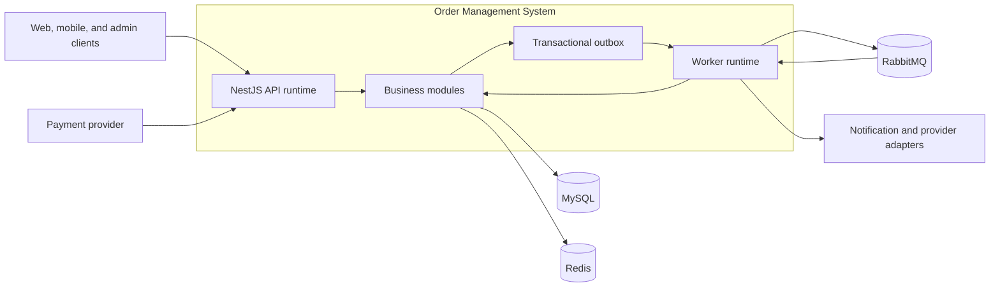

# Architecture overview

## Purpose

This document defines the initial architecture and guardrails for the Order
Management System. It is the shared baseline for implementation and review;
individual decisions with meaningful alternatives are preserved as ADRs.

The first release models a single commerce platform with multiple fulfillment
centers. It supports SKU-level inventory, order placement, payment,
fulfillment, and customer notifications. It is not initially a multi-tenant
marketplace, warehouse-management suite, procurement platform, or last-mile
routing system.

## Quality attributes

The design prioritizes the following attributes, in order:

1. Correctness of inventory, order, and payment state.
2. Recoverability from partial failure and duplicate delivery.
3. Clear ownership and maintainable module boundaries.
4. Security, auditability, and operational visibility.
5. Predictable performance and horizontal scalability.
6. Independent service extraction when justified by evidence.

Availability does not justify silently accepting an incorrect order. When the
system cannot establish a required invariant, it rejects or defers the
operation with an observable error.

## System context

The API and worker are separate deployable processes built from the same
module packages. This gives background work an independent failure and scaling
boundary without introducing network calls between business modules.

## Architectural style

The backend is a modular monolith using Clean Architecture within each business
module. Each module contains four conceptual areas:

- **Domain:** aggregates, entities, value objects, invariants, domain services,
  domain errors, and domain events.
- **Application:** use cases, transaction orchestration, authorization checks,
  and input/output ports.
- **Infrastructure:** Prisma repositories, Redis and RabbitMQ adapters, and
  external provider implementations.
- **Presentation:** HTTP controllers, request validation, response mapping, and
  transport-specific authorization.

Dependencies point toward the domain. Domain code has no NestJS, Prisma,
RabbitMQ, Redis, or HTTP dependency. Transport DTOs and generated database
types do not become domain models.

### Boundary rules

- A module owns its tables and repository interfaces.
- One module cannot query or mutate another module's tables directly.
- Immediate collaboration uses an application port exposed by the owning
  module.
- Durable asynchronous collaboration uses versioned integration events.
- Domain events are internal implementation details; integration events are
  compatibility-managed contracts.
- Cross-module transactions are allowed only in an orchestrating application
  use case where a strong local invariant requires them.
- No network or provider call occurs while a database transaction is open.
- Shared code is limited to stable technical or universal concepts such as
  identifiers, money, clocks, pagination, and correlation metadata.

## Business modules

| Module | Responsibilities | Explicit exclusions |
| --- | --- | --- |
| Identity and Access | Administrator identity, token lifecycle, roles, permissions, and Identity security evidence | Customer commerce profile and cross-module audit queries |
| Customers | Customer profile and saved addresses | Immutable order snapshots |
| Catalog | Products, SKUs, attributes, and lifecycle | Stock and payment |
| Pricing | Price lists, currency, and effective-price lookup | Payment collection |
| Inventory | Warehouse stock, reservations, and immutable movements | Order lifecycle |
| Orders | Order aggregate, totals, item/address snapshots, state, and cancellation policy | Provider-specific payment state |
| Payments | Attempts, provider results, capture, void, refund, and reconciliation | Authoritative order state |
| Fulfillment | Allocation, pick, pack, shipment, and delivery state | Raw stock accounting |
| Notifications | Templates and delivery attempts | Decisions that trigger business notifications |
| Integrations | Provider adapters, webhook validation, and external references | Core business policy |
| Audit | Authorized cross-module audit queries, projections, and export | Ownership of another module's mutation evidence and general diagnostic logging |

Platform capabilities such as configuration, logging, tracing, health,
database access, and messaging support business modules but contain no business
rules.

Each source module owns the atomic write model for evidence created with its
state. Identity therefore owns `identity_security_events`; a future Audit
boundary consumes an exported application query/projection contract and never
uses the shared Prisma client as permission to read Identity tables directly.

Returns will become a distinct module after the purchase-to-delivery path is
stable. Promotions, procurement, supplier management, route optimization, and
multi-tenancy are intentionally deferred.

## Data and consistency

MySQL is authoritative for every business state. Modules have logical schema
ownership even while they share one physical database.

Key conventions:

- Application-generated UUIDv7 identifiers represented as canonical UUID
  strings outside persistence and stored in MySQL as `BINARY(16)`. Conversion
  belongs to infrastructure mappers.
- UTC timestamps with microsecond precision.
- Decimal monetary values paired with an ISO currency code.
- Optimistic versions on mutable aggregates.
- Immutable snapshots for order item, price, tax, and address data.
- Unique constraints for provider events and externally retried commands.
- Immutable inventory, payment, order-transition, and shipment histories where
  an audit trail is required.

The first inventory allocation policy selects one warehouse that can fulfill
the complete order. Split fulfillment is deferred because it changes
cancellation, refund, shipping, and customer-notification behavior.

`stock_items` is the operational balance used for reservation decisions.
`inventory_movements` is an immutable audit and reconciliation ledger; it is
not replayed on every availability request. Reconciliation must detect any
difference between recorded movements and the operational balance.

### Order placement consistency boundary

Order placement performs the following work in one local transaction:

1. Validate or claim the caller's idempotency key and request hash.
2. Load canonical SKU and effective price information.
3. Select an eligible warehouse deterministically.
4. Conditionally reserve stock.
5. Create the order and immutable item and address snapshots.
6. Record inventory movements and order history.
7. Store the idempotent result and append outbox records.

The transaction succeeds completely or does not create an order. Provider
calls and event publication occur after commit.

An order-placement application service owns this transaction boundary. It
uses the explicit unit-of-work contract defined in
[ADR-0006](../adr/0006-persistence-boundaries.md) to coordinate
transaction-aware ports exposed by Orders and Inventory. It does not bypass
those ports or manipulate another module's Prisma repository.

The initial top-level order states are `PAYMENT_PENDING`, `CONFIRMED`,
`FULFILLING`, `SHIPPED`, `DELIVERED`, `CANCELLED`, and `FAILED`. Payment and
fulfillment keep independent detailed state machines rather than expanding the
order state into every possible combination.

## API style

Public HTTP endpoints use versioned REST paths under `/api/v1`. Liveness,
readiness, and metrics endpoints are operational endpoints and are not API
versioned. Paths are case-sensitive; trailing-slash tolerance is retained.

The public transport contract is generated as OpenAPI 3.0.3 from explicit
application-owned metadata. Every operation declares a stable operation ID,
exact responses, and shared error and identity components. The read-only
documentation surface and startup checks are specified in
[OpenAPI and transport validation](openapi-and-transport-validation.md).

Contracts use:

- Strict runtime DTO validation that rejects ordinary unknown fields and wrong
  primitive types without global implicit conversion.
- Cursor pagination for collections.
- Decimal strings and currency codes for money.
- An `Idempotency-Key` header for retryable commands with financial or stock
  effects.
- Request and correlation identifiers on every request.
- Preconditions or aggregate versions for contention-sensitive mutations.
- Problem Details responses with stable machine-readable business error codes.
- Separate public and administrative authorization policies.

Clients never provide trusted totals, prices, order state, payment state, or
warehouse allocation.

DTO validation owns bounded transport shape only. Authorization, cross-field
policy, authoritative-state checks, and aggregate invariants remain in the
application and domain layers. Every future controller operation must publish
its stable operation ID and every response it can produce.

Order creation and payment initiation remain separate commands unless the
payment lifecycle ADR decides otherwise. Creating an order returns a durable
`PAYMENT_PENDING` order and its reservation; initiating a payment is an
idempotent follow-up command. This separation avoids holding an HTTP or
database transaction open during a provider call, while still allowing a
future facade endpoint to compose both operations for client convenience.

### Runtime composition and operational health

Each API process owns one application-scoped `DatabaseConnection`. The
composition root parses and resolves configuration once, then constructs the
database facade through a singleton NestJS provider. Prisma is available only
through the infrastructure-restricted `@oms/database/prisma` capability;
controllers and health indicators depend only on the narrow lifecycle facade.
NestJS shutdown hooks close it after HTTP request draining.

`GET /health/live` confirms only that the HTTP process is responsive.
`GET /health/ready` performs a bounded MySQL probe because MySQL is required for
authoritative application behavior. Redis is mandatory only for fail-closed
credential issuance and optional for safe caching; RabbitMQ is decoupled from
API commits by the transactional outbox. Neither belongs in global API
readiness, and their capability-specific failures remain observable. Their
owning worker runtimes will receive separate readiness policies.

Operational endpoints are excluded from the `/api` prefix and URI versioning,
remain stable across business API versions, disable response caching, and
return sanitized dependency status. See
[Operational health](operational-health.md) for rationale and failure
semantics.

Request identity and diagnostic logs are owned by the API observability
adapter. The API generates every request ID, accepts only one canonical UUIDv4
or UUIDv7 correlation ID, and emits allow-listed JSON records to standard
output. Ambient log context never controls business behavior or crosses a
message boundary. See
[Request identity and structured logging](request-identity-and-logging.md) for
the trust, redaction, and propagation contracts.

## Redis policy

Redis accelerates catalog, pricing, advisory availability reads, and fast-path
replay or idempotency checks. Separately, future login and refresh require its
atomic abuse decision and fail closed when no decision is possible. Durable
MySQL records back any check whose loss could alter a business outcome and
remain authoritative for sessions.

The application remains correct when Redis is unavailable. Redis is not used
as the authoritative inventory store, a durable workflow engine, or the sole
idempotency record. Correctness-critical distributed locks are not part of the
order-placement path.

Redis unavailability degrades cache hit rate and makes login/refresh return the
fixed `503`, but by itself does not make the complete API unready. The exact
fail-open or fail-closed policy is selected per security-sensitive feature
rather than globally.

## Messaging policy

RabbitMQ transports durable integration events using at-least-once delivery.
Publishing uses the transactional outbox, persistent messages, and publisher
confirms. Consumers use manual acknowledgements, bounded retries, dead-letter
queues, and durable deduplication.

Events carry an event identifier, type, schema version, occurrence time,
aggregate identifier and version, correlation identifier, causation
identifier, and the minimum immutable facts needed by consumers. Consumers
must tolerate duplicate and out-of-order messages.

RabbitMQ is neither the system of record nor an event store. Synchronous
in-process calls remain the default when the caller requires an immediate
business decision.

RabbitMQ unavailability does not make the API unready because committed
events remain in the outbox. It does make a publisher or consumer worker that
requires the broker unready. Outbox lag and age are alerted independently so a
long broker outage is visible before it breaches a business SLO.

## Decisions required before domain implementation

The following policies are deliberately not implied by the high-level
architecture. Each must be resolved in a reviewed ADR before implementation of
the affected module:

| Decision | Why it cannot remain implicit | Required before |
| --- | --- | --- |
| Payment authorization versus immediate capture | Determines when an order is confirmed and whether cancellation voids or refunds | Payments |
| Reservation-expiry versus late-payment race | Requires conditional transitions, locking/version rules, and reconciliation behavior | Orders and Payments integration |
| Tax inclusion, discount allocation, and rounding | Determines persisted totals and refund correctness | Pricing and Orders |
| Initial SLO and capacity assumptions | Drive indexes, pool sizes, quorum queue policy, load tests, retention, RPO, and RTO | Production-like deployment |

Until these decisions are accepted, documentation may describe alternatives
but code must not silently select one.

The first local transactional-command idempotency lifecycle is accepted in
[ADR-0016](../adr/0016-make-retryable-commands-durably-idempotent.md).
Administrative authentication, credential handling, permission evaluation,
and login-identifier privacy are accepted in
[ADR-0015](../adr/0015-authenticate-and-authorize-administrative-apis.md).
The exact account/session boundary, opaque credential transport, browser
policy, MySQL authority, and Redis failure semantics are specified in the
[Identity and session contract](identity-and-session.md) and
[ADR-0017](../adr/0017-use-split-browser-session-credentials.md).
Customer registration, account recovery, and provider webhook identity remain
separate decisions before their affected implementations.

## Security and observability

The implemented HTTP identity and logging baseline is specified in
[Request identity and structured logging](request-identity-and-logging.md).
The not-yet-implemented administrator authentication boundary is specified in
[Identity and session](identity-and-session.md); its routes remain gated until
the complete security and dependency contract is tested together.

- Authentication and authorization are separate concerns.
- Administrative actions use explicit permissions and atomically persisted,
  source-module-owned evidence. A future Audit module exposes authorized
  queries without taking ownership of Identity writes.
- Secrets, tokens, payment details, and personal data are redacted from logs.
- Payment webhooks require provider-specific signature verification and replay
  protection.
- Raw payment credentials and card data are never stored.
- Structured logs include request, correlation, causation, actor, and relevant
  aggregate identifiers.
- Metrics cover latency, failures, stock conflicts, reservation expiry, outbox
  lag, queue depth, retries, and dead letters.
- Distributed traces cover HTTP, MySQL, Redis, RabbitMQ, and provider calls.
- Liveness checks process health; readiness represents the ability to serve
  the runtime's required traffic safely.

## Deployment evolution

Notification is the first extraction candidate because it consumes events and
owns limited transactional state. Payment is extracted only when independent
scaling, ownership, compliance isolation, deployment cadence, or failure
containment creates measurable value.

Extraction requires an already isolated module API, owned persistence,
versioned events, independent tests, and an operational owner. It is not used
to repair unclear boundaries.

## Delivery roadmap

### Milestone 1: Architecture and engineering foundation

Define ADRs, repository layout, quality gates, local dependencies,
configuration policy, contribution workflow, and CI skeleton.

**Exit criteria:** decisions are reviewable, commands are reproducible, and the
empty scaffold passes all configured checks.

### Milestone 2: Platform and persistence foundation

Add validated configuration, structured logging, errors, request correlation,
API versioning, OpenAPI, Prisma conventions, migrations, health endpoints, and
test infrastructure.

**Exit criteria:** a thin vertical health slice is deployable and observable,
and database migrations are validated from clean and prior states.

### Milestone 3: Identity, catalog, pricing, and inventory

Build authorization, catalog reads, effective pricing, warehouses, stock
movements, reservations, and contention tests.

**Exit criteria:** concurrent reservation attempts cannot oversell stock, and
every adjustment is attributable and idempotent.

### Milestone 4: Orders

Build order placement, immutable snapshots, the state machine, idempotency,
reservation expiry, queries, and cancellation policy.

**Exit criteria:** the order flow is covered by domain, integration,
concurrency, and HTTP tests, including duplicate requests and expiry races.

### Milestone 5: Payments and reliable messaging

Add the provider port, payment attempts, verified webhooks, transactional
outbox relay, RabbitMQ topology, idempotent consumers, retries, dead letters,
and reconciliation.

**Exit criteria:** duplicate or delayed provider events and process crashes do
not produce duplicate business effects or lose committed events.

### Milestone 6: Fulfillment and notifications

Add allocation, pick/pack/ship/deliver transitions, shipment history, and
event-driven notification delivery.

**Exit criteria:** the purchase-to-delivery journey is auditable, retryable,
and operationally visible.

### Milestone 7: Hardening and release

Complete end-to-end failure tests, load and contention tests, threat modeling,
dashboards, alerts, runbooks, API examples, release automation, and portfolio
documentation.

**Exit criteria:** production-like failure scenarios have documented behavior,
recovery procedures, and measurable service indicators.

An eighth week is held as contingency for provider sandbox behavior, migration
findings, and performance corrections. It is not a pre-approved feature week.

## Review questions for every feature

Every design and pull request should answer:

1. Which module owns the rule and its data?
2. What invariant is protected, and at what transaction boundary?
3. Is the operation safe to retry?
4. What happens after a timeout, duplicate, crash, or reordered event?
5. Which data is authoritative and which is cached or projected?
6. How is the behavior tested against real infrastructure semantics?
7. What logs, metrics, traces, and audit records support operations?
8. Does this change make a future extraction clearer or accidentally couple
   modules?
