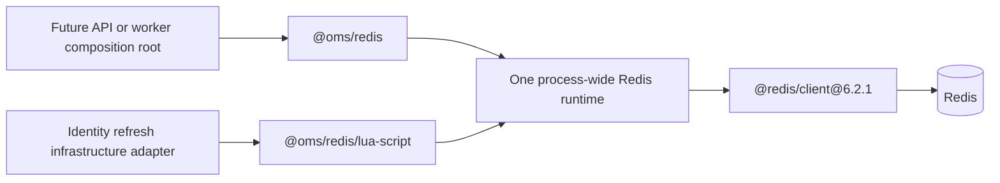

# Redis runtime contract

## Status and scope

This document defines the delivered technical Redis substrate. The
framework-independent `@oms/redis` package owns the exact
`@redis/client@6.2.1` dependency, connection lifecycle, authentication, TLS,
bounded admission, command deadlines, health probing, script execution, safe
failure mapping, and shutdown.

The technical runtime remains infrastructure rather than an Identity
capability. The separate delivered `@oms/identity/infrastructure/redis`
adapter now implements the refresh port, static Lua algorithm, and key schema
through this package's restricted executor. Neither component is composed into
the API or worker, adds an authentication route, makes Redis part of global
readiness, adds caching, or deploys a public environment. MySQL remains session
authority. The Identity-owned policy and algorithm are defined in the
[Identity and session contract](identity-and-session.md).

## Ownership and public surfaces

`@oms/redis` is the only workspace package permitted to import
`@redis/client`. Its package root exports only:

- `createRedisRuntime`;
- the lifecycle and probe contracts needed by a composition root; and
- `RedisRuntimeUnavailableError`, the fixed provider-safe failure.

The root does not expose the vendor client, arbitrary command execution,
script text, hashes, sockets, provider errors, reconnect controls, or a way for
business code to extend the command surface.

The restricted `@oms/redis/lua-script` subpath is for reviewed infrastructure
adapters only. It owns registered, frozen script definitions with captured
source and exact key and argument counts, plus an executor bound to an authentic
runtime instance. Module policy requires static reviewed registration; the
runtime bounds and freezes the supplied value but cannot prove compile-time
constness. Callers cannot supply or change script source at execution time and
cannot access the underlying client. Domain and application layers cannot
import this subpath. Executable architecture checks protect both boundaries.

This is capability-oriented design: the package exposes the smallest operation
needed by a caller, while retaining connection and command authority itself.
The Identity adapter owns its policy and key derivation without becoming a
Redis connection manager.

## Runtime lifecycle

A composition root must create one Redis runtime for a process and share its
narrow capabilities with approved infrastructure adapters. The runtime owns at
most one active client connection. Construction is side-effect free; the first
probe or script operation establishes the connection through a single-flight
path so concurrent callers cannot create a connection herd.

The client uses RESP2 deliberately. The required probe and Lua result shapes
are small and stable, and this avoids introducing RESP3 push semantics before
there is a consumer for them. Authentication is explicit, and TLS is either
disabled for the loopback development service or verifies the server identity
for a showcase, staging, or production environment.

The client is configured with:

- offline queuing disabled;
- a bounded client command queue;
- bounded connect, command, probe, and shutdown deadlines;
- no automatic reconnect within an operation; and
- a mandatory error listener, while operation paths convert dependency failures
  into the fixed package error without leaking provider details or credentials.

Each connect, probe, and script deadline combines a native abort signal with an
absolute captured monotonic expiry checked before dispatch and again on both
provider settlement paths. This prevents a delayed JavaScript timer from
turning late provider success into accepted success. A script invocation uses
one expiry across `EVALSHA` and the permitted `EVAL`. Settlement must also prove
that the runtime still owns that exact client; one concurrent timeout or an
expired shutdown grace quarantines every later result from the discarded
connection. A later operation may make a fresh connection attempt, but the
failed operation is never replayed. This distinction permits recovery without
making an ambiguous request look idempotent.

The root probe performs only bounded connectivity/authentication validation. It
does not mutate business state and does not assert that the Identity script or
adapter has been process-composed. Redis remains absent from global API
readiness at this stage.

## Script execution and ambiguity

Every registered script invocation follows one closed sequence:

1. Validate the registered definition and its exact key/argument cardinality.
2. Execute `EVALSHA` under the operation's existing deadline.
3. Only when the server returns Redis's exact canonical script-cache-miss
   `NOSCRIPT` reply, execute exactly one `EVAL` of that same registered source
   under the remaining deadline.
4. Return the fulfilled result as `unknown` for the owning adapter to validate,
   or fail with `RedisRuntimeUnavailableError`.

The `EVAL` is the single cache-loss fallback; it is not followed by another
`EVALSHA`. A timeout, disconnect, failover, protocol-level rejection, provider
error, or any other ambiguous outcome is never retried within that operation.
The caller must fail closed because the runtime cannot prove whether the script
changed Redis state. A fulfilled script value is not interpreted by the
technical runtime; malformed domain evidence must fail in the owning adapter.
One deadline spans both the initial command and the permitted `NOSCRIPT`
fallback, so cache loss cannot double the latency budget.

This rule is narrower than a general retry policy. The runtime treats only the
pinned Redis server's exact canonical reply as cache-miss evidence, while a
transport failure does not prove non-execution. Because Redis does not
cryptographically distinguish that server reply from an identical error
deliberately returned by Lua, every registered script is reviewed static code
and must never emit the reserved reply. Prefixes, suffixes, and other
`NOSCRIPT`-looking errors fail closed. The delivered Identity script returns
only its closed versioned allow/deny vocabulary. This invariant remains
required when the abuse decision is later composed ahead of credential
issuance.

## Configuration and secret handling

Redis configuration is validated before the runtime receives it. Host, port,
username, password source, TLS mode, optional CA source, connect deadline,
command deadline, probe deadline, shutdown deadline, and maximum admitted
operations are discrete values. A credential-bearing Redis URL is not
accepted, which prevents routine URL diagnostics from carrying a password.

Exactly one password source is mandatory: an environment value or a mounted
secret file. Optional CA value and CA file sources are also mutually exclusive.
Resolved configuration is immutable and configuration failures are
credential-free. Showcase, staging, and production environments require
verified TLS; only local development and isolated CI may explicitly disable
it.

Host, username, password, and certificate-authority text must round-trip as
canonical UTF-8 within the same byte limits enforced by the runtime. A host is
an unbracketed IP literal or an ASCII DNS/service name with 1-through-63-byte
labels and no ambiguous numeric-IP lookalike; intentional internationalized
names must be supplied as reviewed Punycode. Passwords are limited to 8,192
bytes and CA bundles to 1 MiB. File providers receive a maximum read size that
includes one oversize sentinel byte; resolution removes exactly one terminal
LF or CRLF before strict decoding. The Compose bootstrap applies the same
password-byte and UTF-8 rules before hashing, so the ACL and Node client cannot
silently authenticate with different byte sequences.

The initial defaults and accepted bounds are intentionally tight:

| Setting | Default | Minimum | Maximum |
| --- | ---: | ---: | ---: |
| Connect deadline | 500 ms | 100 ms | 5,000 ms |
| Command deadline | 100 ms | 25 ms | 500 ms |
| Probe deadline | 500 ms | 25 ms | 5,000 ms |
| Shutdown deadline | 1,000 ms | 100 ms | 10,000 ms |
| Admitted operations | 256 | 1 | 10,000 |

These are starting budgets, not universal performance targets; load evidence
must justify any increase.

## Diagnostics boundary

The pinned Node Redis client publishes command and reply payloads through
diagnostic channels. This runtime subscribes to none of them. Until a
regression gate proves that an instrumentation adapter drops or safely scrubs
those payloads, process-level tracing, metrics, and error-reporting integrations
must not subscribe to or export Redis command-payload channels.

Registered scripts must receive only pseudonymous keys and non-sensitive
structural arguments. They must never receive raw credentials, personal data,
or business payloads, because Lua source, keys, arguments, and replies could
otherwise cross an instrumentation boundary outside this package. The
delivered Identity adapter satisfies this rule with HMAC-derived keys and bounded policy
integers; Redis credentials remain connection configuration only.

## Shutdown

Shutdown is terminal for that runtime instance:

1. reject new probes and script operations;
2. allow already-admitted operations to drain within the configured bound;
3. destroy the client when the bound expires or when draining completes; and
4. settle shutdown without exposing a socket, provider error, or credential.

The runtime does not wait indefinitely for a stalled network. An operation that
cannot prove its result before shutdown remains unavailable; shutdown never
manufactures a successful script result. The grace cutoff is captured
synchronously and checked monotonically by command settlement, so delayed
timer delivery cannot admit a result after the shutdown budget.

## Local and CI topology

Docker Compose supplies an authenticated, ephemeral Redis service for local
development and CI. It uses Redis `7.2.16` from the official Alpine image,
pinned by immutable digest
`sha256:ccd6aa8d45ff3f033d6fa15b8cc1a50579f65c89f38cf9bb607a954c4f2128ed`.
The service:

- publishes only to loopback;
- authenticates a least-privilege `oms_app` ACL user from a mounted secret;
- disables the default user;
- permits only the commands required by the probe and registered-script path;
- disables RDB and AOF persistence;
- caps Redis data memory at 64 MiB with `noeviction`; and
- uses a bounded container memory/process/security profile.

Compose file-backed secrets are initially readable only by the container's
root bootstrap. The entrypoint therefore starts with only the four capabilities
needed to read the secret and install the generated ACL file, hashes the
credential without placing it in a process argument, then replaces itself with
Redis as UID 999/GID 1000 under `no-new-privileges` and no inherited, permitted,
effective, or ambient capabilities. The recurring health check reads no secret
and replaces its shell with the same unprivileged identity before probing.
Running the image as non-root from its first instruction would be simpler, but
the local Compose secret mount does not provide the required readable ownership
without copying the credential through a less controlled host-side path.

`noeviction` makes memory exhaustion explicit instead of silently discarding
abuse-control state. Persistence is disabled because this service is disposable
development/test infrastructure, not the production system of record. A real
deployment must provide its own authenticated, encrypted Redis service and
capacity policy.

CI starts the same digest with an ephemeral password, verifies authentication,
runs both the technical runtime suite and the Identity adapter's real-Redis
suite, and tears the service down. The adapter gate covers cache-cold execution,
two-runtime atomic contention, isolated dimension capacities, all-or-none
denial, refill/expiry, corrupt state, policy drift, time regression, and a
timed-out single invocation without replay. The gates exercise production
package boundaries rather than importing the vendor client from test
orchestration. This is a reproducible infrastructure proof, not managed
failover evidence, a release pipeline, or a public deployment.

Redis 7.2 is retained for this slice because its source remains under the
[three-clause BSD license](https://github.com/redis/redis/blob/7.2/COPYING)
and it satisfies the required script semantics. The image is sourced from the
[official Redis image](https://hub.docker.com/_/redis). Version upgrades remain
explicit reviewed changes rather than floating tags.

## Why this design

- A dedicated technical package gives every future module one reviewed
  connection/security implementation without letting Redis concepts enter
  business policy.
- The base [`@redis/client`](https://github.com/redis/node-redis) package is the
  smallest official Node Redis dependency needed here; the umbrella package
  would install modules this runtime does not use.
- One process connection matches the official client's normal operating model
  and avoids per-request handshakes, credential churn, and an unbounded pool.
- Static registered scripts make the command surface and key/argument ownership
  reviewable. They also prevent application code from turning the runtime into
  a generic database escape hatch.
- Disabled offline queuing and bounded deadlines preserve backpressure. A
  dependency outage becomes an explicit decision instead of retained work that
  may execute after the caller has gone away.
- `EVALSHA` with only the exact canonical script-cache-miss fallback follows
  Redis's documented volatile script-cache behavior while preserving ambiguity
  rules and the registered-script invariant.
  See [Redis scripting](https://redis.io/docs/latest/develop/interact/programmability/eval-intro/)
  and the official
  [Node Redis client configuration](https://github.com/redis/node-redis/blob/master/docs/client-configuration.md).

## Alternatives considered

### Export the raw Redis client

Rejected. It would let every module invent commands, retries, keys, timeouts,
and error handling, defeating Clean Architecture and making credential-safe
review impractical.

### Use the umbrella `redis` package or `ioredis`

The official umbrella package includes optional Redis modules that this
runtime does not need. `ioredis` is capable, but selecting a second-party
client adds no current benefit over the official base client. Either remains a
future option only if a measured topology or protocol requirement cannot be
met by `@redis/client`.

### Create a pool or one connection per request

Rejected for the current single-node command profile. Handshakes and
authentication would dominate short operations, while a pool would add another
queue and shutdown state machine. A separate blocking-command or high-throughput
workload must earn its own bounded connection budget later.

### Enable automatic reconnect and client retries

Rejected inside an admitted operation. Replaying an atomic script after a
timeout can consume a limit twice, while offline queuing can execute work after
its HTTP deadline. A later request may reconnect; the ambiguous request still
fails closed.

### Use Redis Functions immediately

Functions offer server-side versioning and persistence, but add deployment and
provider capability management before the first algorithm exists. Registered
Lua is portable across the selected Redis 7 baseline. Re-evaluate Functions if
script count, deployment coordination, or cold-cache behavior becomes an
operational problem.

### Make Redis globally readiness-critical

Rejected. Anonymous Catalog reads and Bearer authority do not depend on Redis.
The future login/refresh capability needs a separate readiness and availability
signal so a Redis outage does not remove unrelated API traffic.

## Trade-offs

- One connection is simple and bounded, but a slow command can cause
  head-of-line pressure. Tight command deadlines and queue limits contain that
  risk; evidence may later justify a second isolated runtime.
- Disabling reconnect/retry reduces availability during transient failures in
  exchange for bounded latency and honest ambiguity handling.
- RESP2 avoids unused protocol complexity but forgoes RESP3 features until an
  explicit consumer needs them.
- Exact dependency and image pins make builds reproducible but require
  deliberate security and compatibility upgrades.
- Sending source once after `NOSCRIPT` costs bandwidth and latency on a cold
  cache, but it is safer than a general replay and avoids a separate mutable
  script-loading phase.
- `noeviction` preserves the meaning of existing abuse state but causes new
  writes to fail when the memory budget is exhausted. Credential issuance must
  then fail closed and operations must alert before saturation.
- Verified TLS adds certificate distribution and rotation work in deployed
  environments. Disabling it is limited to loopback development and isolated
  CI, where the network boundary is intentionally different.

## Interview questions

1. **Why does `NOSCRIPT` permit a fallback when a timeout does not?** The exact
   canonical reply is treated as cache-miss evidence under the invariant that
   registered Lua never emits it; a timeout leaves the mutation outcome
   unknown.
2. **Why expose a script executor instead of the client?** It grants only the
   reviewed capability and keeps keys, commands, retry policy, and lifecycle
   under one owner.
3. **Why disable the offline queue?** Work must not execute after its caller's
   deadline or consume memory without a hard bound during an outage.
4. **Why use one connection per process?** Short non-blocking commands do not
   justify handshake-per-request or pool complexity; queue and latency evidence
   can trigger a later split.
5. **Why is Redis not global readiness?** Only specific future credential
   issuance paths require it; unrelated traffic retains a narrower failure
   domain.
6. **Why use `noeviction` for abuse state?** Eviction would silently reset
   attacker cost. Explicit write failure is observable and fails issuance
   closed.
7. **Why keep Identity's Lua outside `@oms/redis`?** The technical package owns
   execution safety, while Identity owns policy, key derivation, bucket
   semantics, and result mapping.
8. **When would a second connection be justified?** A measured blocking or
   high-volume workload with its own bounded budget and shutdown policy—not
   speculative scale.

## Future improvements

- Compose the delivered refresh adapter into the first private refresh use case
  ahead of credential verification and MySQL, without opening a route. Add an
  operator runbook for intentional epoch migration and poisoned/mismatched
  marker repair.
- Compose one runtime into each process that needs Redis, with
  capability-specific readiness, metrics, tracing, saturation alerts, and
  credential-safe diagnostics. Add a regression gate proving that any future
  OpenTelemetry, Sentry, or equivalent instrumentation drops or scrubs Redis
  command-payload diagnostic channels before enabling it.
- Add the separate login abuse-control facet only after its application use
  case and Argon2id admission boundary exist.
- Reassess connection isolation before adding caching, workers, blocking
  commands, Pub/Sub, Cluster, or Sentinel; security admission must not inherit
  an unrelated workload's queue without an explicit budget.
- Automate reviewed client, image, CVE, and Redis-license upgrade checks while
  preserving immutable production pins.
- Define deployed secret/certificate rotation and managed-service capability
  verification when the zero-cost public environment is selected.
- Evaluate Redis Functions only if operational evidence outweighs their
  deployment and portability cost.
